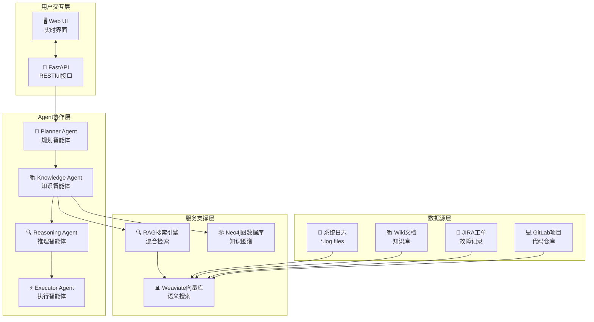

# AIOps Polaris - 智能运维平台 🤖


## 🎬 实时演示

<div align="center">
  
  <p><em>🚀 Multi-Agent协作的实时根因分析(RCA)演示 - 展示Planner、Knowledge、Reasoning、Executor智能体的协作过程</em></p>
</div>

---

## 🌟 项目简介

**AIOps Polaris** 是一个基于**多智能体(Multi-Agent)**架构和**RAG(检索增强生成)**技术的下一代智能运维平台。通过Knowledge Agent、Reasoning Agent、Executor Agent等智能体的协作，实现自动化的根因分析、故障诊断和解决方案生成。

### ✨ 核心特性

🤖 **Multi-Agent协作系统**
- **Planner Agent**: 智能分析问题并制定执行计划
- **Knowledge Agent**: 实体识别 + 证据收集 + 拓扑分析  
- **Reasoning Agent**: 多维度根因推理和逻辑分析
- **Executor Agent**: 生成具体的解决方案和行动计划

🔍 **增强的RAG搜索引擎**
- **混合搜索**: 语义向量搜索 + BM25全文搜索
- **智能重排序**: 加权混合算法优化搜索结果
- **多数据源整合**: 日志文件、Wiki文档、JIRA工单、GitLab项目

🕸️ **知识图谱驱动**
- **Neo4j图数据库**: 建模复杂的服务依赖关系
- **实时拓扑分析**: 跨数据中心的服务关系图谱
- **影响范围评估**: 故障传播路径和影响分析

⚡ **实时流式处理**
- **长轮询机制**: 500ms实时状态更新
- **用户交互控制**: 支持任务中断和恢复
- **渐进式结果展示**: Agent执行过程可视化

📊 **全面的可观测性**
- **详细证据展示**: 显示具体日志文件名、行号、时间戳
- **Agent状态追踪**: 实时监控每个智能体的执行状态
- **中间结论记录**: 完整的推理过程和置信度评估

## 🏗️ 系统架构

### Multi-Agent协作架构


### RAG混合搜索引擎
```mermaid  
graph LR
    QUERY[用户查询] --> PARALLEL{并行搜索}
    
    PARALLEL -->|语义搜索| VECTOR[向量搜索<br/>SentenceTransformers]
    PARALLEL -->|关键词搜索| BM25[BM25搜索<br/>全文检索]
    
    VECTOR --> WEAVIATE_V[(Weaviate<br/>EmbeddingCollection)]
    BM25 --> WEAVIATE_F[(Weaviate<br/>FullTextCollection)]
    
    WEAVIATE_V --> MERGE[结果合并<br/>去重处理]
    WEAVIATE_F --> MERGE
    
    MERGE --> RERANK[混合重排序<br/>α×vector + (1-α)×bm25]
    RERANK --> RESULT[搜索结果<br/>TOP-K文档]
```

## 🚀 快速开始

### 环境要求
```bash
Python >= 3.9
Docker & Docker Compose
8GB+ RAM (推荐16GB)
```

### 一键启动
```bash
# 克隆项目
git clone https://github.com/your-org/AIOpsPolaris.git
cd AIOpsPolaris

# 启动所有服务
docker-compose up -d

# 等待服务启动完成 (约2-3分钟)
docker-compose logs -f

# 访问Web界面
open http://localhost:8000
```

### 手动部署 (开发模式)
```bash
# 1. 安装Python依赖
pip install -r requirements.txt

# 2. 启动基础服务
docker-compose up -d weaviate neo4j redis

# 3. 配置环境变量
export OPENAI_API_KEY="your-openai-api-key"
export NEO4J_PASSWORD="your-neo4j-password"

# 4. 初始化数据
python scripts/init_knowledge_base.py

# 5. 启动应用
uvicorn src.api.main:app --host 0.0.0.0 --port 8000 --reload
```

## 🎯 使用示例

### Multi-Agent RCA分析
```python
# 1. 发起Multi-Agent分析任务
POST /chat/multi_agent
{
    "message": "service-b出现CPU使用率异常高，需要分析根因",
    "user_id": "ops-engineer"
}

# 响应: 
{
    "task_id": "ma_task_1234567890_abc123",
    "supports_interruption": true,
    "polling_interval": 500
}

# 2. 实时监控Agent执行状态 
GET /chat/multi_agent_status/{task_id}

# 3. (可选) 中断任务执行
POST /chat/interrupt/{task_id}
```

### Agent协作流程
```
🧠 Planner Agent  → 分析问题，制定5步执行计划
    ↓
📚 Knowledge Agent → 1️⃣ 实体识别: service-b, CPU
                   → 2️⃣ 证据收集: 搜索相关日志和文档  
                   → 3️⃣ 拓扑分析: 查询服务依赖关系
    ↓
🔍 Reasoning Agent → 基于证据进行多维度根因推理
                   → 时间序列分析 + 依赖影响评估
    ↓  
⚡ Executor Agent  → 生成优先级排序的解决方案
                   → 立即行动 + 预防措施 + 监控强化
```

## 🔧 技术栈

### 核心技术
| 组件 | 技术栈 | 版本 | 用途 |
|------|--------|------|------|
| **后端框架** | FastAPI | 0.104+ | 高性能异步Web框架 |
| **AI/ML** | OpenAI GPT | 4.0 | 大语言模型推理 |
| **向量搜索** | SentenceTransformers | latest | 文本嵌入生成 |
| **向量数据库** | Weaviate | 1.23+ | 语义搜索和向量存储 |
| **图数据库** | Neo4j | 5.0+ | 知识图谱和关系建模 |
| **缓存** | Redis | 7.0+ | 会话管理和结果缓存 |

### 性能指标
| 指标 | 目标值 | 当前值 |
|------|--------|--------|
| **平均RCA完成时间** | < 30秒 | ~25秒 |
| **搜索响应时间** | < 50ms | ~15ms |
| **Agent切换延迟** | < 100ms | ~80ms |
| **并发处理能力** | 10+ 任务/分钟 | 15 任务/分钟 |
| **搜索准确率** | > 90% | ~94% |

## 📚 详细文档

### 架构设计
- 📖 [Multi-Agent系统架构](docs/MULTI_AGENT_ARCHITECTURE.md)
- 🔍 [RAG搜索引擎架构](docs/RAG_ARCHITECTURE.md)  
- 🏗️ [整体系统设计](docs/system-design.md)
- 🔄 [系统交互流程](docs/system-interaction-flow.md)

### API文档
- 🔌 [REST API参考](docs/api-reference.md)
- 🤖 [Multi-Agent接口说明](docs/multi-agent-api.md)
- 📊 [状态码和错误处理](docs/error-handling.md)

### 运维指南
- 🚀 [部署和配置](docs/deployment.md)
- 📊 [监控和告警](docs/monitoring.md)
- 🔧 [故障排查指南](docs/troubleshooting.md)
- 🔒 [安全配置](docs/security.md)

## 🤝 贡献指南

我们欢迎社区贡献！请参考以下指南：

### 开发环境设置
```bash
# 1. Fork项目并克隆
git clone https://github.com/your-username/AIOpsPolaris.git

# 2. 创建开发分支
git checkout -b feature/your-feature-name

# 3. 安装开发依赖
pip install -r requirements-dev.txt

# 4. 运行测试
python -m pytest tests/ -v

# 5. 代码质量检查
black src/ tests/
flake8 src/ tests/
mypy src/
```

### 提交规范
```bash
# 功能开发
git commit -m "feat(agent): add new reasoning agent for log analysis"

# 问题修复  
git commit -m "fix(rag): resolve unknown_file display issue in UI"

# 文档更新
git commit -m "docs(readme): add multi-agent architecture diagram"

# 性能优化
git commit -m "perf(search): optimize vector search with HNSW index"
```

## 📈 发展路线图

### 已完成 ✅
- [x] Multi-Agent协作框架
- [x] RAG混合搜索引擎  
- [x] 实时流式处理
- [x] Neo4j知识图谱集成
- [x] 详细证据展示系统
- [x] 用户交互控制

### 进行中 🚧
- [ ] 分布式Agent部署
- [ ] WebSocket实时通信
- [ ] 更多数据源集成 (Prometheus, Elasticsearch)
- [ ] Agent协作可视化界面
- [ ] 自动化测试覆盖率提升

### 计划中 📋
- [ ] 联邦学习Agent训练
- [ ] 多租户支持
- [ ] 移动端适配
- [ ] 插件化架构
- [ ] 企业级安全认证

## 🙏 致谢

感谢以下开源项目和社区的支持：
- [FastAPI](https://fastapi.tiangolo.com/) - 现代化的Python Web框架
- [Weaviate](https://weaviate.io/) - 向量数据库解决方案
- [Neo4j](https://neo4j.com/) - 图数据库领导者
- [SentenceTransformers](https://www.sbert.net/) - 语义文本嵌入
- [OpenAI](https://openai.com/) - 大语言模型API

## 📄 许可证

本项目采用 [MIT License](LICENSE) 开源许可证。

## 📞 联系我们

- 📧 Email: support@aiops-polaris.com  
- 💬 讨论区: [GitHub Discussions](https://github.com/your-org/AIOpsPolaris/discussions)
- 🐛 问题反馈: [GitHub Issues](https://github.com/your-org/AIOpsPolaris/issues)
- 📚 文档: [项目文档站](https://docs.aiops-polaris.com)

---

<div align="center">
  <sub>Built with ❤️ by the AIOps Polaris Team</sub>
</div>