# AIOps Polaris - Intelligent Operations Platform 🤖

[](README_CN.md)


## 🎬 Live Demo

<div align="center">
  
  <p><em>🚀 Real-time Root Cause Analysis (RCA) demo showcasing Planner, Knowledge, Reasoning, and Executor agents collaboration</em></p>
</div>

---

## 🌟 Project Overview

**AIOps Polaris** is a next-generation intelligent operations platform built on **Multi-Agent** architecture and **RAG (Retrieval-Augmented Generation)** technology. Through the collaboration of Knowledge Agent, Reasoning Agent, Executor Agent and others, it achieves automated root cause analysis, fault diagnosis, and solution generation.

### ✨ Core Features

🤖 **Multi-Agent Collaboration System**
- **Planner Agent**: Intelligently analyzes problems and formulates execution plans
- **Knowledge Agent**: Entity recognition + Evidence collection + Topology analysis  
- **Reasoning Agent**: Multi-dimensional root cause reasoning and logical analysis
- **Executor Agent**: Generates specific solutions and action plans

🔍 **Enhanced RAG Search Engine**
- **Hybrid Search**: Semantic vector search + BM25 full-text search
- **Intelligent Reranking**: Weighted hybrid algorithms optimize search results
- **Multi-source Integration**: Log files, Wiki documentation, JIRA tickets, GitLab projects

🕸️ **Knowledge Graph Driven**
- **Neo4j Graph Database**: Models complex service dependency relationships
- **Real-time Topology Analysis**: Cross-data center service relationship graphs
- **Impact Assessment**: Fault propagation paths and impact analysis

⚡ **Real-time Streaming Processing**
- **Long Polling Mechanism**: 500ms real-time status updates
- **User Interaction Control**: Support for task interruption and resumption
- **Progressive Result Display**: Agent execution process visualization

📊 **Comprehensive Observability**
- **Detailed Evidence Display**: Shows specific log file names, line numbers, timestamps
- **Agent Status Tracking**: Real-time monitoring of each agent's execution status
- **Intermediate Conclusion Recording**: Complete reasoning process and confidence assessment

## 🏗️ System Architecture

### Multi-Agent Collaboration Architecture

```mermaid
graph TB
    subgraph "User Interface Layer"
        UI[🖥️ Web UI<br/>Real-time Interface]
        API[🔌 FastAPI<br/>RESTful API]
    end
    
    subgraph "Agent Collaboration Layer"  
        PLANNER[🧠 Planner Agent<br/>Planning Agent]
        KNOWLEDGE[📚 Knowledge Agent<br/>Knowledge Agent]
        REASONING[🔍 Reasoning Agent<br/>Reasoning Agent] 
        EXECUTOR[⚡ Executor Agent<br/>Execution Agent]
    end
    
    subgraph "Service Support Layer"
        RAG[🔍 RAG Search Engine<br/>Hybrid Retrieval]
        NEO4J[🕸️ Neo4j Graph DB<br/>Knowledge Graph]  
        WEAVIATE[📊 Weaviate Vector DB<br/>Semantic Search]
    end
    
    subgraph "Data Source Layer"
        LOGS[📄 System Logs<br/>*.log files]
        WIKI[📚 Wiki Docs<br/>Knowledge Base]
        JIRA[🎫 JIRA Tickets<br/>Incident Records]
        GITLAB[💻 GitLab Projects<br/>Code Repository]
    end
    
    UI <--> API
    API --> PLANNER
    PLANNER --> KNOWLEDGE
    KNOWLEDGE --> REASONING
    REASONING --> EXECUTOR
    
    KNOWLEDGE --> RAG
    KNOWLEDGE --> NEO4J
    RAG --> WEAVIATE
    
    LOGS --> WEAVIATE
    WIKI --> WEAVIATE  
    JIRA --> WEAVIATE
    GITLAB --> WEAVIATE
```


### RAG Hybrid Search Engine


## 🚀 Quick Start

### Environment Requirements
```bash
Python >= 3.9
Docker & Docker Compose
8GB+ RAM (16GB recommended)
```

### One-Click Launch
```bash
# Clone the project
git clone https://github.com/your-org/AIOpsPolaris.git
cd AIOpsPolaris

# Start all services
docker-compose up -d

# Wait for services to start (approximately 2-3 minutes)
docker-compose logs -f

# Access Web UI
open http://localhost:8000
```

### Manual Deployment (Development Mode)
```bash
# 1. Install Python dependencies
pip install -r requirements.txt

# 2. Start infrastructure services
docker-compose up -d weaviate neo4j redis

# 3. Configure environment variables
export OPENAI_API_KEY="your-openai-api-key"
export NEO4J_PASSWORD="your-neo4j-password"

# 4. Initialize knowledge base
python scripts/init_knowledge_base.py

# 5. Start application
uvicorn src.api.main:app --host 0.0.0.0 --port 8000 --reload
```

## 🎯 Usage Examples

### Multi-Agent RCA Analysis
```python
# 1. Initiate Multi-Agent analysis task
POST /chat/multi_agent
{
    "message": "service-b shows abnormally high CPU usage, need root cause analysis",
    "user_id": "ops-engineer"
}

# Response: 
{
    "task_id": "ma_task_1234567890_abc123",
    "supports_interruption": true,
    "polling_interval": 500
}

# 2. Real-time monitoring of Agent execution status 
GET /chat/multi_agent_status/{task_id}

# 3. (Optional) Interrupt task execution
POST /chat/interrupt/{task_id}
```

### Agent Collaboration Workflow
```
🧠 Planner Agent  → Analyze problem, formulate 5-step execution plan
    ↓
📚 Knowledge Agent → 1️⃣ Entity Recognition: service-b, CPU
                   → 2️⃣ Evidence Collection: Search related logs and docs  
                   → 3️⃣ Topology Analysis: Query service dependencies
    ↓
🔍 Reasoning Agent → Multi-dimensional root cause reasoning based on evidence
                   → Time series analysis + Dependency impact assessment
    ↓  
⚡ Executor Agent  → Generate prioritized solutions
                   → Immediate actions + Preventive measures + Monitoring enhancement
```

## 🔧 Technology Stack

### Core Technologies
| Component | Technology | Version | Purpose |
|-----------|------------|---------|---------|
| **Backend Framework** | FastAPI | 0.104+ | High-performance async web framework |
| **AI/ML** | OpenAI GPT | 4.0 | Large language model inference |
| **Vector Search** | SentenceTransformers | latest | Text embedding generation |
| **Vector Database** | Weaviate | 1.23+ | Semantic search and vector storage |
| **Graph Database** | Neo4j | 5.0+ | Knowledge graph and relationship modeling |
| **Cache** | Redis | 7.0+ | Session management and result caching |

### Performance Metrics

The AIOps Polaris system evaluates performance across multiple dimensions, including system performance, algorithmic effectiveness, and operational efficiency. Actual metrics vary based on hardware resources, data volume, and workload characteristics.

#### 🖥️ **System Performance Metrics**
| Category | Key Indicators | Measurement Approach |
|----------|---------------|---------------------|
| **API Response Time** | Request latency, throughput | P50/P95/P99 percentiles via Prometheus |
| **Resource Utilization** | CPU, memory, disk I/O | Real-time monitoring through cAdvisor |
| **Database Performance** | Query execution time, connection pool efficiency | Per-operation timing and connection metrics |
| **Cache Efficiency** | Hit/miss ratios, eviction rates | Redis and embedding cache statistics |

#### 🤖 **Multi-Agent System Metrics** 
| Agent Type | Performance Indicators | Evaluation Methods |
|------------|----------------------|-------------------|
| **Planner Agent** | Task decomposition quality, planning time | Success rate of generated plans, execution efficiency |
| **Knowledge Agent** | Entity extraction accuracy, evidence relevance | Precision/recall of NER, search result relevance scores |
| **Reasoning Agent** | Logic consistency, inference quality | Reasoning path coherence, conclusion validity |
| **Executor Agent** | Solution effectiveness, action feasibility | Implementation success rate, solution adoption metrics |

#### 🔍 **RAG Search Algorithm Metrics**
| Component | Quality Measures | Technical Metrics |
|-----------|-----------------|-------------------|
| **Vector Search** | Semantic relevance, embedding quality | Cosine similarity scores, vector space density |
| **BM25 Full-text** | Keyword matching precision | BM25 scoring distribution, term frequency analysis |
| **Hybrid Reranking** | Combined search effectiveness | Weighted scoring performance, ranking correlation |
| **Knowledge Retrieval** | Context accuracy, source diversity | Retrieved document relevance, source coverage |

#### 📊 **Operational Intelligence Metrics**
| Domain | Effectiveness Indicators | Assessment Criteria |
|--------|------------------------|-------------------|
| **Root Cause Analysis** | Diagnostic accuracy, time to resolution | Ground truth validation, expert evaluation |
| **Incident Response** | Alert precision, false positive rates | Historical incident correlation, noise reduction |
| **Knowledge Discovery** | Pattern recognition, anomaly detection | Unseen pattern identification, prediction accuracy |
| **Decision Support** | Recommendation quality, user acceptance | Action success rate, operator feedback scores |

#### ⚡ **Scalability & Efficiency Benchmarks**
- **Concurrent Processing**: Multi-user session handling capacity
- **Data Volume Scaling**: Performance degradation curves with dataset growth  
- **Resource Elasticity**: Auto-scaling response to load variations
- **Cross-service Latency**: End-to-end workflow completion times

*Note: Specific performance numbers depend on deployment environment, data characteristics, and hardware specifications. Benchmark your deployment using the included monitoring tools (Prometheus + Grafana) for environment-specific metrics.*

## 📚 Detailed Documentation

### Architecture Design
- 📖 [Multi-Agent System Architecture](docs/MULTI_AGENT_ARCHITECTURE.md)
- 🔍 [RAG Search Engine Architecture](docs/RAG_ARCHITECTURE.md)  
- 🏗️ [Overall System Design](docs/system-design.md)
- 🔄 [System Interaction Flow](docs/system-interaction-flow.md)

### API Documentation
- 🔌 [REST API Reference](docs/api-reference.md)
- 🤖 [Multi-Agent API Specification](docs/multi-agent-api.md)
- 📊 [Status Codes and Error Handling](docs/error-handling.md)

### Operations Guide
- 🚀 [Deployment and Configuration](docs/deployment.md)
- 📊 [Monitoring and Alerting](docs/monitoring.md)
- 🔧 [Troubleshooting Guide](docs/troubleshooting.md)
- 🔒 [Security Configuration](docs/security.md)

## 🤝 Contributing

We welcome community contributions! Please refer to the following guidelines:

### Development Environment Setup
```bash
# 1. Fork the project and clone
git clone https://github.com/your-username/AIOpsPolaris.git

# 2. Create development branch
git checkout -b feature/your-feature-name

# 3. Install development dependencies
pip install -r requirements-dev.txt

# 4. Run tests
python -m pytest tests/ -v

# 5. Code quality checks
black src/ tests/
flake8 src/ tests/
mypy src/
```

### Commit Guidelines
```bash
# Feature development
git commit -m "feat(agent): add new reasoning agent for log analysis"

# Bug fixes  
git commit -m "fix(rag): resolve unknown_file display issue in UI"

# Documentation updates
git commit -m "docs(readme): add multi-agent architecture diagram"

# Performance optimization
git commit -m "perf(search): optimize vector search with HNSW index"
```

## 📈 Roadmap

### Completed ✅
- [x] Multi-Agent collaboration framework
- [x] RAG hybrid search engine  
- [x] Real-time streaming processing
- [x] Neo4j knowledge graph integration
- [x] Detailed evidence display system
- [x] User interaction control

### In Progress 🚧
- [ ] Distributed Agent deployment
- [ ] WebSocket real-time communication
- [ ] More data source integrations (Prometheus, Elasticsearch)
- [ ] Agent collaboration visualization interface
- [ ] Automated test coverage improvement

### Planned 📋
- [ ] Federated learning Agent training
- [ ] Multi-tenant support
- [ ] Mobile adaptation
- [ ] Plugin architecture
- [ ] Enterprise-grade security authentication

## 📄 License

This project is licensed under the [Apache 2.0 License](LICENSE).

---

<div align="center">
  <sub>Built with ❤️ by the AIOps Polaris Team</sub>
</div>