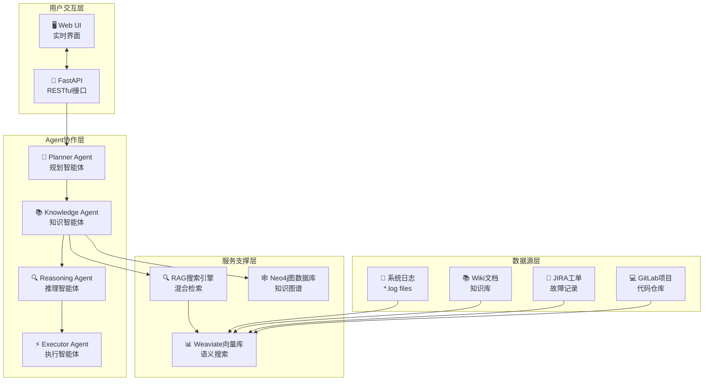
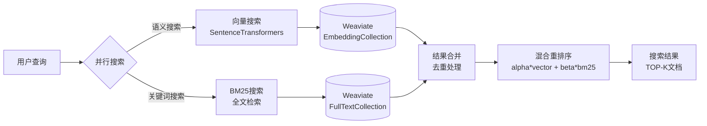

# AIOps Polaris - 智能运维平台 🤖

[](README.md)


## 🎬 实时演示

<div align="center">
  
  <p><em>🚀 Multi-Agent协作的实时根因分析(RCA)演示 - 展示Planner、Knowledge、Reasoning、Executor智能体的协作过程</em></p>
</div>

---

## 🌟 项目简介

**AIOps Polaris** 是一个基于**多智能体(Multi-Agent)**架构和**RAG(检索增强生成)**技术的下一代智能运维平台。通过Knowledge Agent、Reasoning Agent、Executor Agent等智能体的协作，实现自动化的根因分析、故障诊断和解决方案生成。

### ✨ 核心特性

🤖 **Multi-Agent协作系统**
- **Planner Agent**: 智能分析问题并制定执行计划
- **Knowledge Agent**: 实体识别 + 证据收集 + 拓扑分析  
- **Reasoning Agent**: 多维度根因推理和逻辑分析
- **Executor Agent**: 生成具体的解决方案和行动计划

🔍 **增强的RAG搜索引擎**
- **混合搜索**: 语义向量搜索 + BM25全文搜索
- **智能重排序**: 加权混合算法优化搜索结果
- **多数据源整合**: 日志文件、Wiki文档、JIRA工单、GitLab项目

🕸️ **知识图谱驱动**
- **Neo4j图数据库**: 建模复杂的服务依赖关系
- **实时拓扑分析**: 跨数据中心的服务关系图谱
- **影响范围评估**: 故障传播路径和影响分析

⚡ **实时流式处理**
- **长轮询机制**: 500ms实时状态更新
- **用户交互控制**: 支持任务中断和恢复
- **渐进式结果展示**: Agent执行过程可视化

📊 **全面的可观测性**
- **详细证据展示**: 显示具体日志文件名、行号、时间戳
- **Agent状态追踪**: 实时监控每个智能体的执行状态
- **中间结论记录**: 完整的推理过程和置信度评估

## 🏗️ 系统架构

### Multi-Agent协作架构


### RAG混合搜索引擎


## 🚀 快速开始

### 环境要求
```bash
Python >= 3.9
Docker & Docker Compose
8GB+ RAM (推荐16GB)
```

### 一键启动
```bash
# 克隆项目
git clone https://github.com/your-org/AIOpsPolaris.git
cd AIOpsPolaris

# 启动所有服务
docker-compose up -d

# 等待服务启动完成 (约2-3分钟)
docker-compose logs -f

# 访问Web界面
open http://localhost:8000
```

### 手动部署 (开发模式)
```bash
# 1. 安装Python依赖
pip install -r requirements.txt

# 2. 启动基础服务
docker-compose up -d weaviate neo4j redis

# 3. 配置环境变量
export OPENAI_API_KEY="your-openai-api-key"
export NEO4J_PASSWORD="your-neo4j-password"

# 4. 初始化数据
python scripts/init_knowledge_base.py

# 5. 启动应用
uvicorn src.api.main:app --host 0.0.0.0 --port 8000 --reload
```

## 🎯 使用示例

### Multi-Agent RCA分析
```python
# 1. 发起Multi-Agent分析任务
POST /chat/multi_agent
{
    "message": "service-b出现CPU使用率异常高，需要分析根因",
    "user_id": "ops-engineer"
}

# 响应: 
{
    "task_id": "ma_task_1234567890_abc123",
    "supports_interruption": true,
    "polling_interval": 500
}

# 2. 实时监控Agent执行状态 
GET /chat/multi_agent_status/{task_id}

# 3. (可选) 中断任务执行
POST /chat/interrupt/{task_id}
```

### Agent协作流程
```
🧠 Planner Agent  → 分析问题，制定5步执行计划
    ↓
📚 Knowledge Agent → 1️⃣ 实体识别: service-b, CPU
                   → 2️⃣ 证据收集: 搜索相关日志和文档  
                   → 3️⃣ 拓扑分析: 查询服务依赖关系
    ↓
🔍 Reasoning Agent → 基于证据进行多维度根因推理
                   → 时间序列分析 + 依赖影响评估
    ↓  
⚡ Executor Agent  → 生成优先级排序的解决方案
                   → 立即行动 + 预防措施 + 监控强化
```

## 🔧 技术栈

### 核心技术
| 组件 | 技术栈 | 版本 | 用途 |
|------|--------|------|------|
| **后端框架** | FastAPI | 0.104+ | 高性能异步Web框架 |
| **AI/ML** | OpenAI GPT | 4.0 | 大语言模型推理 |
| **向量搜索** | SentenceTransformers | latest | 文本嵌入生成 |
| **向量数据库** | Weaviate | 1.23+ | 语义搜索和向量存储 |
| **图数据库** | Neo4j | 5.0+ | 知识图谱和关系建模 |
| **缓存** | Redis | 7.0+ | 会话管理和结果缓存 |

### 性能指标

AIOps Polaris系统从多个维度评估性能，包括系统性能、算法有效性和运营效率。实际指标因硬件资源、数据量和工作负载特性而异。

#### 🖥️ **系统性能指标**
| 类别 | 关键指标 | 测量方法 |
|------|---------|----------|
| **API响应时间** | 请求延迟、吞吐量 | 通过Prometheus监控P50/P95/P99百分位数 |
| **资源利用率** | CPU、内存、磁盘I/O | 通过cAdvisor实时监控 |
| **数据库性能** | 查询执行时间、连接池效率 | 按操作计时和连接指标 |
| **缓存效率** | 命中/未命中比率、淘汰率 | Redis和嵌入缓存统计信息 |

#### 🤖 **多智能体系统指标**
| Agent类型 | 性能指标 | 评估方法 |
|-----------|---------|----------|
| **Planner Agent** | 任务分解质量、规划时间 | 生成计划的成功率、执行效率 |
| **Knowledge Agent** | 实体提取准确性、证据相关性 | NER的准确率/召回率、搜索结果相关性评分 |
| **Reasoning Agent** | 逻辑一致性、推理质量 | 推理路径连贯性、结论有效性 |
| **Executor Agent** | 解决方案有效性、行动可行性 | 实施成功率、解决方案采用指标 |

#### 🔍 **RAG搜索算法指标**
| 组件 | 质量衡量 | 技术指标 |
|------|---------|----------|
| **向量搜索** | 语义相关性、嵌入质量 | 余弦相似度分数、向量空间密度 |
| **BM25全文搜索** | 关键词匹配精度 | BM25评分分布、词频分析 |
| **混合重排序** | 综合搜索有效性 | 加权评分性能、排序相关性 |
| **知识检索** | 上下文准确性、来源多样性 | 检索文档相关性、来源覆盖率 |

#### 📊 **运营智能指标**
| 领域 | 有效性指标 | 评估标准 |
|------|-----------|----------|
| **根因分析** | 诊断准确性、解决时间 | 基准真值验证、专家评估 |
| **事件响应** | 告警精度、误报率 | 历史事件关联、噪声降低 |
| **知识发现** | 模式识别、异常检测 | 未知模式识别、预测准确性 |
| **决策支持** | 建议质量、用户接受度 | 行动成功率、操作员反馈评分 |

#### ⚡ **扩展性和效率基准**
- **并发处理**: 多用户会话处理能力
- **数据量扩展**: 随数据集增长的性能衰减曲线
- **资源弹性**: 负载变化时的自动扩缩响应
- **跨服务延迟**: 端到端工作流完成时间

*注意：具体性能数字取决于部署环境、数据特征和硬件规格。请使用内置监控工具(Prometheus + Grafana)对您的部署进行基准测试，以获得特定环境的指标。*

## 📚 详细文档

### 架构设计
- 📖 [Multi-Agent系统架构](docs/MULTI_AGENT_ARCHITECTURE.md)
- 🔍 [RAG搜索引擎架构](docs/RAG_ARCHITECTURE.md)  
- 🏗️ [整体系统设计](docs/system-design.md)
- 🔄 [系统交互流程](docs/system-interaction-flow.md)

### API文档
- 🔌 [REST API参考](docs/api-reference.md)
- 🤖 [Multi-Agent接口说明](docs/multi-agent-api.md)
- 📊 [状态码和错误处理](docs/error-handling.md)

### 运维指南
- 🚀 [部署和配置](docs/deployment.md)
- 📊 [监控和告警](docs/monitoring.md)
- 🔧 [故障排查指南](docs/troubleshooting.md)
- 🔒 [安全配置](docs/security.md)

## 🤝 贡献指南

我们欢迎社区贡献！请参考以下指南：

### 开发环境设置
```bash
# 1. Fork项目并克隆
git clone https://github.com/your-username/AIOpsPolaris.git

# 2. 创建开发分支
git checkout -b feature/your-feature-name

# 3. 安装开发依赖
pip install -r requirements-dev.txt

# 4. 运行测试
python -m pytest tests/ -v

# 5. 代码质量检查
black src/ tests/
flake8 src/ tests/
mypy src/
```

### 提交规范
```bash
# 功能开发
git commit -m "feat(agent): add new reasoning agent for log analysis"

# 问题修复  
git commit -m "fix(rag): resolve unknown_file display issue in UI"

# 文档更新
git commit -m "docs(readme): add multi-agent architecture diagram"

# 性能优化
git commit -m "perf(search): optimize vector search with HNSW index"
```

## 📈 发展路线图

### 已完成 ✅
- [x] Multi-Agent协作框架
- [x] RAG混合搜索引擎  
- [x] 实时流式处理
- [x] Neo4j知识图谱集成
- [x] 详细证据展示系统
- [x] 用户交互控制

### 进行中 🚧
- [ ] 分布式Agent部署
- [ ] WebSocket实时通信
- [ ] 更多数据源集成 (Prometheus, Elasticsearch)
- [ ] Agent协作可视化界面
- [ ] 自动化测试覆盖率提升

### 计划中 📋
- [ ] 联邦学习Agent训练
- [ ] 多租户支持
- [ ] 移动端适配
- [ ] 插件化架构
- [ ] 企业级安全认证

## 📄 许可证

本项目采用 [Apache 2.0 License](LICENSE) 开源许可证。

---

<div align="center">
  <sub>Built with ❤️ by the AIOps Polaris Team</sub>
</div>