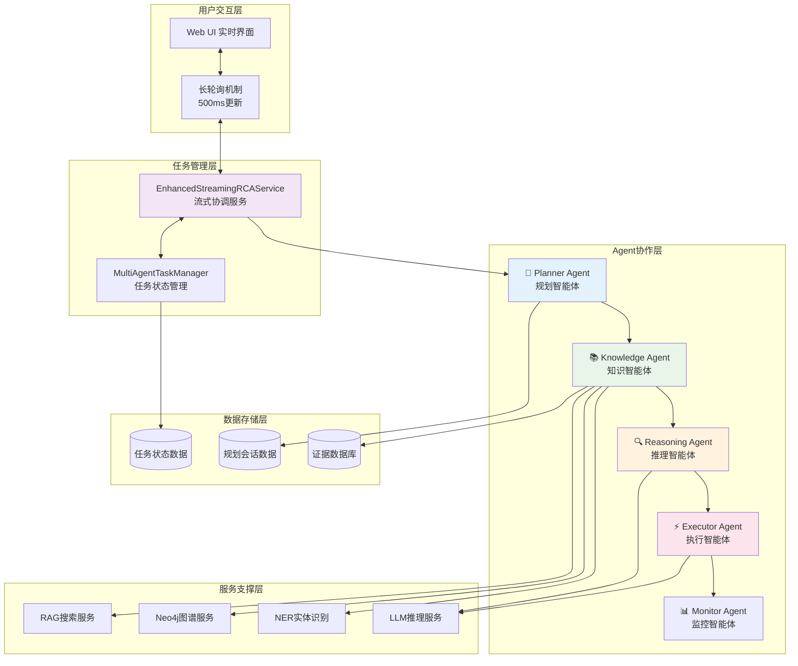
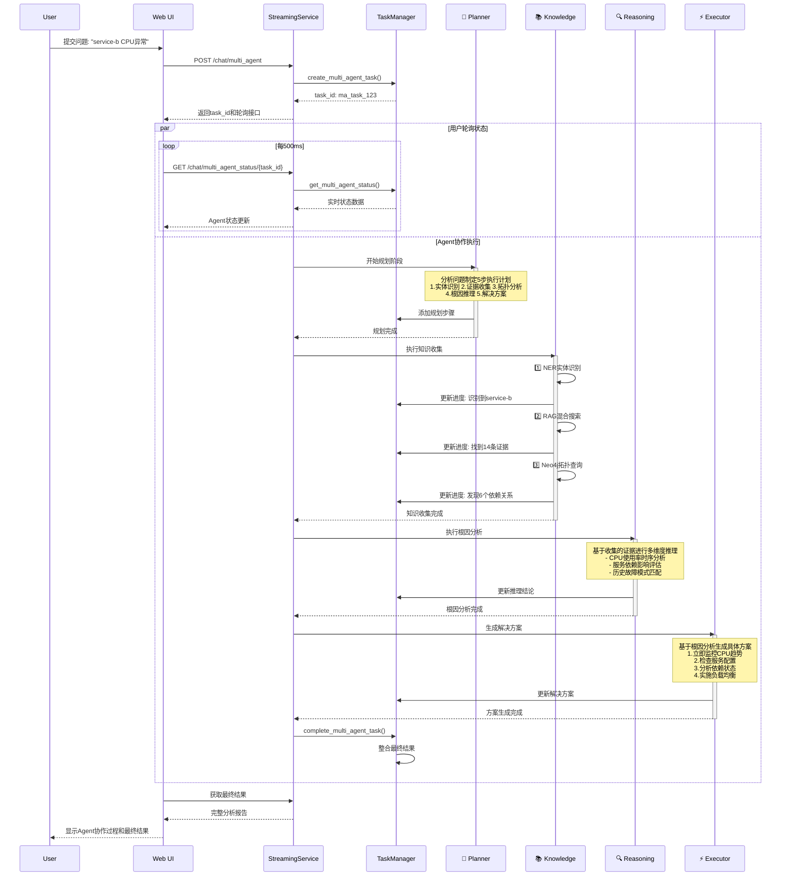
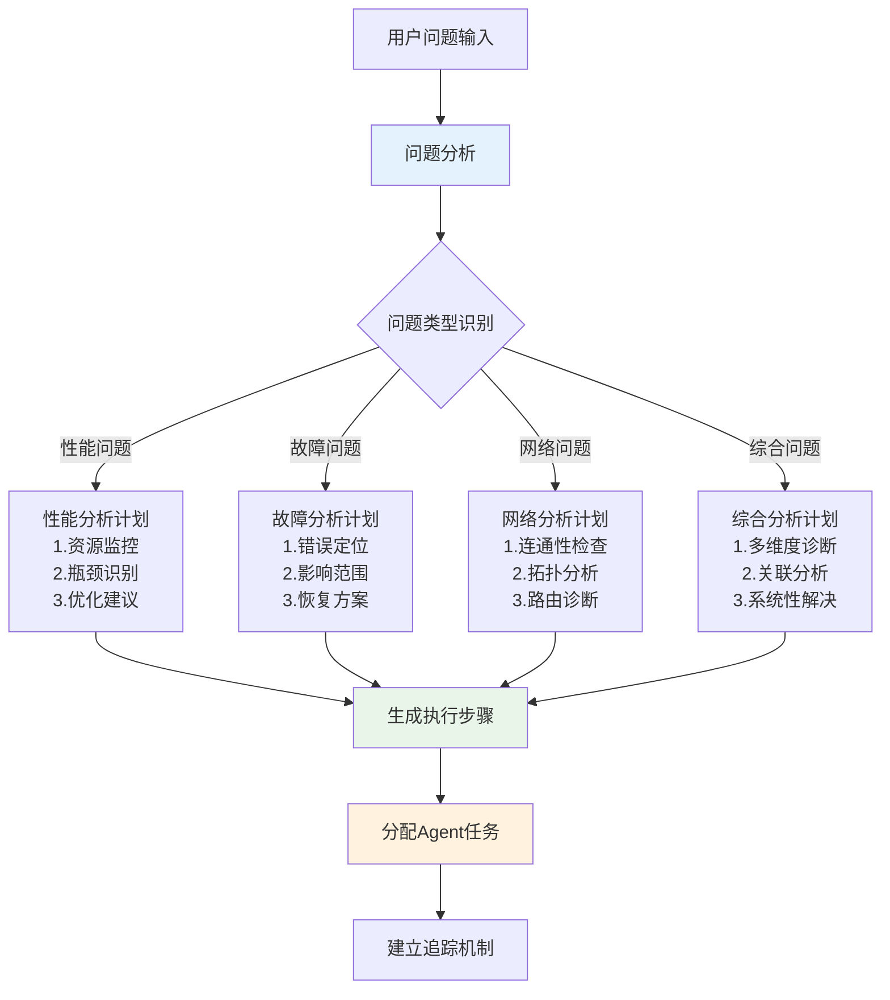
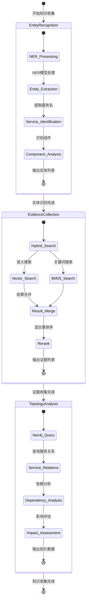
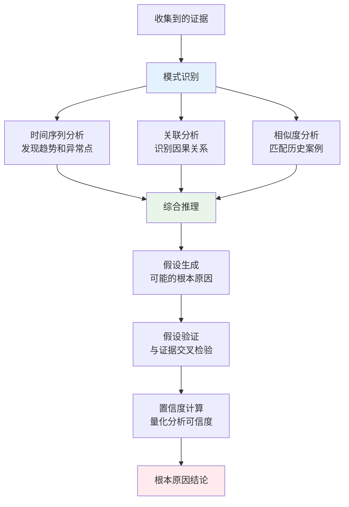
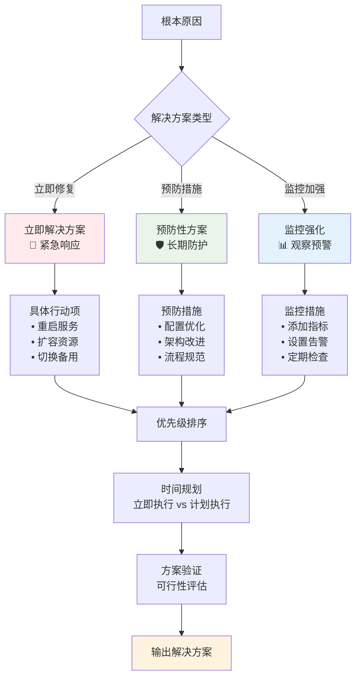
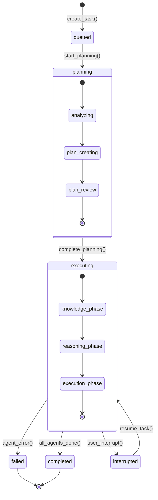

# Multi-Agent 智能RCA分析系统架构

## 🤖 Multi-Agent系统整体架构



## 🔄 Agent协作工作流



## 🧠 Planner Agent 详细设计

### 规划策略


### 规划数据结构
```python
@dataclass
class PlanningSession:
    session_id: str          # plan_1, plan_2...
    plan_version: int        # 规划版本号
    plan_description: str    # 规划描述
    steps: List[PlanStep]    # 执行步骤列表
    status: str              # planning, executing, completed
    reasoning: str           # Planner推理过程
    
@dataclass  
class PlanStep:
    step_id: str            # step_1, step_2...
    step_name: str          # "实体识别", "证据收集"
    description: str        # 详细描述
    assigned_agent: str     # "knowledge", "reasoning" 
    dependencies: List[str] # 依赖的其他步骤
    status: str            # pending, executing, completed
```

## 📚 Knowledge Agent 详细设计

### 三阶段知识收集


### 证据数据结构
```python
# RAG搜索返回的证据结构
{
    "content": "[ERROR] service-b: CPU usage critical: 89%",
    "log_file": "incident_001_service_b_cpu_overload.log",
    "service_name": "service-b", 
    "source_type": "logs",
    "timestamp": "2025-08-20T14:29:33.123Z",
    "search_type": "hybrid",
    "score": 0.8489469289779663,
    "vector_score": 0.8489469289779663,
    "bm25_score": 0.0,
    "hybrid_score": 0.5093681573867798
}

# Neo4j拓扑数据结构
{
    "services": [
        {
            "name": "service-b",
            "datacenter": "DC-East", 
            "status": "active"
        }
    ],
    "relationships": [
        {
            "from_service": "service-a",
            "to_service": "service-b",
            "relation": "DEPENDS_ON",
            "relation_data": {
                "timeout": "10s",
                "weight": 0.8
            }
        }
    ]
}
```

## 🔍 Reasoning Agent 详细设计

### 推理逻辑链


### 推理算法
```python
class ReasoningEngine:
    def analyze_temporal_patterns(self, evidence_list):
        """时间序列模式分析"""
        # 按时间排序证据
        sorted_evidence = sorted(evidence_list, key=lambda x: x['timestamp'])
        
        # 检测异常时间点
        anomaly_points = detect_anomalies(sorted_evidence)
        
        # 分析事件序列
        event_sequence = extract_event_sequence(sorted_evidence)
        
        return {
            "timeline": sorted_evidence,
            "anomalies": anomaly_points, 
            "sequence": event_sequence
        }
    
    def correlate_service_dependencies(self, topology_data, evidence):
        """服务依赖关联分析"""
        affected_services = extract_services_from_evidence(evidence)
        dependency_chain = build_dependency_chain(topology_data, affected_services)
        
        # 计算故障传播路径
        propagation_paths = calculate_failure_propagation(dependency_chain)
        
        return {
            "affected_services": affected_services,
            "dependency_impact": dependency_chain,
            "propagation": propagation_paths
        }
```

## ⚡ Executor Agent 详细设计

### 解决方案生成策略


### 解决方案数据结构
```python
@dataclass
class Solution:
    priority: int           # 1-5优先级
    description: str        # 解决方案描述
    type: str              # immediate, follow_up, monitoring
    category: str          # restart, scale, config, monitor
    estimated_time: str    # 预计执行时间
    risk_level: str        # low, medium, high
    dependencies: List[str] # 前置条件
    validation_steps: List[str] # 验证步骤
    
# 生成的解决方案示例
solutions = [
    {
        "priority": 1,
        "description": "立即监控CPU使用率趋势，识别高消耗进程",
        "type": "immediate", 
        "category": "monitor",
        "estimated_time": "5分钟",
        "risk_level": "low"
    },
    {
        "priority": 2, 
        "description": "检查服务配置，调整资源限制参数",
        "type": "immediate",
        "category": "config", 
        "estimated_time": "15分钟",
        "risk_level": "medium"
    }
]
```

## 📊 任务状态管理

### 状态机设计


### 进度计算算法
```python
def calculate_overall_progress(task_info):
    """计算整体进度"""
    agents = task_info.agents
    total_agents = len(agents)
    
    # 每个Agent的权重
    agent_weights = {
        'planner': 0.15,      # 规划阶段 15%
        'knowledge': 0.40,    # 知识收集 40% (最重要)
        'reasoning': 0.25,    # 推理分析 25%
        'executor': 0.20      # 解决方案 20%
    }
    
    progress = 0.0
    for agent_id, agent in agents.items():
        weight = agent_weights.get(agent_id, 1.0/total_agents)
        
        if agent.status == 'done':
            progress += weight * 1.0
        elif agent.status == 'working':  
            progress += weight * agent.progress
        # waiting或failed状态不计入进度
    
    return min(progress, 1.0)
```

## 🔄 实时交互机制

### 长轮询实现
```javascript
// 前端轮询逻辑
class MultiAgentMonitor {
    constructor(taskId) {
        this.taskId = taskId;
        this.pollInterval = 500; // 500ms轮询间隔
        this.isPolling = false;
    }
    
    async startPolling() {
        this.isPolling = true;
        while (this.isPolling) {
            try {
                const status = await this.fetchTaskStatus();
                this.updateUI(status);
                
                if (status.status === 'completed' || status.status === 'failed') {
                    this.stopPolling();
                    break;
                }
                
                await this.delay(this.pollInterval);
            } catch (error) {
                console.error('轮询错误:', error);
                await this.delay(this.pollInterval * 2); // 错误时延长间隔
            }
        }
    }
    
    async fetchTaskStatus() {
        const response = await fetch(`/chat/multi_agent_status/${this.taskId}`);
        return await response.json();
    }
    
    updateUI(status) {
        // 更新Agent状态显示
        this.renderAgentStatus(status.agents);
        // 更新进度条
        this.updateProgressBar(status.overall_progress);
        // 显示中间结论
        this.displayIntermediateResults(status.intermediate_conclusions);
    }
}
```

### 用户中断机制
```python
async def interrupt_multi_agent_task(task_id: str):
    """用户中断任务执行"""
    success = multi_agent_task_manager.interrupt_task(
        task_id, 
        reason="用户请求中断"
    )
    
    # 取消正在运行的异步任务
    if task_id in streaming_service.running_tasks:
        async_task = streaming_service.running_tasks[task_id]
        if not async_task.done():
            async_task.cancel()
            try:
                await async_task
            except asyncio.CancelledError:
                logger.info(f"任务 {task_id} 已成功中断")
    
    return {"success": success, "message": "任务已中断"}
```

## 📈 性能优化与监控

### Agent协作性能指标
```yaml
执行效率指标:
  - 平均任务完成时间: < 30秒
  - Agent切换延迟: < 100ms
  - 并发任务处理能力: > 10个/分钟

协作质量指标:  
  - 规划准确率: > 90%
  - 证据收集完整性: > 95%
  - 推理逻辑一致性: > 90%
  - 解决方案适用性: > 85%

用户体验指标:
  - 状态更新及时性: < 500ms
  - 中断响应时间: < 1秒  
  - UI渲染流畅度: > 60fps
```

### 监控和调试工具
```python
# Agent性能监控
class AgentMonitor:
    def track_agent_performance(self, agent_id, start_time, end_time, result):
        duration = end_time - start_time
        success = result.get('success', False)
        
        metrics = {
            'agent_id': agent_id,
            'duration_ms': duration * 1000,
            'success': success,
            'timestamp': datetime.now(),
            'memory_usage': get_memory_usage(),
            'cpu_usage': get_cpu_usage()
        }
        
        self.store_metrics(metrics)
        self.alert_if_anomaly(metrics)
    
    def generate_performance_report(self, time_range):
        """生成Agent性能报告"""
        return {
            'agent_efficiency': self.calculate_efficiency_by_agent(),
            'bottleneck_analysis': self.identify_bottlenecks(), 
            'optimization_suggestions': self.suggest_optimizations()
        }
```

---

> 💡 **设计原则**:
> - **松耦合**: Agent之间通过消息传递协作，避免直接依赖
> - **可观察性**: 每个步骤都有详细的状态跟踪和日志记录  
> - **容错性**: 单个Agent失败不影响整体流程，支持重试和降级
> - **可扩展性**: 易于添加新的Agent类型和协作模式
> - **用户体验**: 实时状态反馈，支持用户交互控制