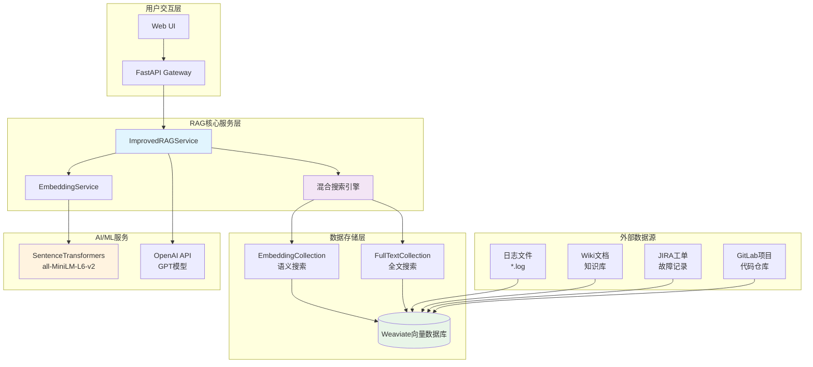
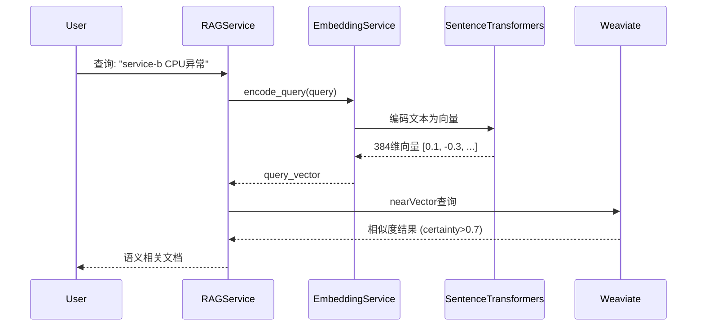
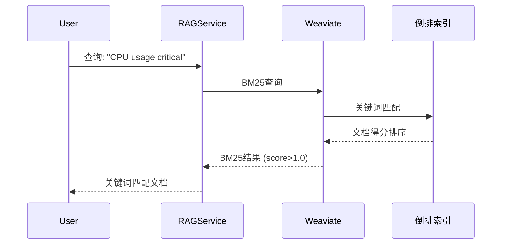

# RAG (检索增强生成) 系统架构详解

## 📊 RAG系统整体架构



## 🔍 混合搜索算法详解

### 1. 向量搜索 (Vector Search)


### 2. BM25全文搜索 (Full-Text Search)  


### 3. 混合重排序算法
```python
# 混合得分计算公式
hybrid_score = α × vector_score + (1-α) × bm25_score_normalized

其中:
- α = 0.6 (向量搜索权重)
- vector_score: 语义相似度得分 (0-1)  
- bm25_score_normalized: 归一化BM25得分 (0-1)
```

## 💾 数据存储架构

### Weaviate Collection设计

#### EmbeddingCollection (语义搜索)
```json
{
  "class": "EmbeddingCollection",
  "properties": [
    {"name": "content", "dataType": ["text"], "description": "文档内容"},
    {"name": "source_type", "dataType": ["text"], "description": "数据源类型"},
    {"name": "service_name", "dataType": ["text"], "description": "服务名称"},
    {"name": "log_file", "dataType": ["text"], "description": "日志文件名"},
    {"name": "timestamp", "dataType": ["text"], "description": "时间戳"},
    {"name": "line_number", "dataType": ["int"], "description": "行号"}
  ],
  "vectorizer": "none",
  "vectorIndexType": "hnsw"
}
```

#### FullTextCollection (全文搜索)
```json
{
  "class": "FullTextCollection", 
  "properties": [
    // 相同字段结构
  ],
  "invertedIndexConfig": {
    "bm25": {"k1": 1.2, "b": 0.75},
    "stopwords": {"preset": "en"}
  }
}
```

## 🔄 搜索流程详解

```mermaid
flowchart TD
    START([用户查询]) --> QUERY{解析查询}
    
    QUERY -->|并行执行| VEC[向量搜索]
    QUERY -->|并行执行| BM25[BM25搜索]
    
    VEC --> VEC_EMB[生成查询向量<br/>384维 SentenceTransformers]
    VEC_EMB --> VEC_SEARCH[在EmbeddingCollection中<br/>nearVector搜索]
    VEC_SEARCH --> VEC_RESULT[语义相似结果<br/>certainty > 0.1]
    
    BM25 --> BM25_SEARCH[在FullTextCollection中<br/>BM25关键词搜索] 
    BM25_SEARCH --> BM25_RESULT[关键词匹配结果<br/>score > 0.0]
    
    VEC_RESULT --> MERGE[结果合并去重]
    BM25_RESULT --> MERGE
    
    MERGE --> RERANK[混合重排序<br/>α×vector + (1-α)×bm25]
    RERANK --> FILTER[结果过滤和限制<br/>top-k结果]
    FILTER --> FORMAT[格式化输出<br/>添加搜索元数据]
    FORMAT --> END([返回搜索结果])
    
    style VEC fill:#e3f2fd
    style BM25 fill:#f3e5f5  
    style MERGE fill:#e8f5e8
    style RERANK fill:#fff3e0
```

## 🎯 数据源分类与处理

### 1. 日志文件 (logs)
```yaml
识别标识: source_type = "logs"
文件格式: *.log 文件
数据特征:
  - log_file: "incident_001_service_b_cpu_overload.log"
  - service_name: "service-b" 
  - 包含时间戳、日志级别、具体错误信息
处理策略:
  - 按时间序列索引
  - 错误级别加权（ERROR > WARN > INFO）
  - 服务名称精确匹配
```

### 2. Wiki知识库 (wiki)
```yaml
识别标识: source_type = "wiki"
内容类型: 技术文档、最佳实践、故障手册
数据特征:
  - log_file: "wiki"
  - service_name: "documentation"
  - 结构化知识内容
处理策略:
  - 语义搜索优先
  - 章节和标题加权
  - 关键词提取和标签化
```

### 3. JIRA工单 (jira) 
```yaml
识别标识: source_type = "jira"
内容类型: 故障工单、问题描述、解决方案
数据特征:
  - log_file: "jira"
  - service_name: "unknown" (需要从内容推断)
  - Issue描述和解决记录
处理策略:
  - 问题分类匹配
  - 解决方案优先级
  - 历史案例相似度
```

### 4. GitLab代码 (gitlab)
```yaml
识别标识: source_type = "gitlab" 
内容类型: 代码提交、问题修复、配置变更
数据特征:
  - log_file: "gitlab"
  - service_name: "unknown" (从项目信息推断)
  - 技术变更记录
处理策略:
  - 代码变更影响分析
  - 配置变更关联
  - 技术债务识别
```

## ⚡ 性能优化策略

### 1. 索引优化
```yaml
向量索引 (HNSW):
  - maxConnections: 64
  - efConstruction: 128
  - ef: 动态调整 (100-500)
  - distance: cosine相似度

全文索引 (BM25):
  - k1: 1.2 (词频饱和度)
  - b: 0.75 (文档长度归一化)
  - cleanupInterval: 60秒
```

### 2. 缓存策略
```yaml
Embedding缓存:
  - 本地文件缓存: cache/embeddings/
  - 缓存键: query文本的MD5哈希
  - 缓存过期: 7天

查询结果缓存:
  - Redis缓存: 热门查询结果
  - 过期时间: 1小时
  - LRU淘汰策略
```

### 3. 并发优化
```python
async def hybrid_search(self, query: str, limit: int = 10):
    # 并行执行向量搜索和BM25搜索
    vector_task = asyncio.create_task(self.vector_search(query, limit))
    bm25_task = asyncio.create_task(self.bm25_search(query, limit))
    
    vector_results, bm25_results = await asyncio.gather(
        vector_task, bm25_task
    )
    
    # 混合重排序
    return self.rerank_results(vector_results, bm25_results, query)
```

## 📈 监控与调试

### 关键指标
```yaml
搜索性能指标:
  - 平均响应时间: < 20ms
  - P95响应时间: < 50ms  
  - 搜索成功率: > 95%

搜索质量指标:
  - 向量搜索召回率: 监控语义相关性
  - BM25搜索精确率: 监控关键词匹配
  - 混合搜索F1得分: 平衡precision和recall

数据质量指标:
  - 索引健康状态: shard状态监控
  - 数据一致性: collection数量对比
  - 向量质量: embedding分布检查
```

### 调试工具
```bash
# 检查索引状态
curl -X GET "http://localhost:8080/v1/schema/FullTextCollection/shards"

# 测试搜索性能
python test_rag_performance.py

# 验证向量质量  
python test_embedding_quality.py
```

---

> 💡 **最佳实践**: 
> - 定期监控搜索性能和质量指标
> - 根据用户反馈调整混合搜索权重
> - 保持数据源的及时更新和索引重建
> - 使用A/B测试验证搜索算法改进效果