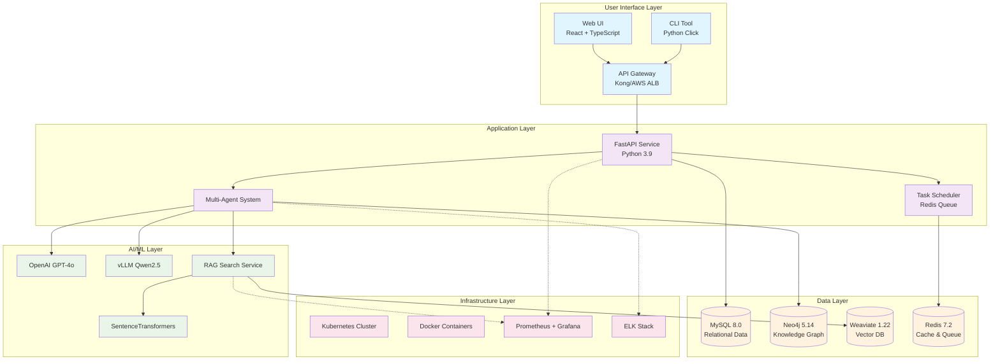
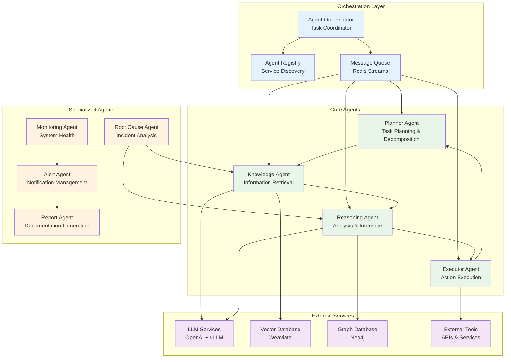
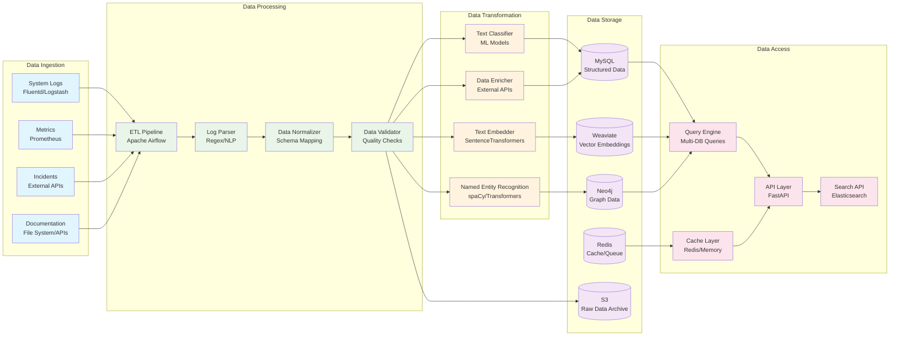
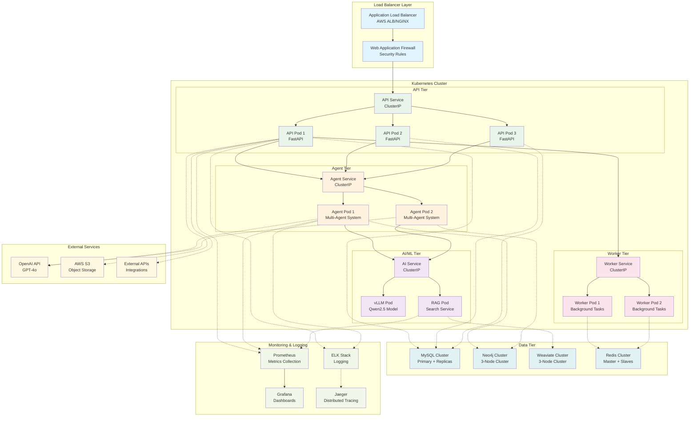
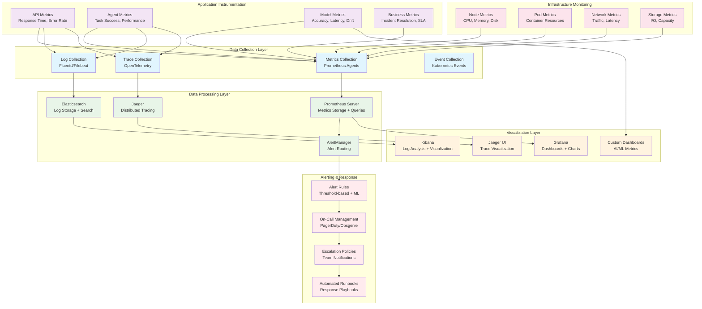
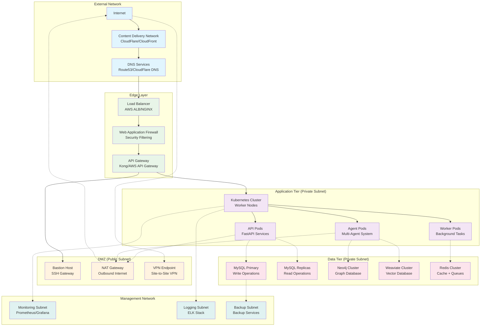

# AIOps Polaris Architecture Diagrams and Charts

## Document Information
- **Document Title**: Architecture Diagrams and Charts
- **Version**: 1.0
- **Date**: 2025-09-01
- **Author**: AI System Architect
- **Status**: Draft

## System Overview Architecture



## Multi-Agent Architecture



## RAG Search Architecture

```mermaid
graph TB
    subgraph "Input Processing"
        USER_QUERY[User Query]
        QUERY_PROCESSOR[Query Processor<br/>Text Cleaning & Normalization]
        INTENT_CLASSIFIER[Intent Classifier<br/>Query Type Detection]
    end
    
    subgraph "Retrieval Layer"
        VECTOR_SEARCH[Vector Search<br/>Semantic Similarity]
        BM25_SEARCH[BM25 Search<br/>Keyword Matching]
        GRAPH_SEARCH[Graph Search<br/>Entity Relationships]
        HYBRID_RANKER[Hybrid Ranker<br/>Score Fusion]
    end
    
    subgraph "Knowledge Sources"
        INCIDENT_DOCS[Incident Documentation]
        RUNBOOKS[Operational Runbooks]
        LOGS[System Logs]
        METRICS[Performance Metrics]
        KB[Knowledge Base Articles]
    end
    
    subgraph "Vector Processing"
        EMBEDDING_MODEL[SentenceTransformers<br/>all-MiniLM-L6-v2]
        WEAVIATE_DB[(Weaviate<br/>Vector Database)]
        VECTOR_INDEX[Vector Index<br/>HNSW Algorithm]
    end
    
    subgraph "Graph Processing"
        NEO4J_DB[(Neo4j<br/>Knowledge Graph)]
        ENTITY_LINKING[Entity Linking<br/>NER + Linking]
        RELATION_EXTRACTION[Relation Extraction<br/>Knowledge Graph Queries]
    end
    
    subgraph "Generation Layer"
        CONTEXT_BUILDER[Context Builder<br/>Retrieved Info Assembly]
        LLM_GENERATOR[LLM Generator<br/>GPT-4o Response]
        ANSWER_VALIDATOR[Answer Validator<br/>Quality Checking]
        RESPONSE_FORMATTER[Response Formatter<br/>Structured Output]
    end
    
    %% Input flow
    USER_QUERY --> QUERY_PROCESSOR
    QUERY_PROCESSOR --> INTENT_CLASSIFIER
    
    %% Retrieval paths
    INTENT_CLASSIFIER --> VECTOR_SEARCH
    INTENT_CLASSIFIER --> BM25_SEARCH
    INTENT_CLASSIFIER --> GRAPH_SEARCH
    
    %% Vector search path
    VECTOR_SEARCH --> EMBEDDING_MODEL
    EMBEDDING_MODEL --> WEAVIATE_DB
    WEAVIATE_DB --> VECTOR_INDEX
    
    %% Graph search path
    GRAPH_SEARCH --> ENTITY_LINKING
    ENTITY_LINKING --> NEO4J_DB
    NEO4J_DB --> RELATION_EXTRACTION
    
    %% Knowledge sources
    INCIDENT_DOCS --> WEAVIATE_DB
    RUNBOOKS --> WEAVIATE_DB
    LOGS --> WEAVIATE_DB
    METRICS --> NEO4J_DB
    KB --> WEAVIATE_DB
    
    %% Ranking and generation
    VECTOR_SEARCH --> HYBRID_RANKER
    BM25_SEARCH --> HYBRID_RANKER
    GRAPH_SEARCH --> HYBRID_RANKER
    HYBRID_RANKER --> CONTEXT_BUILDER
    CONTEXT_BUILDER --> LLM_GENERATOR
    LLM_GENERATOR --> ANSWER_VALIDATOR
    ANSWER_VALIDATOR --> RESPONSE_FORMATTER
    
    classDef input fill:#e1f5fe
    classDef retrieval fill:#e8f5e8
    classDef knowledge fill:#fff3e0
    classDef vector fill:#f3e5f5
    classDef graph fill:#fce4ec
    classDef generation fill:#e0f2f1
    
    class USER_QUERY,QUERY_PROCESSOR,INTENT_CLASSIFIER input
    class VECTOR_SEARCH,BM25_SEARCH,GRAPH_SEARCH,HYBRID_RANKER retrieval
    class INCIDENT_DOCS,RUNBOOKS,LOGS,METRICS,KB knowledge
    class EMBEDDING_MODEL,WEAVIATE_DB,VECTOR_INDEX vector
    class NEO4J_DB,ENTITY_LINKING,RELATION_EXTRACTION graph
    class CONTEXT_BUILDER,LLM_GENERATOR,ANSWER_VALIDATOR,RESPONSE_FORMATTER generation
```

## Data Flow Architecture



## Deployment Architecture



## Security Architecture

```mermaid
graph TB
    subgraph "Perimeter Security"
        INTERNET[Internet]
        FIREWALL[Network Firewall<br/>Security Groups]
        WAF[Web Application Firewall<br/>OWASP Rules]
        DDoS[DDoS Protection<br/>AWS Shield/CloudFlare]
    end
    
    subgraph "API Security"
        API_GW[API Gateway<br/>Rate Limiting + Auth]
        JWT_VALIDATOR[JWT Validator<br/>Token Verification]
        RBAC[RBAC Engine<br/>Role-Based Access]
        API_AUDIT[API Audit Logger<br/>Request Tracking]
    end
    
    subgraph "Application Security"
        INPUT_VALIDATION[Input Validation<br/>XSS/Injection Prevention]
        ENCRYPTION[Data Encryption<br/>AES-256 + TLS]
        SECRET_MGMT[Secret Management<br/>HashiCorp Vault]
        SESSION_MGMT[Session Management<br/>Secure Cookies]
    end
    
    subgraph "Infrastructure Security"
        VPC[Virtual Private Cloud<br/>Network Isolation]
        IAM[Identity & Access Management<br/>AWS IAM/RBAC]
        CONTAINER_SEC[Container Security<br/>Image Scanning]
        NETWORK_SEG[Network Segmentation<br/>Security Groups]
    end
    
    subgraph "Data Security"
        DB_ENCRYPTION[Database Encryption<br/>Encryption at Rest]
        BACKUP_ENCRYPTION[Backup Encryption<br/>Encrypted Backups]
        DATA_MASKING[Data Masking<br/>PII Protection]
        ACCESS_AUDIT[Access Auditing<br/>Data Access Logs]
    end
    
    subgraph "Monitoring & Response"
        SIEM[SIEM System<br/>Security Event Monitoring]
        THREAT_DETECTION[Threat Detection<br/>ML-based Analysis]
        INCIDENT_RESPONSE[Incident Response<br/>Automated Playbooks]
        COMPLIANCE_MONITOR[Compliance Monitor<br/>Policy Enforcement]
    end
    
    %% Perimeter security flow
    INTERNET --> DDoS
    DDoS --> FIREWALL
    FIREWALL --> WAF
    WAF --> API_GW
    
    %% API security flow
    API_GW --> JWT_VALIDATOR
    JWT_VALIDATOR --> RBAC
    RBAC --> API_AUDIT
    
    %% Application security
    API_AUDIT --> INPUT_VALIDATION
    INPUT_VALIDATION --> ENCRYPTION
    ENCRYPTION --> SECRET_MGMT
    SECRET_MGMT --> SESSION_MGMT
    
    %% Infrastructure security
    SESSION_MGMT -.-> VPC
    VPC --> IAM
    IAM --> CONTAINER_SEC
    CONTAINER_SEC --> NETWORK_SEG
    
    %% Data security
    NETWORK_SEG -.-> DB_ENCRYPTION
    DB_ENCRYPTION --> BACKUP_ENCRYPTION
    BACKUP_ENCRYPTION --> DATA_MASKING
    DATA_MASKING --> ACCESS_AUDIT
    
    %% Monitoring connections
    API_AUDIT -.-> SIEM
    ACCESS_AUDIT -.-> SIEM
    SIEM --> THREAT_DETECTION
    THREAT_DETECTION --> INCIDENT_RESPONSE
    INCIDENT_RESPONSE --> COMPLIANCE_MONITOR
    
    classDef perimeter fill:#ffebee
    classDef api fill:#e8eaf6
    classDef app fill:#e0f2f1
    classDef infra fill:#fff3e0
    classDef data fill:#f3e5f5
    classDef monitoring fill:#e1f5fe
    
    class INTERNET,FIREWALL,WAF,DDoS perimeter
    class API_GW,JWT_VALIDATOR,RBAC,API_AUDIT api
    class INPUT_VALIDATION,ENCRYPTION,SECRET_MGMT,SESSION_MGMT app
    class VPC,IAM,CONTAINER_SEC,NETWORK_SEG infra
    class DB_ENCRYPTION,BACKUP_ENCRYPTION,DATA_MASKING,ACCESS_AUDIT data
    class SIEM,THREAT_DETECTION,INCIDENT_RESPONSE,COMPLIANCE_MONITOR monitoring
```



## CI/CD Pipeline Architecture

```mermaid
graph LR
    subgraph "Source Control"
        GITHUB[GitHub Repository<br/>Source Code]
        BRANCH[Feature Branch<br/>Development]
        PR[Pull Request<br/>Code Review]
    end
    
    subgraph "CI Pipeline"
        TRIGGER[Webhook Trigger<br/>GitHub Actions]
        CHECKOUT[Code Checkout<br/>Latest Commit]
        LINT[Code Linting<br/>flake8 + black]
        UNIT_TEST[Unit Tests<br/>pytest + coverage]
        SECURITY_SCAN[Security Scan<br/>bandit + safety]
        BUILD[Build Artifacts<br/>Docker Images]
    end
    
    subgraph "Quality Gates"
        COVERAGE[Coverage Check<br/>> 80% Required]
        PERF_TEST[Performance Tests<br/>Load Testing]
        INTEGRATION[Integration Tests<br/>API + DB Tests]
        SECURITY_GATE[Security Gate<br/>No Critical CVEs]
    end
    
    subgraph "Artifact Management"
        REGISTRY[Container Registry<br/>GHCR/ECR]
        HELM_REPO[Helm Repository<br/>Chart Storage]
        ARTIFACT_SIGN[Artifact Signing<br/>Cosign]
        VULNERABILITY_SCAN[Vulnerability Scan<br/>Trivy/Snyk]
    end
    
    subgraph "CD Pipeline"
        DEPLOY_DEV[Deploy to Dev<br/>Automatic]
        E2E_TEST[E2E Tests<br/>Cypress/Playwright]
        DEPLOY_STAGING[Deploy to Staging<br/>Manual Approval]
        SMOKE_TEST[Smoke Tests<br/>Health Checks]
        DEPLOY_PROD[Deploy to Production<br/>Manual Approval]
    end
    
    subgraph "Monitoring"
        ROLLOUT_MONITOR[Rollout Monitoring<br/>Metrics + Alerts]
        HEALTH_CHECK[Health Checks<br/>Readiness Probes]
        ROLLBACK[Auto Rollback<br/>On Failure]
        NOTIFICATION[Notifications<br/>Slack + Email]
    end
    
    %% Source control flow
    GITHUB --> BRANCH
    BRANCH --> PR
    PR --> TRIGGER
    
    %% CI pipeline flow
    TRIGGER --> CHECKOUT
    CHECKOUT --> LINT
    LINT --> UNIT_TEST
    UNIT_TEST --> SECURITY_SCAN
    SECURITY_SCAN --> BUILD
    
    %% Quality gates flow
    BUILD --> COVERAGE
    COVERAGE --> PERF_TEST
    PERF_TEST --> INTEGRATION
    INTEGRATION --> SECURITY_GATE
    
    %% Artifact management flow
    SECURITY_GATE --> REGISTRY
    REGISTRY --> HELM_REPO
    HELM_REPO --> ARTIFACT_SIGN
    ARTIFACT_SIGN --> VULNERABILITY_SCAN
    
    %% CD pipeline flow
    VULNERABILITY_SCAN --> DEPLOY_DEV
    DEPLOY_DEV --> E2E_TEST
    E2E_TEST --> DEPLOY_STAGING
    DEPLOY_STAGING --> SMOKE_TEST
    SMOKE_TEST --> DEPLOY_PROD
    
    %% Monitoring flow
    DEPLOY_PROD --> ROLLOUT_MONITOR
    ROLLOUT_MONITOR --> HEALTH_CHECK
    HEALTH_CHECK --> ROLLBACK
    ROLLBACK --> NOTIFICATION
    
    classDef source fill:#e1f5fe
    classDef ci fill:#e8f5e8
    classDef quality fill:#fff3e0
    classDef artifact fill:#f3e5f5
    classDef cd fill:#fce4ec
    classDef monitoring fill:#e0f2f1
    
    class GITHUB,BRANCH,PR source
    class TRIGGER,CHECKOUT,LINT,UNIT_TEST,SECURITY_SCAN,BUILD ci
    class COVERAGE,PERF_TEST,INTEGRATION,SECURITY_GATE quality
    class REGISTRY,HELM_REPO,ARTIFACT_SIGN,VULNERABILITY_SCAN artifact
    class DEPLOY_DEV,E2E_TEST,DEPLOY_STAGING,SMOKE_TEST,DEPLOY_PROD cd
    class ROLLOUT_MONITOR,HEALTH_CHECK,ROLLBACK,NOTIFICATION monitoring
```



## Monitoring and Observability Architecture



## Network Architecture



## Summary

This comprehensive architecture documentation provides visual representations of all major system components and their interactions. The diagrams cover:

1. **System Overview**: High-level architecture showing all layers
2. **Multi-Agent Architecture**: Detailed agent interactions and orchestration
3. **RAG Search Architecture**: Information retrieval and generation pipeline
4. **Data Flow Architecture**: Data ingestion, processing, and access patterns
5. **Deployment Architecture**: Kubernetes-based container orchestration
6. **Security Architecture**: Multi-layered security controls and monitoring
7. **CI/CD Pipeline**: Automated build, test, and deployment processes
8. **Monitoring Architecture**: Observability and alerting infrastructure
9. **Network Architecture**: Network topology and security boundaries

These diagrams serve as technical blueprints for system implementation, maintenance, and scaling decisions.

---

**Document Control:**
- Last Updated: 2025-09-01
- Next Review Date: **TBD**: 2025-12-01
- Document Owner: Architecture Team
- Approval Status: Draft - Pending Review