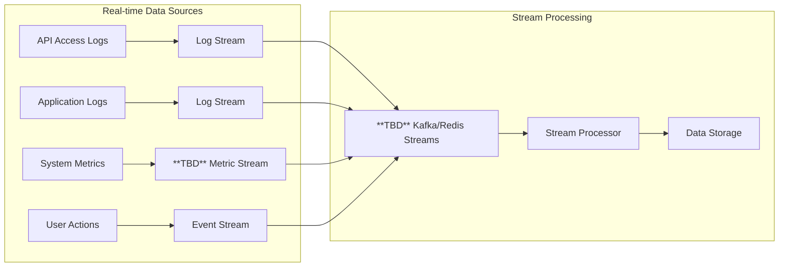
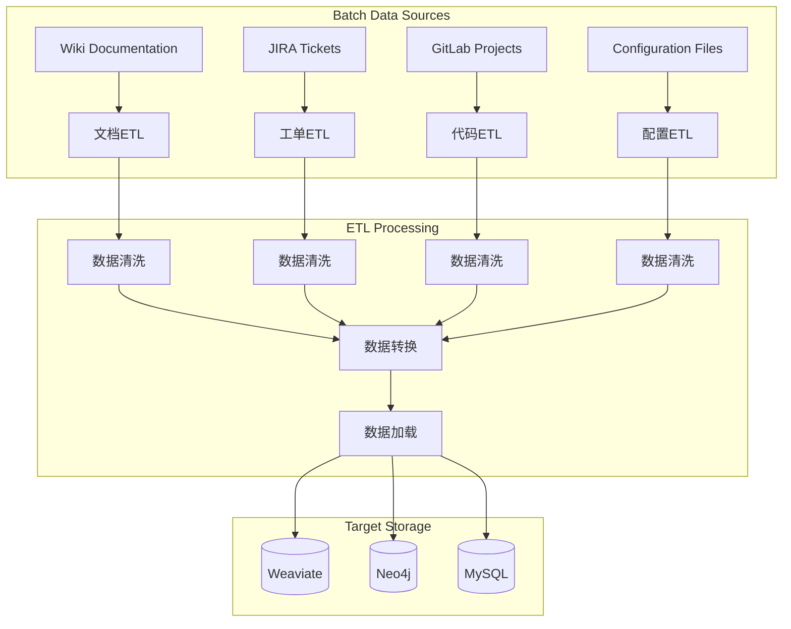
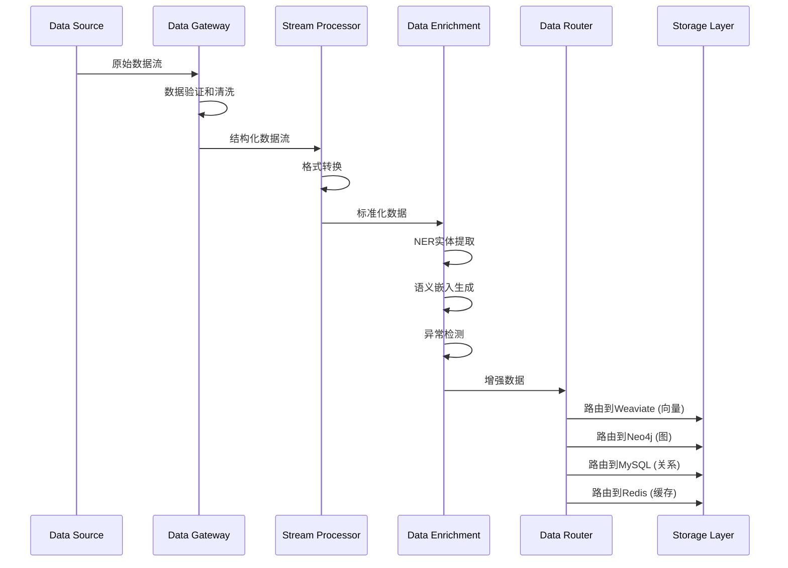
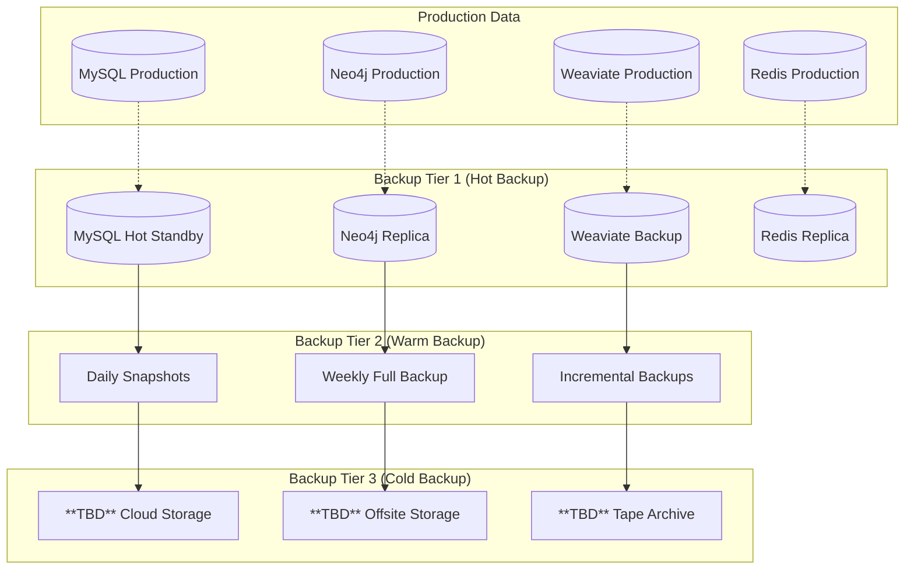
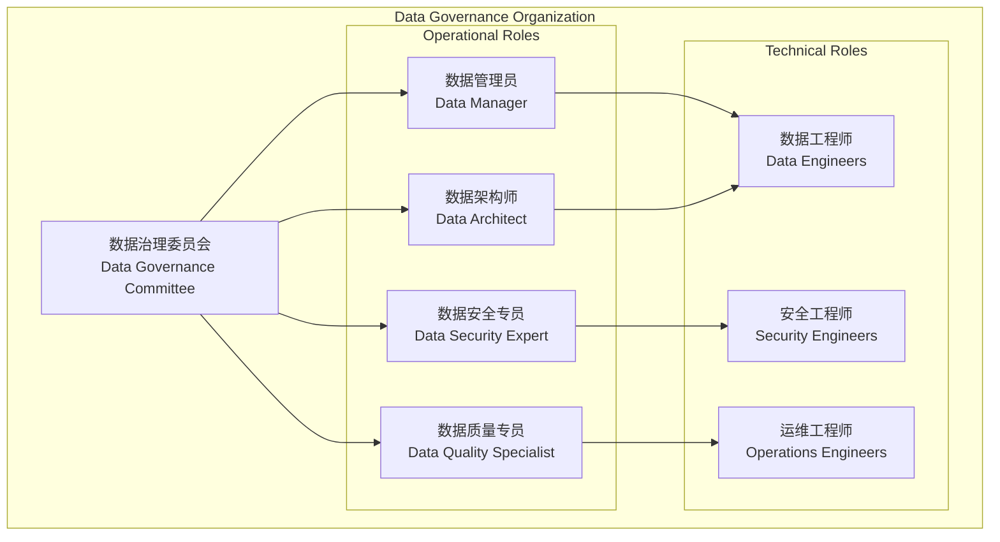

# 数据架构文档
# Data Architecture Document

## 文档信息
- **项目名称**: AIOps Polaris - 智能运维平台
- **文档版本**: 1.0.0
- **创建日期**: 2025-09-01
- **最后更新**: 2025-09-01
- **数据架构师**: **TBD**
- **审批人**: **TBD**

## 1. 数据架构概述

### 1.1 数据架构原则
1. **多模态存储**: 结构化、半结构化、非结构化数据统一管理
2. **实时性**: 支持实时数据摄取和查询
3. **可扩展性**: 支持PB级数据存储和处理
4. **一致性**: 跨多数据源的数据一致性保证
5. **安全性**: 数据加密、脱敏和访问控制

### 1.2 数据分类体系
| 数据类型 | 存储方式 | 访问模式 | 保留周期 |
|---------|---------|----------|---------|
| **运维日志** | 向量化存储 | 语义搜索、时序查询 | **TBD** |
| **知识文档** | 混合存储 | 全文检索、语义匹配 | 永久 |
| **实体关系** | 图存储 | 关系查询、路径分析 | 永久 |
| **会话数据** | 关系存储 | 事务查询、索引查找 | **TBD** |
| **任务状态** | 内存存储 | 高频读写、实时更新 | 7天 |
| **系统指标** | 时序存储 | **TBD** - 时序分析、聚合查询 | **TBD** |

## 2. 数据源架构

### 2.1 数据源分类

#### 2.1.1 实时数据源


**数据源特征**:
| 数据源 | 格式 | 频率 | 大小 | 处理要求 |
|--------|------|------|------|---------|
| **API访问日志** | JSON | 1000次/秒 | 1KB/条 | 实时解析、异常检测 |
| **应用日志** | 多格式 | 500条/秒 | 2KB/条 | 格式识别、错误提取 |
| **系统指标** | **TBD** - Prometheus | 15秒/次 | **TBD** | 时序存储、聚合计算 |
| **用户操作** | 事件流 | 100次/秒 | 0.5KB/条 | 行为分析、会话跟踪 |

#### 2.1.2 批量数据源  


**批量处理特征**:
| 数据源 | 更新频率 | 数据量 | 处理复杂度 | 处理时间窗口 |
|--------|---------|--------|-----------|-------------|
| **Wiki文档** | 每日 | **TBD** 文档 | 高（NLP处理） | 夜间批处理 |
| **JIRA工单** | 每小时 | **TBD** 工单 | 中（结构化解析） | 准实时 |
| **GitLab项目** | 每次提交 | **TBD** 文件 | 高（代码分析） | 实时触发 |
| **配置文件** | 变更时 | **TBD** 配置 | 低（解析存储） | 实时 |

### 2.2 数据摄取架构

#### 2.2.1 日志摄取管道
```python
class LogIngestionPipeline:
    """日志摄取管道"""
    
    async def ingest_log_stream(self, log_source: str):
        """摄取日志流"""
        
        # Step 1: 数据接收
        async for log_batch in self._receive_log_stream(log_source):
            
            # Step 2: 格式检测和解析
            parsed_logs = []
            for raw_log in log_batch:
                try:
                    parsed_log = await self._detect_and_parse_format(raw_log)
                    if self._validate_log_structure(parsed_log):
                        parsed_logs.append(parsed_log)
                except Exception as e:
                    logger.warning(f"Failed to parse log: {e}")
            
            # Step 3: 数据增强
            for log in parsed_logs:
                # 3.1 实体识别
                entities = await self.ner_service.extract_entities(log["message"])
                log["entities"] = entities
                
                # 3.2 异常检测
                anomaly_score = await self._detect_anomaly(log)
                log["anomaly_score"] = anomaly_score
                
                # 3.3 分类标签
                category = await self._classify_log(log)
                log["category"] = category
            
            # Step 4: 数据存储
            await self._batch_store_logs(parsed_logs)
    
    async def _detect_and_parse_format(self, raw_log: str) -> Dict[str, Any]:
        """检测并解析日志格式"""
        
        # 常见日志格式模式
        log_patterns = {
            "apache_combined": r'(?P<ip>\S+) \S+ \S+ \[(?P<timestamp>[^\]]+)\] "(?P<method>\S+) (?P<path>\S+) (?P<protocol>\S+)" (?P<status>\d+) (?P<size>\S+)',
            "nginx_error": r'(?P<timestamp>\d{4}/\d{2}/\d{2} \d{2}:\d{2}:\d{2}) \[(?P<level>\w+)\] (?P<pid>\d+)#(?P<tid>\d+): (?P<message>.*)',
            "application_json": r'^{.*}$',
            "syslog": r'(?P<timestamp>\w{3} \d{2} \d{2}:\d{2}:\d{2}) (?P<hostname>\S+) (?P<program>\S+): (?P<message>.*)'
        }
        
        for format_name, pattern in log_patterns.items():
            match = re.match(pattern, raw_log.strip())
            if match:
                parsed = match.groupdict()
                parsed["format_type"] = format_name
                parsed["raw"] = raw_log
                return await self._normalize_log_fields(parsed)
        
        # 无法识别格式，使用通用处理
        return {
            "format_type": "unknown",
            "raw": raw_log,
            "message": raw_log,
            "timestamp": datetime.utcnow().isoformat(),
            "level": "INFO"
        }
```

## 3. 数据存储架构

### 3.1 向量数据库设计 (Weaviate)

#### 3.1.1 Collection Schema设计
```python
# 嵌入向量集合Schema
EMBEDDING_COLLECTION_SCHEMA = {
    "class": "EmbeddingCollection",
    "description": "文档和日志的语义向量存储",
    "properties": [
        # 基础字段
        {"name": "title", "dataType": ["text"], "description": "文档标题"},
        {"name": "content", "dataType": ["text"], "description": "文档内容"},
        {"name": "source", "dataType": ["text"], "description": "数据源"},
        {"name": "category", "dataType": ["text"], "description": "分类标签"},
        {"name": "timestamp", "dataType": ["date"], "description": "创建时间"},
        
        # 日志专用字段
        {"name": "log_level", "dataType": ["text"], "description": "日志级别"},
        {"name": "component", "dataType": ["text"], "description": "组件名称"}, 
        {"name": "hostname", "dataType": ["text"], "description": "主机名"},
        {"name": "service_name", "dataType": ["text"], "description": "服务名"},
        {"name": "file_path", "dataType": ["text"], "description": "日志文件路径"},
        {"name": "line_number", "dataType": ["int"], "description": "行号"},
        
        # 增强字段
        {"name": "entities", "dataType": ["text[]"], "description": "提取的实体"},
        {"name": "anomaly_score", "dataType": ["number"], "description": "异常分数"},
        {"name": "confidence", "dataType": ["number"], "description": "置信度"},
        {"name": "processing_metadata", "dataType": ["object"], "description": "处理元数据"}
    ],
    "vectorizer": "none",  # 使用自定义向量
    "vectorIndexConfig": {
        "distance": "cosine",
        "efConstruction": 256,    # 构建时候的邻居数
        "maxConnections": 64,     # 每个节点最大连接数
        "efSearch": 100,          # 搜索时候的邻居数
        "dynamicEfMin": 100,
        "dynamicEfMax": 500,
        "vectorCacheMaxObjects": 1000000
    },
    "invertedIndexConfig": {
        "bm25": {
            "b": 0.75,
            "k1": 1.2
        }
    }
}

# BM25全文搜索集合Schema  
FULLTEXT_COLLECTION_SCHEMA = {
    "class": "FullTextCollection", 
    "description": "全文搜索和BM25索引",
    "properties": [
        {"name": "content", "dataType": ["text"], "tokenization": "word"},
        {"name": "title", "dataType": ["text"], "tokenization": "word"},
        {"name": "source", "dataType": ["text"], "tokenization": "keyword"},
        {"name": "category", "dataType": ["text"], "tokenization": "keyword"},
        {"name": "timestamp", "dataType": ["date"]},
        {"name": "metadata", "dataType": ["object"]}
    ],
    "vectorizer": "none",
    "invertedIndexConfig": {
        "bm25": {
            "b": 0.75,     # 文档长度归一化参数
            "k1": 1.2      # 词频饱和度参数
        },
        "stopwords": {
            "preset": "en",
            "additions": ["的", "了", "在", "是", "和", "与"]  # 中文停用词
        }
    }
}
```

#### 3.1.2 向量索引优化
```python
class WeaviateIndexOptimizer:
    """Weaviate索引优化器"""
    
    def optimize_vector_index(self):
        """优化向量索引配置"""
        
        # 根据数据规模动态调整参数
        data_size = self.get_collection_size()
        
        if data_size < 10000:
            # 小规模数据集
            config = {
                "efConstruction": 128,
                "maxConnections": 32,
                "efSearch": 64
            }
        elif data_size < 100000:
            # 中规模数据集  
            config = {
                "efConstruction": 256,
                "maxConnections": 64,
                "efSearch": 100
            }
        else:
            # 大规模数据集
            config = {
                "efConstruction": 512,
                "maxConnections": 128,
                "efSearch": 200
            }
        
        return config
    
    async def rebuild_index_if_needed(self):
        """根据需要重建索引"""
        index_stats = await self.get_index_statistics()
        
        # 检查索引性能指标
        if (index_stats["search_latency_p95"] > 1000 or  # P95延迟>1秒
            index_stats["memory_usage"] > 0.9 or         # 内存使用>90%
            index_stats["fragmentation"] > 0.3):         # 碎片率>30%
            
            logger.info("Index performance degraded, starting rebuild...")
            await self.rebuild_vector_index()
```

### 3.2 图数据库设计 (Neo4j)

#### 3.2.1 知识图谱Schema
```cypher
// 实体节点定义
CREATE CONSTRAINT entity_unique IF NOT EXISTS FOR (e:Entity) REQUIRE (e.name, e.type) IS UNIQUE;

// 主要实体类型
(:Entity {
    name: string,           // 实体名称，唯一标识
    type: string,           // 实体类型
    confidence: float,      // 置信度 [0.0, 1.0]
    properties: map,        // 动态属性
    created_at: datetime,   // 创建时间
    updated_at: datetime,   // 更新时间
    source_id: string,      // 来源文档ID
    extraction_method: string // 提取方法 (manual, nlp, rule_based)
})

// 服务实体
(:Service:Entity {
    name: string,           // 服务名
    type: "SERVICE",
    environment: string,    // production, staging, development
    version: string,        // 服务版本  
    port: int,             // 服务端口
    status: string,        // running, stopped, error, unknown
    health_check_url: string,
    dependencies: list,     // 依赖服务列表
    owner_team: string     // 负责团队
})

// 主机实体
(:Host:Entity {
    name: string,          // 主机名
    type: "HOST", 
    ip_address: string,    // IP地址
    os: string,           // 操作系统
    cpu_cores: int,       // CPU核数
    memory_gb: float,     // 内存大小GB
    disk_gb: float,       // 磁盘大小GB
    location: string,     // 数据中心位置
    environment: string   // 环境标识
})

// 数据库实体
(:Database:Entity {
    name: string,          // 数据库名
    type: "DATABASE",
    db_type: string,       // mysql, postgresql, redis, neo4j
    version: string,       // 数据库版本
    port: int,            // 端口
    max_connections: int, // 最大连接数
    storage_gb: float,    // 存储大小
    backup_strategy: string // 备份策略
})

// 错误实体
(:Error:Entity {
    name: string,          // 错误名称/代码
    type: "ERROR",
    error_code: string,    // 错误代码
    severity: string,      // critical, high, medium, low
    description: string,   // 错误描述
    resolution_steps: list, // 解决步骤
    known_causes: list     // 已知原因
})
```

#### 3.2.2 关系定义
```cypher
// 关系类型定义
()-[:RELATES_TO {
    type: string,           // 具体关系类型
    confidence: float,      // 关系置信度
    weight: float,          // 关系权重
    created_at: datetime,   // 创建时间
    last_verified: datetime, // 最后验证时间
    source: string,         // 关系来源
    properties: map         // 扩展属性
}]->()

// 具体关系类型
(:Service)-[:DEPENDS_ON {weight: 0.8}]->(:Database)
(:Service)-[:RUNS_ON {weight: 0.9}]->(:Host)
(:Service)-[:CONNECTS_TO {port: 8080, protocol: "HTTP"}]->(:Service)
(:Error)-[:OCCURS_ON {frequency: 0.1}]->(:Service)
(:Error)-[:CAUSED_BY {probability: 0.7}]->(:Error)
(:Host)-[:LOCATED_IN]->(:DataCenter)
(:Database)-[:BACKUP_TO]->(:BackupLocation)
```

#### 3.2.3 图查询优化
```cypher
-- 创建复合索引提升查询性能
CREATE INDEX entity_name_type_idx IF NOT EXISTS FOR (e:Entity) ON (e.name, e.type);
CREATE INDEX entity_confidence_idx IF NOT EXISTS FOR (e:Entity) ON (e.confidence);
CREATE INDEX relationship_type_idx IF NOT EXISTS FOR ()-[r:RELATES_TO]-() ON (r.type);
CREATE INDEX relationship_weight_idx IF NOT EXISTS FOR ()-[r:RELATES_TO]-() ON (r.weight);

-- 性能优化查询示例
-- 查找高置信度的服务依赖关系
MATCH (s:Service)-[r:RELATES_TO]->(target)
WHERE s.name = $service_name 
  AND r.type = "DEPENDS_ON"
  AND r.confidence > 0.7
RETURN target
ORDER BY r.weight DESC
LIMIT 10;

-- 查找故障传播路径
MATCH path = (error:Error)-[:OCCURS_ON]->(:Service)-[:DEPENDS_ON*1..3]->(affected:Service)
WHERE error.severity IN ["critical", "high"]
RETURN path, length(path) as impact_distance
ORDER BY impact_distance;
```

### 3.3 关系数据库设计 (MySQL)

#### 3.3.1 核心表设计
```sql
-- 用户和会话管理
CREATE TABLE users (
    id VARCHAR(50) PRIMARY KEY COMMENT '用户ID',
    username VARCHAR(100) NOT NULL UNIQUE COMMENT '用户名',
    email VARCHAR(200) UNIQUE COMMENT '邮箱',
    role ENUM('admin', 'ops_engineer', 'viewer') DEFAULT 'viewer' COMMENT '用户角色',
    created_at TIMESTAMP DEFAULT CURRENT_TIMESTAMP COMMENT '创建时间',
    updated_at TIMESTAMP DEFAULT CURRENT_TIMESTAMP ON UPDATE CURRENT_TIMESTAMP COMMENT '更新时间',
    last_login TIMESTAMP NULL COMMENT '最后登录时间',
    status ENUM('active', 'inactive', 'suspended') DEFAULT 'active' COMMENT '状态',
    preferences JSON COMMENT '用户偏好设置',
    INDEX idx_username (username),
    INDEX idx_role (role),
    INDEX idx_status (status)
) ENGINE=InnoDB DEFAULT CHARSET=utf8mb4 COMMENT='用户表';

CREATE TABLE user_sessions (
    id VARCHAR(36) PRIMARY KEY COMMENT '会话ID',
    user_id VARCHAR(50) NOT NULL COMMENT '用户ID',
    session_name VARCHAR(200) COMMENT '会话名称',
    created_at TIMESTAMP DEFAULT CURRENT_TIMESTAMP COMMENT '创建时间',
    updated_at TIMESTAMP DEFAULT CURRENT_TIMESTAMP ON UPDATE CURRENT_TIMESTAMP COMMENT '更新时间',
    last_activity TIMESTAMP DEFAULT CURRENT_TIMESTAMP COMMENT '最后活动时间',
    status ENUM('active', 'archived', 'deleted') DEFAULT 'active' COMMENT '状态',
    metadata JSON COMMENT '会话元数据',
    message_count INT DEFAULT 0 COMMENT '消息数量',
    FOREIGN KEY (user_id) REFERENCES users(id) ON DELETE CASCADE,
    INDEX idx_user_id (user_id),
    INDEX idx_status (status),
    INDEX idx_last_activity (last_activity)
) ENGINE=InnoDB DEFAULT CHARSET=utf8mb4 COMMENT='用户会话表';

-- 任务执行记录
CREATE TABLE task_executions (
    id BIGINT AUTO_INCREMENT PRIMARY KEY COMMENT '任务ID',
    task_id VARCHAR(50) UNIQUE NOT NULL COMMENT '任务标识',
    user_id VARCHAR(50) NOT NULL COMMENT '用户ID',
    session_id VARCHAR(36) COMMENT '会话ID',
    task_type ENUM('rca', 'chat', 'search', 'knowledge_extract') NOT NULL COMMENT '任务类型',
    status ENUM('pending', 'running', 'completed', 'failed', 'interrupted') NOT NULL COMMENT '任务状态',
    priority ENUM('low', 'medium', 'high', 'critical') DEFAULT 'medium' COMMENT '优先级',
    
    -- 输入数据
    user_message TEXT NOT NULL COMMENT '用户消息',
    input_context JSON COMMENT '输入上下文',
    
    -- 执行过程
    agent_execution_log JSON COMMENT '智能体执行日志',
    intermediate_results JSON COMMENT '中间结果',
    error_message TEXT COMMENT '错误信息',
    error_stack_trace TEXT COMMENT '错误堆栈',
    
    -- 输出结果
    final_result JSON COMMENT '最终结果',
    confidence_score FLOAT COMMENT '置信度分数',
    evidence_count INT DEFAULT 0 COMMENT '证据数量',
    
    -- 时间统计
    start_time TIMESTAMP DEFAULT CURRENT_TIMESTAMP COMMENT '开始时间',
    end_time TIMESTAMP NULL COMMENT '结束时间',
    processing_time_ms INT COMMENT '处理时间(毫秒)',
    
    -- 资源使用
    cpu_usage_avg FLOAT COMMENT '平均CPU使用率',
    memory_usage_max FLOAT COMMENT '最大内存使用',
    llm_tokens_used INT DEFAULT 0 COMMENT 'LLM Token使用量',
    
    FOREIGN KEY (user_id) REFERENCES users(id),
    FOREIGN KEY (session_id) REFERENCES user_sessions(id),
    INDEX idx_user_id (user_id),
    INDEX idx_session_id (session_id),
    INDEX idx_status (status),
    INDEX idx_task_type (task_type),
    INDEX idx_start_time (start_time),
    INDEX idx_priority (priority)
) ENGINE=InnoDB DEFAULT CHARSET=utf8mb4 COMMENT='任务执行表';

-- 知识库文档管理
CREATE TABLE knowledge_documents (
    id BIGINT AUTO_INCREMENT PRIMARY KEY COMMENT '文档ID',
    title VARCHAR(500) NOT NULL COMMENT '文档标题',
    content LONGTEXT COMMENT '文档内容',
    content_hash VARCHAR(64) UNIQUE COMMENT '内容哈希',
    source VARCHAR(100) NOT NULL COMMENT '数据源',
    source_id VARCHAR(200) COMMENT '源系统ID',
    category VARCHAR(100) COMMENT '分类',
    tags JSON COMMENT '标签数组',
    language VARCHAR(10) DEFAULT 'zh' COMMENT '语言',
    
    -- 向量化信息
    weaviate_ids JSON COMMENT 'Weaviate文档ID列表',
    embedding_model VARCHAR(100) COMMENT '嵌入模型',
    chunk_count INT DEFAULT 1 COMMENT '分块数量',
    
    -- 图数据库关联
    neo4j_node_id VARCHAR(100) COMMENT 'Neo4j节点ID',
    entities_extracted JSON COMMENT '提取的实体列表',
    
    -- 质量评估
    quality_score FLOAT COMMENT '文档质量分数',
    readability_score FLOAT COMMENT '可读性分数',
    relevance_keywords JSON COMMENT '相关关键词',
    
    -- 管理字段
    created_at TIMESTAMP DEFAULT CURRENT_TIMESTAMP COMMENT '创建时间',
    updated_at TIMESTAMP DEFAULT CURRENT_TIMESTAMP ON UPDATE CURRENT_TIMESTAMP COMMENT '更新时间',
    last_indexed TIMESTAMP COMMENT '最后索引时间',
    status ENUM('active', 'archived', 'deleted') DEFAULT 'active' COMMENT '状态',
    created_by VARCHAR(50) COMMENT '创建者',
    
    INDEX idx_source (source),
    INDEX idx_category (category),
    INDEX idx_content_hash (content_hash),
    INDEX idx_status (status),
    INDEX idx_created_at (created_at),
    FULLTEXT INDEX idx_content_fulltext (title, content)
) ENGINE=InnoDB DEFAULT CHARSET=utf8mb4 COMMENT='知识文档表';
```

#### 3.3.2 数据归档策略
```sql
-- 分区表设计 (按月分区)
CREATE TABLE chat_messages_partitioned (
    id BIGINT AUTO_INCREMENT,
    session_id VARCHAR(36) NOT NULL,
    message_type ENUM('user', 'assistant', 'system') NOT NULL,
    content TEXT NOT NULL,
    metadata JSON,
    timestamp TIMESTAMP DEFAULT CURRENT_TIMESTAMP,
    
    PRIMARY KEY (id, timestamp),
    INDEX idx_session_timestamp (session_id, timestamp)
) 
PARTITION BY RANGE (YEAR(timestamp) * 100 + MONTH(timestamp)) (
    PARTITION p202501 VALUES LESS THAN (202502),
    PARTITION p202502 VALUES LESS THAN (202503),
    PARTITION p202503 VALUES LESS THAN (202504),
    PARTITION p202504 VALUES LESS THAN (202505),
    PARTITION p202505 VALUES LESS THAN (202506),
    PARTITION p202506 VALUES LESS THAN (202507),
    -- 自动分区管理脚本
    PARTITION p_future VALUES LESS THAN MAXVALUE
);

-- 历史数据归档存储过程
DELIMITER $$
CREATE PROCEDURE ArchiveOldData(IN months_to_keep INT)
BEGIN
    DECLARE archive_date DATE;
    SET archive_date = DATE_SUB(CURDATE(), INTERVAL months_to_keep MONTH);
    
    -- 归档聊天消息
    INSERT INTO chat_messages_archive 
    SELECT * FROM chat_messages_partitioned 
    WHERE timestamp < archive_date;
    
    -- 删除已归档数据
    DELETE FROM chat_messages_partitioned 
    WHERE timestamp < archive_date;
    
    -- 归档任务执行记录
    INSERT INTO task_executions_archive
    SELECT * FROM task_executions
    WHERE start_time < archive_date;
    
    DELETE FROM task_executions 
    WHERE start_time < archive_date;
END$$
DELIMITER ;
```

### 3.4 缓存数据设计 (Redis)

#### 3.4.1 Redis数据结构设计
```python
# Redis键命名规范和数据结构
REDIS_SCHEMAS = {
    # 任务状态 (Hash结构)
    "task:{task_id}": {
        "structure": "hash",
        "ttl": 604800,  # 7天
        "fields": {
            "task_id": "ma_task_1725187800_abc123",
            "status": "running|completed|failed|interrupted",
            "user_id": "ops-engineer-01",
            "session_id": "session_20250901_001",
            "current_agent": "knowledge|planner|reasoning|executor", 
            "progress_percentage": "75.0",
            "start_time": "2025-09-01T10:30:00Z",
            "agent_statuses": "JSON string",
            "intermediate_results": "JSON array string",
            "final_result": "JSON string or null",
            "error_info": "error message or null"
        }
    },
    
    # 搜索结果缓存 (String结构)
    "search:{query_hash}": {
        "structure": "string", 
        "ttl": 600,  # 10分钟
        "content": "JSON serialized search results"
    },
    
    # 嵌入向量缓存 (String结构)
    "embed:{text_hash}": {
        "structure": "string",
        "ttl": 3600,  # 1小时
        "content": "JSON array of float values"
    },
    
    # 用户会话缓存 (Hash结构)
    "session:{session_id}": {
        "structure": "hash",
        "ttl": 86400,  # 24小时
        "fields": {
            "user_id": "ops-engineer-01",
            "session_name": "Morning Troubleshooting",
            "created_at": "2025-09-01T08:00:00Z",
            "last_activity": "2025-09-01T10:30:00Z", 
            "message_count": "15",
            "context": "JSON string"
        }
    },
    
    # API限流计数 (String结构)
    "rate_limit:{user_id}:{endpoint}": {
        "structure": "string",
        "ttl": 3600,  # 1小时
        "content": "request_count"
    },
    
    # 任务队列 (List结构)
    "task_queue": {
        "structure": "list", 
        "ttl": null,  # 永不过期
        "content": "task_id列表，支持优先级队列"
    }
}
```

#### 3.4.2 缓存一致性策略
```python
class CacheConsistencyManager:
    """缓存一致性管理"""
    
    async def invalidate_related_cache(self, entity_type: str, entity_id: str):
        """失效相关缓存"""
        
        # 根据实体类型确定需要失效的缓存模式
        invalidation_patterns = {
            "task": [
                f"task:{entity_id}",
                f"task_status:{entity_id}",
                f"user_tasks:{self._extract_user_id(entity_id)}:*"
            ],
            "session": [
                f"session:{entity_id}",
                f"user_sessions:{self._extract_user_id(entity_id)}"
            ],
            "search": [
                f"search:{entity_id}*",
                "search:*"  # 全局搜索缓存失效
            ]
        }
        
        patterns = invalidation_patterns.get(entity_type, [])
        for pattern in patterns:
            if "*" in pattern:
                # 模糊匹配删除
                keys = await self.redis.keys(pattern)
                if keys:
                    await self.redis.delete(*keys)
            else:
                # 精确删除
                await self.redis.delete(pattern)
    
    async def cache_warming(self):
        """缓存预热"""
        
        # 1. 预加载热门搜索查询
        popular_queries = await self._get_popular_queries()
        for query in popular_queries:
            if not await self.redis.exists(f"search:{hash(query)}"):
                result = await self.search_service.search(query)
                await self.redis.setex(f"search:{hash(query)}", 600, json.dumps(result))
        
        # 2. 预加载活跃用户会话
        active_sessions = await self._get_active_sessions()
        for session_id in active_sessions:
            session_data = await self.database.get_session(session_id)
            await self.redis.hset(f"session:{session_id}", mapping=session_data)
```

## 4. 数据流设计

### 4.1 实时数据流

#### 4.1.1 流处理架构


#### 4.1.2 数据管道实现
```python
class RealTimeDataPipeline:
    """实时数据处理管道"""
    
    def __init__(self):
        self.data_gateway = DataGateway()
        self.stream_processor = StreamProcessor()
        self.data_enricher = DataEnricher() 
        self.data_router = DataRouter()
        
    async def process_realtime_stream(self, data_source: str):
        """处理实时数据流"""
        
        async for data_batch in self.data_gateway.receive_stream(data_source):
            
            # Step 1: 数据验证和清洗
            validated_batch = []
            for data_item in data_batch:
                if await self._validate_data_item(data_item):
                    cleaned_item = await self._clean_data_item(data_item)
                    validated_batch.append(cleaned_item)
            
            # Step 2: 流处理转换
            transformed_batch = await self.stream_processor.transform_batch(validated_batch)
            
            # Step 3: 数据增强
            enriched_batch = []
            for item in transformed_batch:
                enriched_item = await self.data_enricher.enrich(item)
                enriched_batch.append(enriched_item)
            
            # Step 4: 数据路由存储
            await self.data_router.route_batch(enriched_batch)
            
            # Step 5: 实时索引更新
            await self._update_realtime_indexes(enriched_batch)
```

### 4.2 批量数据处理

#### 4.2.1 ETL管道设计
```python
class ETLPipeline:
    """ETL数据管道"""
    
    async def extract_from_source(self, source_config: Dict) -> List[Dict]:
        """数据抽取 (Extract)"""
        
        source_type = source_config["type"]
        extractors = {
            "file": FileExtractor(),
            "database": DatabaseExtractor(),
            "api": APIExtractor(),
            "webhook": WebhookExtractor()
        }
        
        extractor = extractors.get(source_type)
        if not extractor:
            raise ValueError(f"Unsupported source type: {source_type}")
        
        return await extractor.extract(source_config)
    
    async def transform_data(self, raw_data: List[Dict]) -> List[Dict]:
        """数据转换 (Transform)"""
        
        transformed_data = []
        
        for item in raw_data:
            try:
                # 1. 数据标准化
                normalized_item = await self._normalize_data_format(item)
                
                # 2. 数据清洗
                cleaned_item = await self._clean_data_fields(normalized_item)
                
                # 3. 数据增强
                enriched_item = await self._enrich_data_content(cleaned_item)
                
                # 4. 质量检查
                if await self._validate_data_quality(enriched_item):
                    transformed_data.append(enriched_item)
                
            except Exception as e:
                logger.warning(f"Failed to transform data item: {e}")
                continue
        
        return transformed_data
    
    async def load_to_targets(self, transformed_data: List[Dict]):
        """数据加载 (Load)"""
        
        # 并行加载到多个目标存储
        load_tasks = [
            self._load_to_weaviate(transformed_data),
            self._load_to_neo4j(transformed_data), 
            self._load_to_mysql(transformed_data)
        ]
        
        results = await asyncio.gather(*load_tasks, return_exceptions=True)
        
        # 检查加载结果
        for i, result in enumerate(results):
            if isinstance(result, Exception):
                logger.error(f"Load task {i} failed: {result}")
```

## 5. 数据质量和治理

### 5.1 数据质量管理

#### 5.1.1 数据质量评估
```python
class DataQualityAssessment:
    """数据质量评估器"""
    
    def assess_document_quality(self, document: Dict) -> Dict[str, float]:
        """评估文档质量"""
        
        quality_metrics = {}
        
        # 1. 完整性评估
        completeness = self._assess_completeness(document)
        quality_metrics["completeness"] = completeness
        
        # 2. 准确性评估  
        accuracy = await self._assess_accuracy(document)
        quality_metrics["accuracy"] = accuracy
        
        # 3. 一致性评估
        consistency = self._assess_consistency(document)
        quality_metrics["consistency"] = consistency
        
        # 4. 时效性评估
        timeliness = self._assess_timeliness(document)
        quality_metrics["timeliness"] = timeliness
        
        # 5. 相关性评估
        relevance = await self._assess_relevance(document)
        quality_metrics["relevance"] = relevance
        
        # 综合质量分数
        weights = {
            "completeness": 0.3,
            "accuracy": 0.25, 
            "consistency": 0.2,
            "timeliness": 0.15,
            "relevance": 0.1
        }
        
        overall_score = sum(
            quality_metrics[metric] * weight 
            for metric, weight in weights.items()
        )
        quality_metrics["overall_score"] = overall_score
        
        return quality_metrics
    
    def _assess_completeness(self, document: Dict) -> float:
        """评估数据完整性"""
        required_fields = ["title", "content", "source", "timestamp"]
        optional_fields = ["category", "tags", "author"]
        
        required_score = sum(
            1.0 if document.get(field) else 0.0 
            for field in required_fields
        ) / len(required_fields)
        
        optional_score = sum(
            1.0 if document.get(field) else 0.0
            for field in optional_fields  
        ) / len(optional_fields)
        
        return required_score * 0.8 + optional_score * 0.2
```

#### 5.1.2 数据清洗规则
```python
class DataCleaningRules:
    """数据清洗规则引擎"""
    
    # 清洗规则配置
    CLEANING_RULES = {
        "text_normalization": {
            "remove_extra_whitespace": True,
            "normalize_encoding": "utf-8",
            "remove_control_chars": True
        },
        "content_filtering": {
            "min_content_length": 10,
            "max_content_length": 100000,
            "remove_empty_documents": True,
            "filter_test_data": True
        },
        "format_standardization": {
            "timestamp_format": "ISO 8601",
            "datetime_timezone": "UTC", 
            "number_precision": 6
        },
        "sensitive_data": {
            "redact_passwords": True,
            "redact_api_keys": True,
            "redact_personal_info": True,
            "redaction_replacement": "[REDACTED]"
        }
    }
    
    async def clean_document(self, document: Dict) -> Dict:
        """文档清洗主流程"""
        cleaned = document.copy()
        
        # 1. 文本标准化
        cleaned = await self._normalize_text_fields(cleaned)
        
        # 2. 内容过滤
        if not await self._passes_content_filter(cleaned):
            return None
        
        # 3. 格式标准化
        cleaned = await self._standardize_formats(cleaned)
        
        # 4. 敏感数据处理
        cleaned = await self._redact_sensitive_data(cleaned)
        
        # 5. 质量标记
        cleaned["data_quality"] = await self._calculate_quality_score(cleaned)
        cleaned["cleaned_at"] = datetime.utcnow().isoformat()
        
        return cleaned
```

### 5.2 数据治理策略

#### 5.2.1 数据生命周期管理
```python
class DataLifecycleManager:
    """数据生命周期管理器"""
    
    # 数据保留策略
    RETENTION_POLICIES = {
        "chat_messages": {
            "active_period": 90,      # 90天活跃期
            "archive_period": 365,    # 1年归档期
            "deletion_period": 2555   # 7年后删除
        },
        "task_executions": {
            "active_period": 30,      # 30天活跃期
            "archive_period": 365,    # 1年归档期 
            "deletion_period": 2555   # 7年后删除
        },
        "log_entries": {
            "active_period": 30,      # 30天活跃期
            "archive_period": 180,    # 6个月归档期
            "deletion_period": 1095   # 3年后删除
        },
        "knowledge_documents": {
            "active_period": null,    # 永久活跃
            "archive_period": null,   # 不归档
            "deletion_period": null   # 不删除
        }
    }
    
    async def execute_lifecycle_policies(self):
        """执行生命周期策略"""
        
        current_time = datetime.utcnow()
        
        for data_type, policy in self.RETENTION_POLICIES.items():
            
            # 数据归档
            if policy["archive_period"]:
                archive_date = current_time - timedelta(days=policy["active_period"])
                await self._archive_data(data_type, archive_date)
            
            # 数据删除
            if policy["deletion_period"]:
                deletion_date = current_time - timedelta(days=policy["deletion_period"])
                await self._delete_expired_data(data_type, deletion_date)
```

#### 5.2.2 数据血缘追踪
```python
class DataLineageTracker:
    """数据血缘追踪器"""
    
    async def track_data_lineage(
        self,
        source_data: Dict,
        transformation: str,
        target_data: Dict
    ):
        """追踪数据血缘"""
        
        lineage_record = {
            "lineage_id": self._generate_lineage_id(),
            "source": {
                "data_id": source_data.get("id"),
                "data_type": source_data.get("type"),
                "source_system": source_data.get("source"),
                "timestamp": source_data.get("timestamp")
            },
            "transformation": {
                "operation": transformation,
                "processor": self.__class__.__name__,
                "processing_time": datetime.utcnow().isoformat(),
                "parameters": {}  # 转换参数
            },
            "target": {
                "data_id": target_data.get("id"),
                "data_type": target_data.get("type"),
                "target_system": target_data.get("storage_type"),
                "timestamp": target_data.get("timestamp")
            },
            "quality_metrics": {
                "input_quality": source_data.get("quality_score", 0.0),
                "output_quality": target_data.get("quality_score", 0.0),
                "transformation_success": True
            }
        }
        
        # 存储血缘记录
        await self._store_lineage_record(lineage_record)
    
    async def query_data_lineage(
        self,
        data_id: str,
        direction: str = "both"  # upstream, downstream, both
    ) -> Dict[str, Any]:
        """查询数据血缘"""
        
        lineage_graph = {
            "nodes": [],
            "edges": [], 
            "metadata": {}
        }
        
        if direction in ["upstream", "both"]:
            upstream = await self._trace_upstream_lineage(data_id)
            lineage_graph["nodes"].extend(upstream["nodes"])
            lineage_graph["edges"].extend(upstream["edges"])
        
        if direction in ["downstream", "both"]:
            downstream = await self._trace_downstream_lineage(data_id)
            lineage_graph["nodes"].extend(downstream["nodes"])
            lineage_graph["edges"].extend(downstream["edges"])
        
        return lineage_graph
```

## 6. 数据安全架构

### 6.1 数据加密设计

#### 6.1.1 传输加密
```python
class DataTransmissionSecurity:
    """数据传输安全"""
    
    # TLS配置
    TLS_CONFIG = {
        "min_version": "TLSv1.3",
        "cipher_suites": [
            "TLS_AES_256_GCM_SHA384",
            "TLS_CHACHA20_POLY1305_SHA256", 
            "TLS_AES_128_GCM_SHA256"
        ],
        "certificate_transparency": True,
        "perfect_forward_secrecy": True
    }
    
    # 数据库连接加密
    DATABASE_SSL_CONFIG = {
        "mysql": {
            "ssl_mode": "REQUIRED",
            "ssl_ca": "/certs/mysql-ca.pem",
            "ssl_cert": "/certs/mysql-client-cert.pem",
            "ssl_key": "/certs/mysql-client-key.pem"
        },
        "neo4j": {
            "encrypted": True,
            "trust_strategy": "TRUST_SYSTEM_CA_SIGNED_CERTIFICATES"
        },
        "redis": {
            "ssl": True,
            "ssl_cert": "/certs/redis-client.crt",
            "ssl_key": "/certs/redis-client.key",
            "ssl_ca": "/certs/redis-ca.crt"
        }
    }
```

#### 6.1.2 存储加密 (**TBD**)
```python
class DataStorageEncryption:
    """数据存储加密"""
    
    def __init__(self):
        self.encryption_key = self._load_master_key()
        self.field_encryption_keys = self._load_field_keys()
    
    async def encrypt_sensitive_field(self, field_value: str, field_type: str) -> str:
        """敏感字段加密"""
        
        # 根据字段类型选择加密策略
        encryption_strategy = {
            "password": "AES-256-GCM",
            "api_key": "AES-256-GCM", 
            "personal_info": "Format-Preserving-Encryption",
            "financial_data": "Tokenization"
        }
        
        strategy = encryption_strategy.get(field_type, "AES-256-GCM")
        return await self._apply_encryption(field_value, strategy)
    
    async def decrypt_sensitive_field(self, encrypted_value: str, field_type: str) -> str:
        """敏感字段解密"""
        # 实现对应的解密逻辑
        pass
```

### 6.2 数据访问控制

#### 6.2.1 细粒度权限控制
```python
class DataAccessController:
    """数据访问控制器"""
    
    # 数据访问权限矩阵
    ACCESS_MATRIX = {
        "admin": {
            "chat_messages": ["read", "write", "delete"],
            "task_executions": ["read", "write", "delete"], 
            "knowledge_documents": ["read", "write", "delete"],
            "system_configs": ["read", "write", "delete"],
            "user_data": ["read", "write", "delete"]
        },
        "ops_engineer": {
            "chat_messages": ["read", "write"],  # 只能访问自己的
            "task_executions": ["read", "write"], # 只能访问自己的
            "knowledge_documents": ["read"],
            "system_configs": ["read"],
            "user_data": ["read"]  # 只能访问自己的
        },
        "viewer": {
            "chat_messages": ["read"],  # 只能访问自己的
            "task_executions": ["read"], # 只能访问自己的
            "knowledge_documents": ["read"],
            "system_configs": [],
            "user_data": ["read"]  # 只能访问自己的
        }
    }
    
    async def check_data_access(
        self,
        user_id: str,
        user_role: str,
        data_type: str,
        operation: str,
        resource_id: Optional[str] = None
    ) -> bool:
        """检查数据访问权限"""
        
        # 1. 基础权限检查
        allowed_operations = self.ACCESS_MATRIX.get(user_role, {}).get(data_type, [])
        if operation not in allowed_operations:
            return False
        
        # 2. 资源级权限检查
        if resource_id:
            return await self._check_resource_ownership(user_id, data_type, resource_id)
        
        return True
    
    async def _check_resource_ownership(
        self,
        user_id: str, 
        data_type: str,
        resource_id: str
    ) -> bool:
        """检查资源所有权"""
        
        ownership_queries = {
            "chat_messages": """
                SELECT COUNT(*) as count FROM chat_messages cm
                JOIN user_sessions us ON cm.session_id = us.id
                WHERE cm.id = %s AND us.user_id = %s
            """,
            "task_executions": """
                SELECT COUNT(*) as count FROM task_executions
                WHERE id = %s AND user_id = %s  
            """,
            "user_sessions": """
                SELECT COUNT(*) as count FROM user_sessions
                WHERE id = %s AND user_id = %s
            """
        }
        
        query = ownership_queries.get(data_type)
        if not query:
            return True  # 无特殊限制
        
        result = await self.database.execute_query(query, (resource_id, user_id))
        return result[0]["count"] > 0
```

### 6.2 数据脱敏策略

#### 6.2.1 敏感数据识别
```python
class SensitiveDataDetector:
    """敏感数据检测器"""
    
    # 敏感数据模式
    SENSITIVE_PATTERNS = {
        "credit_card": r"\b\d{4}[-\s]?\d{4}[-\s]?\d{4}[-\s]?\d{4}\b",
        "phone_number": r"\b\d{3}[-\.\s]?\d{3}[-\.\s]?\d{4}\b", 
        "email": r"\b[A-Za-z0-9._%+-]+@[A-Za-z0-9.-]+\.[A-Z|a-z]{2,}\b",
        "ip_address": r"\b\d{1,3}\.\d{1,3}\.\d{1,3}\.\d{1,3}\b",
        "password": r'password["\s]*[:=]["\s]*([^\s"]+)',
        "api_key": r'(?:api[_-]?key|access[_-]?token)["\s]*[:=]["\s]*([^\s"]+)',
        "ssh_key": r"ssh-(?:rsa|dss|ecdsa) [A-Za-z0-9+/]+[=]{0,2}",
        "jwt_token": r"eyJ[A-Za-z0-9_-]*\.eyJ[A-Za-z0-9_-]*\.[A-Za-z0-9_-]*"
    }
    
    def detect_sensitive_data(self, content: str) -> Dict[str, List[str]]:
        """检测敏感数据"""
        detections = {}
        
        for pattern_name, pattern in self.SENSITIVE_PATTERNS.items():
            matches = re.findall(pattern, content, re.IGNORECASE)
            if matches:
                detections[pattern_name] = matches
        
        return detections
    
    def mask_sensitive_data(self, content: str, detection_results: Dict) -> str:
        """脱敏处理"""
        masked_content = content
        
        for pattern_name, matches in detection_results.items():
            for match in matches:
                if pattern_name in ["password", "api_key", "jwt_token"]:
                    # 完全替换
                    replacement = f"[REDACTED_{pattern_name.upper()}]"
                elif pattern_name in ["credit_card", "phone_number"]:
                    # 部分掩码
                    replacement = self._partial_mask(match)
                elif pattern_name == "email":
                    # 邮箱掩码
                    replacement = self._mask_email(match)
                else:
                    # 默认掩码
                    replacement = f"[MASKED_{pattern_name.upper()}]"
                
                masked_content = masked_content.replace(match, replacement)
        
        return masked_content
```

## 7. 数据监控和告警

### 7.1 数据质量监控

#### 7.1.1 监控指标设计
```python
class DataQualityMonitor:
    """数据质量监控器"""
    
    # 数据质量指标
    QUALITY_METRICS = {
        "completeness_rate": {
            "description": "数据完整性比率",
            "calculation": "complete_records / total_records", 
            "threshold": 0.95,
            "alert_level": "warning"
        },
        "accuracy_rate": {
            "description": "数据准确性比率",
            "calculation": "validated_records / total_records",
            "threshold": 0.90,
            "alert_level": "critical"
        },
        "timeliness_score": {
            "description": "数据时效性分数",
            "calculation": "fresh_data_percentage",
            "threshold": 0.85,
            "alert_level": "warning"
        },
        "consistency_score": {
            "description": "数据一致性分数", 
            "calculation": "consistent_records / total_records",
            "threshold": 0.95,
            "alert_level": "warning"
        }
    }
    
    async def collect_quality_metrics(self) -> Dict[str, float]:
        """收集数据质量指标"""
        metrics = {}
        
        # 1. 完整性检查
        total_docs = await self.count_documents()
        complete_docs = await self.count_complete_documents()
        metrics["completeness_rate"] = complete_docs / total_docs if total_docs > 0 else 0
        
        # 2. 准确性检查  
        validated_docs = await self.count_validated_documents()
        metrics["accuracy_rate"] = validated_docs / total_docs if total_docs > 0 else 0
        
        # 3. 时效性检查
        fresh_docs = await self.count_fresh_documents()
        metrics["timeliness_score"] = fresh_docs / total_docs if total_docs > 0 else 0
        
        # 4. 一致性检查
        consistent_docs = await self.count_consistent_documents()  
        metrics["consistency_score"] = consistent_docs / total_docs if total_docs > 0 else 0
        
        return metrics
```

#### 7.1.2 异常检测和告警
```python
class DataAnomalyDetector:
    """数据异常检测器"""
    
    async def detect_data_anomalies(self) -> List[Dict[str, Any]]:
        """检测数据异常"""
        anomalies = []
        
        # 1. 数据量异常检测
        volume_anomaly = await self._detect_volume_anomaly()
        if volume_anomaly:
            anomalies.append(volume_anomaly)
        
        # 2. 数据质量异常检测  
        quality_anomaly = await self._detect_quality_anomaly()
        if quality_anomaly:
            anomalies.append(quality_anomaly)
        
        # 3. 数据分布异常检测
        distribution_anomaly = await self._detect_distribution_anomaly()
        if distribution_anomaly:
            anomalies.append(distribution_anomaly)
        
        # 4. 数据访问异常检测
        access_anomaly = await self._detect_access_anomaly()
        if access_anomaly:
            anomalies.append(access_anomaly)
        
        return anomalies
    
    async def _detect_volume_anomaly(self) -> Optional[Dict[str, Any]]:
        """检测数据量异常"""
        
        # 获取过去7天的数据量统计
        daily_volumes = await self._get_daily_data_volumes(days=7)
        
        if len(daily_volumes) < 3:
            return None
        
        # 计算基线和标准差
        volumes = [v["volume"] for v in daily_volumes[:-1]]  # 排除今天
        baseline = statistics.mean(volumes)
        std_dev = statistics.stdev(volumes) if len(volumes) > 1 else 0
        
        # 检查今天的数据量
        today_volume = daily_volumes[-1]["volume"]
        
        # 异常阈值：超过2个标准差
        threshold = 2.0
        if abs(today_volume - baseline) > threshold * std_dev:
            return {
                "type": "volume_anomaly",
                "severity": "high" if abs(today_volume - baseline) > 3 * std_dev else "medium",
                "current_volume": today_volume,
                "baseline_volume": baseline,
                "deviation": abs(today_volume - baseline) / std_dev,
                "timestamp": datetime.utcnow().isoformat()
            }
        
        return None
```

## 8. 数据备份和恢复

### 8.1 备份策略设计

#### 8.1.1 分层备份架构


#### 8.1.2 备份实施策略
```python
class BackupManager:
    """备份管理器"""
    
    # 备份策略配置
    BACKUP_STRATEGIES = {
        "mysql": {
            "hot_standby": {
                "method": "master_slave_replication",
                "sync_mode": "semi_sync",  
                "lag_threshold": 1  # 1秒延迟阈值
            },
            "warm_backup": {
                "method": "mysqldump",
                "frequency": "daily",
                "time": "02:00",
                "compression": True,
                "encryption": True
            },
            "cold_backup": {
                "method": "cloud_sync",
                "frequency": "weekly", 
                "retention": "3_months",
                "storage_class": "glacier"
            }
        },
        "neo4j": {
            "hot_standby": {
                "method": "read_replica",
                "replica_count": 2,
                "sync_mode": "async"
            },
            "warm_backup": {
                "method": "neo4j_admin_dump",
                "frequency": "daily",
                "time": "03:00"
            }
        },
        "weaviate": {
            "warm_backup": {
                "method": "snapshot_export",
                "frequency": "daily", 
                "time": "04:00"
            },
            "cold_backup": {
                "method": "full_export",
                "frequency": "weekly",
                "format": "jsonl"
            }
        }
    }
    
    async def execute_backup_plan(self, data_source: str, backup_type: str):
        """执行备份计划"""
        
        strategy = self.BACKUP_STRATEGIES.get(data_source, {}).get(backup_type, {})
        if not strategy:
            raise ValueError(f"No backup strategy for {data_source}:{backup_type}")
        
        backup_id = self._generate_backup_id(data_source, backup_type)
        
        try:
            # 1. 预备份检查
            await self._pre_backup_check(data_source)
            
            # 2. 执行备份
            backup_result = await self._execute_backup(data_source, strategy)
            
            # 3. 验证备份
            await self._verify_backup(backup_result)
            
            # 4. 记录备份元数据
            await self._record_backup_metadata(backup_id, backup_result)
            
            logger.info(f"Backup completed successfully: {backup_id}")
            
        except Exception as e:
            await self._handle_backup_failure(backup_id, str(e))
            raise
```

### 8.2 数据恢复设计

#### 8.2.1 恢复流程设计
```python
class DataRecoveryManager:
    """数据恢复管理器"""
    
    # 恢复目标定义
    RECOVERY_OBJECTIVES = {
        "mysql": {
            "RTO": 240,      # 4小时恢复时间目标  
            "RPO": 60,       # 1小时恢复点目标
            "priority": "high"
        },
        "neo4j": {
            "RTO": 120,      # 2小时恢复时间目标
            "RPO": 240,      # 4小时恢复点目标  
            "priority": "medium"
        },
        "weaviate": {
            "RTO": 360,      # 6小时恢复时间目标
            "RPO": 720,      # 12小时恢复点目标
            "priority": "medium"
        }
    }
    
    async def execute_recovery_plan(
        self,
        data_source: str,
        recovery_point: datetime,
        recovery_type: str = "full"
    ) -> Dict[str, Any]:
        """执行数据恢复计划"""
        
        recovery_id = self._generate_recovery_id()
        
        try:
            # 1. 评估恢复可行性
            feasibility = await self._assess_recovery_feasibility(
                data_source, recovery_point, recovery_type
            )
            
            if not feasibility["feasible"]:
                raise RecoveryError(feasibility["reason"])
            
            # 2. 准备恢复环境
            await self._prepare_recovery_environment(data_source)
            
            # 3. 执行数据恢复
            if recovery_type == "full":
                result = await self._full_recovery(data_source, recovery_point)
            elif recovery_type == "incremental":
                result = await self._incremental_recovery(data_source, recovery_point)
            else:
                result = await self._point_in_time_recovery(data_source, recovery_point)
            
            # 4. 验证恢复结果
            verification = await self._verify_recovery(data_source, result)
            
            # 5. 恢复后处理
            await self._post_recovery_processing(data_source, result)
            
            return {
                "recovery_id": recovery_id,
                "status": "success",
                "data_source": data_source,
                "recovery_point": recovery_point.isoformat(),
                "recovery_type": recovery_type,
                "verification": verification,
                "completed_at": datetime.utcnow().isoformat()
            }
            
        except Exception as e:
            await self._handle_recovery_failure(recovery_id, str(e))
            raise
```

## 9. 数据治理和合规

### 9.1 数据治理框架

#### 9.1.1 数据治理组织架构


#### 9.1.2 数据治理策略
```python
class DataGovernancePolicy:
    """数据治理策略"""
    
    # 数据分类分级
    DATA_CLASSIFICATION = {
        "public": {
            "description": "公开数据",
            "examples": ["产品文档", "公开API文档"],
            "access_control": "无限制",
            "encryption": "可选",
            "retention": "永久"
        },
        "internal": {
            "description": "内部数据", 
            "examples": ["系统日志", "性能指标"],
            "access_control": "员工可访问",
            "encryption": "传输加密",
            "retention": "3年"
        },
        "confidential": {
            "description": "机密数据",
            "examples": ["用户会话", "业务配置"],
            "access_control": "角色权限控制",
            "encryption": "传输+存储加密", 
            "retention": "1年"
        },
        "restricted": {
            "description": "限制数据",
            "examples": ["API密钥", "数据库凭据"],
            "access_control": "最小权限原则",
            "encryption": "强制加密",
            "retention": "6个月"
        }
    }
    
    # 数据使用规则
    DATA_USAGE_RULES = {
        "collection": {
            "principle": "数据最小化原则",
            "rules": [
                "只收集业务必需的数据",
                "明确数据收集目的",
                "获得适当的授权"
            ]
        },
        "processing": {
            "principle": "目的限制原则", 
            "rules": [
                "仅用于声明的目的",
                "不得进行未授权分析",
                "处理过程可审计"
            ]
        },
        "sharing": {
            "principle": "最小共享原则",
            "rules": [
                "内部共享需要授权",
                "外部共享严格禁止",
                "共享日志完整记录"
            ]
        }
    }
```

### 9.2 合规性设计

#### 9.2.1 GDPR合规设计 (**TBD**)
```python
class GDPRComplianceManager:
    """GDPR合规管理器"""
    
    async def handle_data_subject_request(
        self,
        request_type: str,  # access, rectification, erasure, portability
        user_id: str,
        request_details: Dict
    ) -> Dict[str, Any]:
        """处理数据主体请求"""
        
        if request_type == "access":
            # 数据访问请求
            return await self._generate_data_export(user_id)
        elif request_type == "rectification":
            # 数据更正请求
            return await self._rectify_user_data(user_id, request_details)
        elif request_type == "erasure":
            # 数据删除请求（被遗忘权）
            return await self._erase_user_data(user_id)
        elif request_type == "portability":
            # 数据可携带请求
            return await self._export_portable_data(user_id)
        else:
            raise ValueError(f"Unsupported request type: {request_type}")
    
    async def _erase_user_data(self, user_id: str) -> Dict[str, Any]:
        """执行用户数据删除"""
        
        deletion_plan = {
            "mysql_deletions": [
                "DELETE FROM chat_messages WHERE session_id IN (SELECT id FROM user_sessions WHERE user_id = ?)",
                "DELETE FROM task_executions WHERE user_id = ?",
                "DELETE FROM user_sessions WHERE user_id = ?",
                "DELETE FROM users WHERE id = ?"
            ],
            "redis_deletions": [
                "session:{session_id}*",
                "user:{user_id}:*"
            ],
            "weaviate_deletions": [
                # 需要标记用户相关文档，不能直接删除共享知识
            ]
        }
        
        deletion_result = {
            "user_id": user_id,
            "deleted_records": {},
            "completed_at": datetime.utcnow().isoformat()
        }
        
        # 执行删除计划
        for db_type, queries in deletion_plan.items():
            try:
                if db_type == "mysql_deletions":
                    for query in queries:
                        result = await self.mysql.execute(query, (user_id,))
                        deletion_result["deleted_records"][f"mysql_{queries.index(query)}"] = result.rowcount
                
                # 其他数据库删除逻辑...
                
            except Exception as e:
                logger.error(f"Failed to delete {db_type} data for user {user_id}: {e}")
        
        return deletion_result
```

## 10. 数据集成和同步

### 10.1 数据同步机制

#### 10.1.1 多数据库同步设计
```python
class DataSynchronizationManager:
    """数据同步管理器"""
    
    async def sync_document_across_stores(self, document: Dict) -> bool:
        """跨存储系统同步文档"""
        
        try:
            # 1. 生成向量嵌入
            embedding = await self.embedding_service.encode_text(
                f"{document['title']} {document['content']}"
            )
            
            # 2. 提取实体
            entities = await self.ner_service.extract_entities(document["content"])
            
            # 3. 并行存储到多个系统
            storage_tasks = [
                self._store_to_weaviate(document, embedding),
                self._store_to_neo4j(document, entities),
                self._store_to_mysql(document)
            ]
            
            results = await asyncio.gather(*storage_tasks, return_exceptions=True)
            
            # 4. 检查同步结果
            success_count = sum(1 for r in results if not isinstance(r, Exception))
            
            if success_count < len(storage_tasks):
                # 部分失败，需要补偿处理
                await self._handle_partial_sync_failure(document, results)
                return False
            
            # 5. 更新同步状态
            await self._update_sync_status(document["id"], "synced")
            
            return True
            
        except Exception as e:
            logger.error(f"Document sync failed: {e}")
            await self._update_sync_status(document["id"], "failed")
            return False
    
    async def _handle_partial_sync_failure(
        self,
        document: Dict,
        results: List
    ):
        """处理部分同步失败"""
        
        # 记录失败详情
        failure_details = []
        for i, result in enumerate(results):
            if isinstance(result, Exception):
                storage_name = ["weaviate", "neo4j", "mysql"][i]
                failure_details.append({
                    "storage": storage_name,
                    "error": str(result)
                })
        
        # 添加到重试队列
        retry_task = {
            "document": document,
            "failed_stores": [f["storage"] for f in failure_details],
            "retry_count": 0,
            "max_retries": 3,
            "next_retry": datetime.utcnow() + timedelta(minutes=5)
        }
        
        await self._add_to_retry_queue(retry_task)
```

#### 10.1.2 数据一致性保证
```python
class DataConsistencyManager:
    """数据一致性管理器"""
    
    async def ensure_cross_store_consistency(self):
        """确保跨存储一致性"""
        
        # 1. 检查数据计数一致性
        counts = await self._check_document_counts()
        if not self._validate_count_consistency(counts):
            await self._reconcile_document_counts()
        
        # 2. 检查关键数据一致性
        sample_docs = await self._get_sample_documents(100)
        inconsistencies = []
        
        for doc in sample_docs:
            mysql_doc = await self._get_from_mysql(doc["id"])
            weaviate_doc = await self._get_from_weaviate(doc["weaviate_id"])
            neo4j_doc = await self._get_from_neo4j(doc["neo4j_id"])
            
            if not self._compare_document_versions(mysql_doc, weaviate_doc, neo4j_doc):
                inconsistencies.append(doc["id"])
        
        # 3. 修复发现的不一致
        if inconsistencies:
            await self._fix_inconsistencies(inconsistencies)
    
    async def _fix_inconsistencies(self, inconsistent_ids: List[str]):
        """修复数据不一致"""
        
        for doc_id in inconsistent_ids:
            try:
                # 以MySQL为主数据源进行修复
                master_doc = await self._get_from_mysql(doc_id)
                
                # 更新其他存储系统
                await self._force_sync_document(master_doc)
                
                logger.info(f"Fixed data inconsistency for document: {doc_id}")
                
            except Exception as e:
                logger.error(f"Failed to fix inconsistency for {doc_id}: {e}")
```

---

**变更记录**:
| 版本 | 日期 | 变更内容 | 变更人 |
|------|------|----------|--------|
| 1.0.0 | 2025-09-01 | 初始版本创建 | **TBD** |

**审批记录**:
- 数据架构师: _________________ 日期: _______
- 技术负责人: _________________ 日期: _______
- 安全负责人: _________________ 日期: _______
- DBA: _________________ 日期: _______