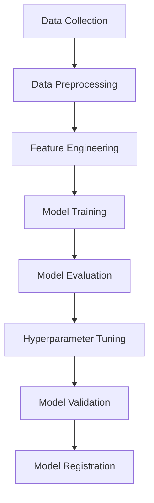
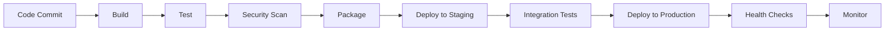

# AIOps Polaris MLOps/DevOps Process Document

## Document Information
- **Document Title**: MLOps/DevOps Process Document
- **Version**: 1.0
- **Date**: 2025-09-01
- **Author**: AI System Architect
- **Status**: Draft

## Table of Contents
1. [Overview](#overview)
2. [MLOps Process](#mlops-process)
3. [DevOps Process](#devops-process)
4. [CI/CD Pipeline](#cicd-pipeline)
5. [Model Lifecycle Management](#model-lifecycle-management)
6. [Infrastructure as Code](#infrastructure-as-code)
7. [Monitoring and Observability](#monitoring-and-observability)
8. [Testing Strategy](#testing-strategy)
9. [Security and Compliance](#security-and-compliance)
10. [Governance and Approval Process](#governance-and-approval-process)
11. [Tools and Technologies](#tools-and-technologies)
12. [Process Automation](#process-automation)
13. [Risk Management](#risk-management)
14. [Documentation and Knowledge Management](#documentation-and-knowledge-management)

## 1. Overview

### 1.1 Purpose
This document defines the MLOps (Machine Learning Operations) and DevOps (Development Operations) processes for the AIOps Polaris platform, ensuring reliable, scalable, and maintainable deployment of AI-powered operational intelligence solutions.

### 1.2 Scope
- Model development and deployment lifecycle
- Code development and deployment processes
- Infrastructure provisioning and management
- Continuous integration and deployment
- Quality assurance and testing
- Monitoring and maintenance

### 1.3 Key Principles
- **Automation First**: Minimize manual interventions
- **Reproducibility**: Ensure consistent environments across stages
- **Observability**: Comprehensive monitoring and logging
- **Security**: Built-in security controls and compliance
- **Scalability**: Support for growing workloads
- **Reliability**: High availability and fault tolerance

## 2. MLOps Process

### 2.1 Model Development Lifecycle

#### 2.1.1 Experimentation Phase


**Process Steps:**
1. **Data Collection and Validation**
   - Automated data quality checks
   - Data lineage tracking
   - Version control for datasets
   - **TBD**: Specific data validation rules and thresholds

2. **Model Training**
   - Reproducible training environments
   - Experiment tracking with MLflow
   - Resource allocation and optimization
   - **TBD**: Training infrastructure scaling policies

3. **Model Evaluation**
   - Standardized evaluation metrics
   - A/B testing framework
   - Performance benchmarking
   - **TBD**: Model performance SLAs and acceptance criteria

#### 2.1.2 Model Registry
- **Model Versioning**: Semantic versioning (MAJOR.MINOR.PATCH)
- **Metadata Management**: Training data, parameters, metrics
- **Model Lineage**: Full traceability from data to deployment
- **Approval Workflow**: Multi-stage approval process

### 2.2 Model Deployment Pipeline

#### 2.2.1 Staging Environment
```yaml
# Example deployment configuration
apiVersion: apps/v1
kind: Deployment
metadata:
  name: aiops-model-staging
spec:
  replicas: 2
  selector:
    matchLabels:
      app: aiops-model
      environment: staging
  template:
    spec:
      containers:
      - name: model-server
        image: aiops/model:latest
        resources:
          limits:
            cpu: 2
            memory: 4Gi
          requests:
            cpu: 1
            memory: 2Gi
```

#### 2.2.2 Production Deployment
- **Blue-Green Deployment**: Zero-downtime deployments
- **Canary Releases**: Gradual rollout to minimize risk
- **Rollback Mechanisms**: Quick reversion to previous versions
- **Health Checks**: Automated deployment validation

### 2.3 Model Monitoring

#### 2.3.1 Performance Monitoring
- **Model Accuracy**: Real-time prediction quality metrics
- **Data Drift Detection**: Input data distribution changes
- **Model Drift Detection**: Output distribution changes
- **Resource Utilization**: CPU, memory, and GPU usage

#### 2.3.2 Business Metrics
- **Incident Resolution Time**: MTTR improvement tracking
- **False Positive Rate**: Alert accuracy monitoring
- **User Satisfaction**: Feedback and adoption metrics
- **Cost Optimization**: Resource usage and efficiency

## 3. DevOps Process

### 3.1 Development Workflow

#### 3.1.1 Git Workflow
```
main branch (production)
├── develop branch (integration)
│   ├── feature/agent-optimization
│   ├── feature/rag-enhancement
│   └── hotfix/critical-bug-fix
└── release/v1.2.0
```

**Branching Strategy:**
- **Main Branch**: Production-ready code
- **Develop Branch**: Integration branch for features
- **Feature Branches**: Individual feature development
- **Release Branches**: Release preparation and testing
- **Hotfix Branches**: Critical production fixes

#### 3.1.2 Code Review Process
1. **Pull Request Creation**
   - Automated code quality checks
   - Security vulnerability scanning
   - Unit test execution
   - **TBD**: Code coverage thresholds

2. **Review Requirements**
   - Minimum 2 reviewers for production changes
   - Security review for sensitive components
   - Architecture review for major changes
   - **TBD**: Review assignment automation rules

### 3.2 Environment Management

#### 3.2.1 Environment Hierarchy
```
Development → Testing → Staging → Production
     ↓           ↓        ↓         ↓
   Local    Integration  Pre-prod  Live
```

**Environment Specifications:**
- **Development**: Individual developer environments
- **Testing**: Automated testing and QA validation
- **Staging**: Production-like environment for final testing
- **Production**: Live system serving end users

#### 3.2.2 Configuration Management
- **Environment-specific configurations**
- **Secret management with HashiCorp Vault**
- **Configuration validation and drift detection**
- **Automated configuration deployment**

## 4. CI/CD Pipeline

### 4.1 Continuous Integration

#### 4.1.1 Pipeline Stages
```yaml
# GitHub Actions CI/CD Pipeline
name: AIOps Polaris CI/CD
on:
  push:
    branches: [main, develop]
  pull_request:
    branches: [main]

jobs:
  test:
    runs-on: ubuntu-latest
    steps:
      - uses: actions/checkout@v3
      - name: Set up Python
        uses: actions/setup-python@v3
        with:
          python-version: '3.9'
      - name: Install dependencies
        run: |
          pip install -r requirements.txt
          pip install -r requirements-dev.txt
      - name: Run tests
        run: |
          pytest tests/ --cov=src/
          flake8 src/
          mypy src/
      - name: Security scan
        run: bandit -r src/
```

#### 4.1.2 Quality Gates
1. **Code Quality**: Linting, formatting, complexity analysis
2. **Security**: Vulnerability scanning, dependency checks
3. **Testing**: Unit tests, integration tests, coverage thresholds
4. **Performance**: Load testing, memory profiling
5. **Documentation**: API docs generation and validation

### 4.2 Continuous Deployment

#### 4.2.1 Deployment Pipeline


#### 4.2.2 Deployment Strategies
- **Rolling Updates**: Gradual replacement of instances
- **Blue-Green**: Complete environment switch
- **Canary**: Percentage-based traffic routing
- ****TBD**: Automated rollback triggers and conditions**

## 5. Model Lifecycle Management

### 5.1 Model Versioning

#### 5.1.1 Version Schema
```
Model Version: {MAJOR}.{MINOR}.{PATCH}-{BUILD}
Example: 2.1.3-20240901.1
```

- **MAJOR**: Breaking changes or significant architecture updates
- **MINOR**: New features or significant improvements
- **PATCH**: Bug fixes and minor improvements
- **BUILD**: Build number with timestamp

#### 5.1.2 Model Artifacts
```
model-artifacts/
├── model.pkl                 # Serialized model
├── preprocessing.pkl         # Data preprocessing pipeline
├── metadata.json            # Model metadata and metrics
├── requirements.txt         # Model dependencies
├── model_card.md           # Model documentation
└── validation_report.pdf    # Performance validation
```

### 5.2 Model Governance

#### 5.2.1 Approval Workflow
1. **Model Development**: Data scientist develops and validates model
2. **Technical Review**: Senior ML engineer reviews architecture
3. **Quality Assurance**: QA team validates performance and reliability
4. **Security Review**: Security team reviews for vulnerabilities
5. **Business Approval**: Product owner approves for production
6. **Deployment Authorization**: DevOps team authorizes deployment

#### 5.2.2 Compliance Requirements
- **Model Explainability**: SHAP/LIME integration for interpretability
- **Bias Detection**: Fairness metrics and bias mitigation
- **Audit Trail**: Complete lineage from data to predictions
- **Data Privacy**: GDPR/CCPA compliance for data handling

## 6. Infrastructure as Code

### 6.1 Infrastructure Management

#### 6.1.1 Terraform Configuration
```hcl
# main.tf - Infrastructure definition
provider "aws" {
  region = var.aws_region
}

module "eks_cluster" {
  source = "./modules/eks"
  
  cluster_name    = "aiops-polaris"
  node_groups = {
    workers = {
      instance_types = ["m5.xlarge"]
      capacity_type  = "ON_DEMAND"
      min_size      = 2
      max_size      = 10
      desired_size  = 3
    }
  }
}

module "rds_database" {
  source = "./modules/rds"
  
  engine_version = "8.0"
  instance_class = "db.r5.xlarge"
  storage_size   = 100
}
```

#### 6.1.2 Kubernetes Resources
```yaml
# namespace.yaml
apiVersion: v1
kind: Namespace
metadata:
  name: aiops-polaris
  labels:
    name: aiops-polaris
---
# deployment.yaml
apiVersion: apps/v1
kind: Deployment
metadata:
  name: aiops-api
  namespace: aiops-polaris
spec:
  replicas: 3
  selector:
    matchLabels:
      app: aiops-api
  template:
    spec:
      containers:
      - name: api
        image: aiops/api:latest
        ports:
        - containerPort: 8000
        env:
        - name: DATABASE_URL
          valueFrom:
            secretKeyRef:
              name: database-secret
              key: url
```

### 6.2 Environment Provisioning

#### 6.2.1 Automated Provisioning
- **Infrastructure Templates**: Reusable Terraform modules
- **Environment Configuration**: Environment-specific variables
- **Resource Tagging**: Cost tracking and resource management
- **Security Groups**: Network access control and isolation

#### 6.2.2 Resource Scaling
- **Horizontal Pod Autoscaler**: CPU/memory-based scaling
- **Vertical Pod Autoscaler**: Resource optimization
- **Cluster Autoscaler**: Node provisioning automation
- ****TBD**: Custom metrics-based scaling policies**

## 7. Monitoring and Observability

### 7.1 Monitoring Stack

#### 7.1.1 Metrics Collection
```yaml
# prometheus-config.yaml
global:
  scrape_interval: 15s
  evaluation_interval: 15s

rule_files:
  - "aiops_rules.yml"

scrape_configs:
  - job_name: 'aiops-api'
    static_configs:
      - targets: ['aiops-api:8000']
    metrics_path: /metrics
    scrape_interval: 10s

  - job_name: 'aiops-agents'
    static_configs:
      - targets: ['aiops-agents:8001']
    metrics_path: /metrics
    scrape_interval: 10s
```

#### 7.1.2 Key Performance Indicators
- **System Metrics**: CPU, memory, disk, network utilization
- **Application Metrics**: Request latency, throughput, error rates
- **Model Metrics**: Prediction accuracy, inference time, drift scores
- **Business Metrics**: Incident resolution time, user engagement

### 7.2 Logging and Tracing

#### 7.2.1 Structured Logging
```python
# logging_config.py
import structlog

structlog.configure(
    processors=[
        structlog.stdlib.filter_by_level,
        structlog.stdlib.add_logger_name,
        structlog.stdlib.add_log_level,
        structlog.stdlib.PositionalArgumentsFormatter(),
        structlog.processors.TimeStamper(fmt="iso"),
        structlog.processors.StackInfoRenderer(),
        structlog.processors.format_exc_info,
        structlog.processors.UnicodeDecoder(),
        structlog.processors.JSONRenderer()
    ],
    context_class=dict,
    logger_factory=structlog.stdlib.LoggerFactory(),
    wrapper_class=structlog.stdlib.BoundLogger,
    cache_logger_on_first_use=True,
)
```

#### 7.2.2 Distributed Tracing
- **OpenTelemetry Integration**: Request tracing across services
- **Jaeger Backend**: Trace storage and visualization
- **Service Mesh**: Istio for automatic instrumentation
- ****TBD**: Custom span attributes for business context**

### 7.3 Alerting and Incident Response

#### 7.3.1 Alert Configuration
```yaml
# alerting_rules.yml
groups:
- name: aiops.rules
  rules:
  - alert: HighErrorRate
    expr: rate(http_requests_total{status=~"5.."}[5m]) > 0.1
    for: 2m
    labels:
      severity: warning
    annotations:
      summary: "High error rate detected"
      description: "Error rate is {{ $value }} errors per second"

  - alert: ModelAccuracyDrop
    expr: aiops_model_accuracy < 0.85
    for: 5m
    labels:
      severity: critical
    annotations:
      summary: "Model accuracy below threshold"
      description: "Model accuracy dropped to {{ $value }}"
```

#### 7.3.2 Incident Response
1. **Alert Generation**: Automated threshold-based alerts
2. **Escalation Policies**: Multi-tier notification system
3. **Runbooks**: Standardized response procedures
4. **Post-Incident Reviews**: Root cause analysis and improvements

## 8. Testing Strategy

### 8.1 Testing Pyramid

#### 8.1.1 Unit Testing
```python
# test_rag_service.py
import pytest
from unittest.mock import Mock, patch
from src.services.rag_search_service import RAGSearchService

class TestRAGSearchService:
    @pytest.fixture
    def rag_service(self):
        return RAGSearchService()

    def test_search_with_valid_query(self, rag_service):
        query = "database connection error"
        results = rag_service.search(query, top_k=5)
        assert len(results) <= 5
        assert all('score' in result for result in results)

    @patch('src.services.rag_search_service.weaviate_client')
    def test_search_handles_empty_results(self, mock_client, rag_service):
        mock_client.query.get.return_value.execute.return_value = []
        results = rag_service.search("nonexistent query")
        assert results == []
```

#### 8.1.2 Integration Testing
```python
# test_agent_integration.py
import pytest
from src.agents.planner_agent import PlannerAgent
from src.agents.knowledge_agent import KnowledgeAgent

@pytest.mark.integration
class TestAgentIntegration:
    def test_planner_knowledge_interaction(self):
        planner = PlannerAgent()
        knowledge = KnowledgeAgent()
        
        # Test agent communication
        plan = planner.create_plan("investigate database outage")
        knowledge_query = knowledge.extract_query_from_plan(plan)
        
        assert knowledge_query is not None
        assert "database" in knowledge_query.lower()
```

#### 8.1.3 End-to-End Testing
```python
# test_e2e_workflow.py
import pytest
import requests

@pytest.mark.e2e
class TestE2EWorkflow:
    def test_complete_incident_analysis_workflow(self):
        # Submit incident
        incident_data = {
            "title": "Database Connection Issues",
            "description": "Users unable to connect to database",
            "severity": "high"
        }
        
        response = requests.post("/api/incidents", json=incident_data)
        assert response.status_code == 201
        incident_id = response.json()["id"]
        
        # Trigger analysis
        analysis_response = requests.post(f"/api/incidents/{incident_id}/analyze")
        assert analysis_response.status_code == 200
        
        # Check results
        result_response = requests.get(f"/api/incidents/{incident_id}/results")
        assert result_response.status_code == 200
        assert "root_cause" in result_response.json()
```

### 8.2 Performance Testing

#### 8.2.1 Load Testing
```python
# locustfile.py
from locust import HttpUser, task, between

class AIOpsUser(HttpUser):
    wait_time = between(1, 3)
    
    def on_start(self):
        self.client.post("/api/auth/login", json={
            "username": "test_user",
            "password": "test_pass"
        })
    
    @task(3)
    def search_knowledge(self):
        self.client.post("/api/search", json={
            "query": "database performance issue",
            "filters": {"type": "incident"}
        })
    
    @task(1)
    def analyze_incident(self):
        self.client.post("/api/incidents/analyze", json={
            "incident_id": "test-incident-123"
        })
```

#### 8.2.2 Model Performance Testing
- **Inference Latency**: Response time under various loads
- **Throughput**: Requests per second capacity
- **Resource Utilization**: CPU, memory, GPU usage patterns
- ****TBD**: Performance benchmarks and SLA definitions**

### 8.3 Security Testing

#### 8.3.1 Security Scan Integration
```yaml
# security-scan.yml
name: Security Scan
on: [push, pull_request]

jobs:
  security:
    runs-on: ubuntu-latest
    steps:
      - uses: actions/checkout@v3
      
      - name: Run Bandit Security Scan
        run: |
          pip install bandit
          bandit -r src/ -f json -o bandit-report.json
      
      - name: Run Safety Check
        run: |
          pip install safety
          safety check --json --output safety-report.json
      
      - name: Container Image Scan
        uses: aquasec/trivy-action@master
        with:
          image-ref: 'aiops/api:latest'
          format: 'sarif'
          output: 'trivy-results.sarif'
```

#### 8.3.2 Penetration Testing
- **API Security Testing**: OWASP ZAP integration
- **Authentication/Authorization**: JWT token validation
- **Input Validation**: SQL injection, XSS prevention
- ****TBD**: Third-party security audit schedule**

## 9. Security and Compliance

### 9.1 Security Controls

#### 9.1.1 Access Control
- **Role-Based Access Control (RBAC)**: Kubernetes RBAC policies
- **Multi-Factor Authentication**: SSO integration with SAML/OIDC
- **API Authentication**: JWT tokens with refresh mechanism
- **Service-to-Service**: mTLS for inter-service communication

#### 9.1.2 Data Security
```python
# encryption_utils.py
from cryptography.fernet import Fernet
import os

class DataEncryption:
    def __init__(self):
        self.key = os.environ.get('ENCRYPTION_KEY', Fernet.generate_key())
        self.cipher = Fernet(self.key)
    
    def encrypt_sensitive_data(self, data: str) -> bytes:
        return self.cipher.encrypt(data.encode())
    
    def decrypt_sensitive_data(self, encrypted_data: bytes) -> str:
        return self.cipher.decrypt(encrypted_data).decode()
```

### 9.2 Compliance Framework

#### 9.2.1 Regulatory Requirements
- **GDPR Compliance**: Data privacy and user consent management
- **SOC 2 Type II**: Security and availability controls
- **ISO 27001**: Information security management system
- ****TBD**: Industry-specific compliance requirements**

#### 9.2.2 Audit Trail
```python
# audit_logger.py
import structlog
from datetime import datetime
from typing import Dict, Any

audit_logger = structlog.get_logger("audit")

class AuditLogger:
    @staticmethod
    def log_model_access(user_id: str, model_id: str, action: str):
        audit_logger.info(
            "model_access",
            user_id=user_id,
            model_id=model_id,
            action=action,
            timestamp=datetime.utcnow().isoformat()
        )
    
    @staticmethod
    def log_data_access(user_id: str, dataset_id: str, query: str):
        audit_logger.info(
            "data_access",
            user_id=user_id,
            dataset_id=dataset_id,
            query_hash=hash(query),
            timestamp=datetime.utcnow().isoformat()
        )
```

## 10. Governance and Approval Process

### 10.1 Change Management

#### 10.1.1 Change Categories
- **Low Risk**: Bug fixes, configuration updates
- **Medium Risk**: Feature additions, dependency updates
- **High Risk**: Architecture changes, security updates
- **Emergency**: Critical hotfixes, security patches

#### 10.1.2 Approval Matrix
```
Change Type    | Developer | Tech Lead | Architect | Security | Operations
Low Risk       |     R     |     A     |           |          |
Medium Risk    |     R     |     A     |     C     |          |     I
High Risk      |     R     |     A     |     A     |     A    |     A
Emergency      |     R     |     A     |           |     C    |     I

R = Responsible, A = Accountable, C = Consulted, I = Informed
```

### 10.2 Release Management

#### 10.2.1 Release Planning
1. **Feature Freeze**: Code complete deadline
2. **Testing Phase**: Comprehensive testing cycle
3. **User Acceptance Testing**: Stakeholder validation
4. **Production Deployment**: Scheduled release window
5. **Post-Release Monitoring**: Performance and stability tracking

#### 10.2.2 Release Documentation
```markdown
# Release Notes Template
## Release Version: v2.1.0
## Release Date: 2024-09-01

### New Features
- Enhanced RAG search with hybrid retrieval
- Multi-agent orchestration improvements
- Real-time incident correlation

### Bug Fixes
- Fixed memory leak in knowledge graph service
- Resolved authentication timeout issues
- Corrected data pipeline error handling

### Breaking Changes
- API endpoint restructuring for v2 compatibility
- Database schema migration required

### Deployment Instructions
1. Run database migrations
2. Update configuration files
3. Deploy services in specified order
4. Verify health checks
```

## 11. Tools and Technologies

### 11.1 Development Tools

#### 11.1.1 Core Technologies
- **Programming Languages**: Python 3.9+, TypeScript
- **Frameworks**: FastAPI, React, LangChain
- **Databases**: MySQL, Neo4j, Weaviate, Redis
- **Message Queues**: Redis Streams
- **Container Runtime**: Docker, containerd

#### 11.1.2 MLOps Tools
- **Experiment Tracking**: MLflow, Weights & Biases
- **Model Serving**: vLLM, TensorFlow Serving
- **Feature Store**: **TBD**: Feast or custom solution
- **Data Validation**: Great Expectations
- **Model Monitoring**: Evidently AI, WhyLabs

### 11.2 Infrastructure Tools

#### 11.2.1 Cloud Platform
- **Primary Cloud**: AWS (Amazon Web Services)
- **Container Orchestration**: Amazon EKS
- **Service Mesh**: Istio
- **API Gateway**: Kong, AWS API Gateway
- **Load Balancer**: AWS Application Load Balancer

#### 11.2.2 Observability Stack
- **Metrics**: Prometheus, CloudWatch
- **Logging**: ELK Stack (Elasticsearch, Logstash, Kibana)
- **Tracing**: Jaeger, AWS X-Ray
- **Visualization**: Grafana, Kibana dashboards
- **Alerting**: AlertManager, PagerDuty

### 11.3 Security Tools

#### 11.3.1 Security Scanning
- **SAST**: SonarQube, CodeQL
- **DAST**: OWASP ZAP
- **Container Scanning**: Trivy, Clair
- **Dependency Scanning**: Snyk, Safety
- **Infrastructure Scanning**: Checkov, Terrascan

#### 11.3.2 Secret Management
```yaml
# vault-config.yaml
apiVersion: v1
kind: ConfigMap
metadata:
  name: vault-config
data:
  vault.hcl: |
    ui = true
    storage "mysql" {
      username = "vault"
      password = "vault_password"
      database = "vault"
      table    = "vault_data"
      max_parallel = 128
    }
    
    listener "tcp" {
      address = "0.0.0.0:8200"
      tls_disable = false
      tls_cert_file = "/etc/ssl/certs/vault.crt"
      tls_key_file = "/etc/ssl/private/vault.key"
    }
```

## 12. Process Automation

### 12.1 Automated Workflows

#### 12.1.1 GitHub Actions Workflows
```yaml
# .github/workflows/deploy.yml
name: Deploy to Production
on:
  push:
    tags:
      - 'v*'

env:
  REGISTRY: ghcr.io
  IMAGE_NAME: ${{ github.repository }}

jobs:
  build-and-deploy:
    runs-on: ubuntu-latest
    permissions:
      contents: read
      packages: write
    
    steps:
      - name: Checkout
        uses: actions/checkout@v3
      
      - name: Build Docker images
        run: |
          docker build -t ${{ env.REGISTRY }}/${{ env.IMAGE_NAME }}:${{ github.ref_name }} .
          docker push ${{ env.REGISTRY }}/${{ env.IMAGE_NAME }}:${{ github.ref_name }}
      
      - name: Deploy to Kubernetes
        run: |
          kubectl set image deployment/aiops-api \
            api=${{ env.REGISTRY }}/${{ env.IMAGE_NAME }}:${{ github.ref_name }}
          kubectl rollout status deployment/aiops-api
```

#### 12.1.2 Model Deployment Automation
```python
# model_deployment.py
from typing import Dict, Any
import requests
import time

class ModelDeploymentAutomator:
    def __init__(self, k8s_client, model_registry):
        self.k8s_client = k8s_client
        self.model_registry = model_registry
    
    def deploy_model(self, model_id: str, environment: str) -> Dict[str, Any]:
        # Get model artifacts
        model_info = self.model_registry.get_model(model_id)
        
        # Update deployment configuration
        deployment_config = self.generate_deployment_config(model_info, environment)
        
        # Apply Kubernetes resources
        self.k8s_client.apply_deployment(deployment_config)
        
        # Wait for rollout completion
        self.wait_for_rollout(f"aiops-model-{environment}")
        
        # Run health checks
        health_check_result = self.run_health_checks(environment)
        
        return {
            "status": "success" if health_check_result else "failed",
            "model_id": model_id,
            "environment": environment,
            "deployment_time": time.time()
        }
```

### 12.2 Infrastructure Automation

#### 12.2.1 Terraform Automation
```hcl
# automation/main.tf
resource "aws_lambda_function" "infrastructure_monitor" {
  filename         = "infrastructure_monitor.zip"
  function_name    = "aiops-infrastructure-monitor"
  role            = aws_iam_role.lambda_role.arn
  handler         = "index.handler"
  source_code_hash = filebase64sha256("infrastructure_monitor.zip")
  runtime         = "python3.9"
  timeout         = 300

  environment {
    variables = {
      SLACK_WEBHOOK_URL = var.slack_webhook_url
      SNS_TOPIC_ARN    = aws_sns_topic.infrastructure_alerts.arn
    }
  }
}

resource "aws_cloudwatch_event_rule" "infrastructure_check" {
  name                = "infrastructure-health-check"
  description         = "Trigger infrastructure health checks"
  schedule_expression = "rate(5 minutes)"
}
```

### 12.3 Testing Automation

#### 12.3.1 Automated Test Suite
```python
# test_automation.py
import pytest
from typing import List, Dict
from concurrent.futures import ThreadPoolExecutor

class TestAutomationFramework:
    def __init__(self):
        self.test_suites = {
            'unit': self.run_unit_tests,
            'integration': self.run_integration_tests,
            'performance': self.run_performance_tests,
            'security': self.run_security_tests
        }
    
    def run_all_tests(self) -> Dict[str, bool]:
        results = {}
        with ThreadPoolExecutor(max_workers=4) as executor:
            futures = {
                suite: executor.submit(test_func)
                for suite, test_func in self.test_suites.items()
            }
            
            for suite, future in futures.items():
                try:
                    results[suite] = future.result()
                except Exception as e:
                    results[suite] = False
                    print(f"Test suite {suite} failed: {e}")
        
        return results
```

## 13. Risk Management

### 13.1 Technical Risks

#### 13.1.1 Model Performance Risks
- **Model Drift**: Continuous monitoring and retraining pipelines
- **Data Quality Issues**: Automated data validation and alerts
- **Inference Latency**: Performance testing and optimization
- **Resource Constraints**: Auto-scaling and resource monitoring

#### 13.1.2 Infrastructure Risks
- **Service Unavailability**: Multi-AZ deployment and disaster recovery
- **Scaling Bottlenecks**: Horizontal and vertical scaling strategies
- **Security Vulnerabilities**: Regular security scans and updates
- **Dependency Failures**: Circuit breakers and fallback mechanisms

### 13.2 Operational Risks

#### 13.2.1 Deployment Risks
```python
# deployment_safety.py
class DeploymentSafetyChecks:
    def __init__(self):
        self.checks = [
            self.verify_resource_limits,
            self.check_database_migrations,
            self.validate_configuration,
            self.test_external_dependencies
        ]
    
    def run_pre_deployment_checks(self, deployment_config):
        for check in self.checks:
            result = check(deployment_config)
            if not result.passed:
                raise DeploymentBlockedException(
                    f"Safety check failed: {result.message}"
                )
    
    def verify_resource_limits(self, config):
        # Verify CPU/memory limits are within acceptable ranges
        pass
    
    def check_database_migrations(self, config):
        # Ensure all migrations are applied and reversible
        pass
```

#### 13.2.2 Data Risks
- **Data Loss**: Regular backups and point-in-time recovery
- **Data Corruption**: Checksums and integrity validation
- **Privacy Violations**: Data masking and access controls
- ****TBD**: Data retention policies and automated cleanup**

### 13.3 Business Continuity

#### 13.3.1 Disaster Recovery
```yaml
# disaster-recovery.yml
apiVersion: v1
kind: ConfigMap
metadata:
  name: disaster-recovery-config
data:
  recovery_procedures: |
    1. Database Recovery:
       - Restore from latest automated backup
       - Apply transaction logs since backup
       - Verify data consistency
    
    2. Service Recovery:
       - Deploy services to alternate region
       - Update DNS to point to new services
       - Validate end-to-end functionality
    
    3. Communication:
       - Notify stakeholders of incident
       - Provide regular status updates
       - Document lessons learned
```

#### 13.3.2 Backup Strategy
- **Database Backups**: Daily automated backups with 30-day retention
- **Configuration Backups**: Version-controlled infrastructure configs
- **Model Artifacts**: Immutable model registry with versioning
- ****TBD**: Cross-region backup replication strategy**

## 14. Documentation and Knowledge Management

### 14.1 Documentation Strategy

#### 14.1.1 Living Documentation
```python
# documentation_generator.py
import ast
import inspect
from typing import Dict, List

class DocumentationGenerator:
    def generate_api_docs(self, module_path: str) -> Dict[str, Any]:
        """Generate API documentation from source code"""
        with open(module_path, 'r') as file:
            tree = ast.parse(file.read())
        
        docs = {
            'endpoints': [],
            'models': [],
            'examples': []
        }
        
        for node in ast.walk(tree):
            if isinstance(node, ast.FunctionDef):
                if self.is_api_endpoint(node):
                    docs['endpoints'].append(self.extract_endpoint_info(node))
        
        return docs
    
    def update_confluence_pages(self, docs: Dict[str, Any]):
        """Update Confluence documentation automatically"""
        # **TBD**: Confluence API integration
        pass
```

#### 14.1.2 Knowledge Base
- **Technical Documentation**: Architecture decisions, API references
- **Operational Procedures**: Runbooks, troubleshooting guides
- **Training Materials**: Onboarding guides, best practices
- **Incident Post-Mortems**: Root cause analysis and improvements

### 14.2 Knowledge Sharing

#### 14.2.1 Code Reviews as Learning
```yaml
# code-review-checklist.yml
review_checklist:
  - architectural_consistency: "Does the code follow established patterns?"
  - performance_impact: "Are there potential performance bottlenecks?"
  - security_considerations: "Are security best practices followed?"
  - testing_coverage: "Are tests comprehensive and meaningful?"
  - documentation_quality: "Is the code self-documenting with good comments?"
  - error_handling: "Are errors handled gracefully?"
  - dependency_management: "Are new dependencies justified and secure?"
```

#### 14.2.2 Community of Practice
- **Technical Talks**: Regular knowledge sharing sessions
- **Brown Bag Sessions**: Informal learning opportunities
- **Code Kata**: Practice sessions for skill development
- ****TBD**: External conference participation and knowledge sharing**

---

## Appendices

### Appendix A: Emergency Response Procedures

#### A.1 Critical System Failure
1. **Immediate Response** (0-15 minutes)
   - Activate incident response team
   - Assess impact and severity
   - Implement immediate containment measures
   - Communicate with stakeholders

2. **Investigation and Resolution** (15 minutes - 4 hours)
   - Identify root cause
   - Implement fix or rollback
   - Verify system restoration
   - Document incident details

3. **Post-Incident Activities** (Next 48 hours)
   - Conduct post-mortem review
   - Implement preventive measures
   - Update procedures and documentation
   - Communicate lessons learned

### Appendix B: Tool Configuration Templates

#### B.1 Monitoring Configuration
```yaml
# monitoring-template.yml
apiVersion: v1
kind: ConfigMap
metadata:
  name: monitoring-config
data:
  prometheus.yml: |
    global:
      scrape_interval: 15s
      evaluation_interval: 15s
    
    rule_files:
      - "/etc/prometheus/rules/*.yml"
    
    scrape_configs:
      - job_name: 'kubernetes-apiservers'
        kubernetes_sd_configs:
        - role: endpoints
        scheme: https
        tls_config:
          ca_file: /var/run/secrets/kubernetes.io/serviceaccount/ca.crt
        bearer_token_file: /var/run/secrets/kubernetes.io/serviceaccount/token
```

### Appendix C: Compliance Checklists

#### C.1 GDPR Compliance Checklist
- [ ] Data processing lawful basis documented
- [ ] Privacy impact assessments completed
- [ ] User consent mechanisms implemented
- [ ] Data subject rights procedures established
- [ ] Data breach notification procedures in place
- [ ] **TBD**: Data protection officer appointed

### Appendix D: Performance Benchmarks

#### D.1 System Performance Targets
| Metric | Target | Measurement Method |
|--------|--------|-------------------|
| API Response Time | < 200ms (95th percentile) | Application Performance Monitoring |
| Model Inference Latency | < 1000ms | Custom metrics |
| System Uptime | > 99.9% | Health check monitoring |
| Error Rate | < 0.1% | Error tracking |
| **TBD** | **TBD** | **TBD** |

---

**Document Control:**
- Last Updated: 2025-09-01
- Next Review Date: **TBD**
- Document Owner: DevOps Team Lead
- Approval Status: Draft - Pending Review