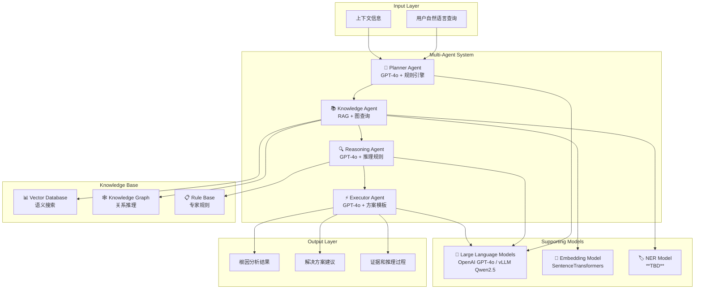
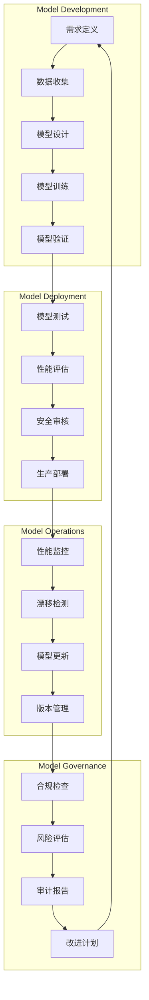

# 模型文档 (Model Card)
# AI Model Documentation and Fact Sheet

## 文档信息
- **项目名称**: AIOps Polaris - 智能运维平台
- **文档版本**: 1.0.0
- **创建日期**: 2025-09-01
- **最后更新**: 2025-09-01
- **模型负责人**: **TBD**
- **审批人**: **TBD**

## 1. 模型概述

### 1.1 模型基本信息
| 属性 | 值 | 备注 |
|------|---|------|
| **模型名称** | AIOps Polaris Multi-Agent System | 多智能体协作系统 |
| **模型版本** | v1.0.0 | 初始生产版本 |
| **模型类型** | 多智能体系统 + RAG增强 | 混合AI架构 |
| **开发机构** | **TBD** | **TBD** |
| **许可证** | Apache 2.0 | 开源许可 |
| **发布日期** | 2025-09-01 | **TBD** |

### 1.2 模型用途和应用场景
**主要用途**: 
- 自动化IT运维根因分析（RCA）
- 智能故障诊断和解决方案生成
- 运维知识问答和决策支持
- 服务依赖关系分析

**适用场景**:
- 生产环境故障快速定位
- 复杂系统问题诊断
- 运维经验知识化和传承
- 新手工程师技能增强

**不适用场景**:
- 实时系统控制和自动化操作
- 财务和法律决策支持
- 医疗诊断相关应用
- 安全漏洞利用和攻击

## 2. 模型架构

### 2.1 整体架构设计



### 2.2 核心模型组件

#### 2.2.1 大语言模型 (LLM)
| 模型 | 用途 | 输入格式 | 输出格式 | 性能指标 |
|------|------|----------|----------|---------|
| **OpenAI GPT-4o** | 主要推理模型 | 文本提示 + 上下文 | 结构化文本 | **TBD** tokens/sec |
| **vLLM Qwen2.5-1.5B** | 本地备用模型 | 文本提示 | 文本回复 | **TBD** tokens/sec |

**模型配置参数**:
```python
LLM_CONFIGS = {
    "openai_gpt4o": {
        "model_name": "gpt-4o",
        "max_tokens": 2048,
        "temperature": 0.1,        # 低温度保证稳定性
        "top_p": 0.9,
        "frequency_penalty": 0.0,
        "presence_penalty": 0.0,
        "timeout": 30              # 30秒超时
    },
    "vllm_qwen25": {
        "model_name": "Qwen/Qwen2.5-1.5B-Instruct",
        "max_tokens": 1024,
        "temperature": 0.2,
        "top_p": 0.85,
        "repetition_penalty": 1.1
    }
}
```

#### 2.2.2 文本嵌入模型
| 属性 | 值 | 说明 |
|------|---|------|
| **模型名称** | sentence-transformers/all-MiniLM-L6-v2 | 轻量级多语言模型 |
| **向量维度** | 384维 | 平衡性能和存储成本 |
| **最大序列长度** | 512 tokens | 适合文档片段处理 |
| **支持语言** | 中文、英文 | 多语言支持 |
| **推理时间** | ~10ms/文档 | CPU推理性能 |

**嵌入模型评估**:
```python
EMBEDDING_MODEL_METRICS = {
    "semantic_similarity": {
        "test_dataset": "IT运维相关文档对",
        "test_size": 1000,
        "similarity_threshold": 0.7,
        "accuracy": "**TBD**%",
        "recall": "**TBD**%"
    },
    "cross_lingual_performance": {
        "zh_en_similarity": "**TBD**",  # 中英文语义相似度
        "domain_adaptation": "**TBD**"  # 领域适应性能
    },
    "computational_efficiency": {
        "cpu_inference_time": "~10ms",
        "memory_usage": "~200MB",
        "batch_processing": "64 docs/batch"
    }
}
```

#### 2.2.3 命名实体识别模型 (**TBD**)
| 属性 | 值 | 说明 |
|------|---|------|
| **模型类型** | **TBD** | 待确定具体NER模型 |
| **实体类型** | SERVICE, HOST, DATABASE, ERROR, METRIC | 运维领域实体 |
| **语言支持** | 中文、英文 | 双语实体识别 |
| **准确率** | **TBD**% | 在运维文档上的表现 |
| **召回率** | **TBD**% | 实体覆盖率 |

## 3. 训练数据

### 3.1 数据源构成
| 数据类型 | 数量规模 | 数据质量 | 标注状态 | 来源 |
|---------|---------|----------|---------|------|
| **系统日志** | **TBD** 条 | 原始数据 | 部分标注 | 生产环境 |
| **运维文档** | **TBD** 篇 | 高质量 | 人工标注 | Wiki、手册 |
| **故障工单** | **TBD** 个 | 结构化 | 已标注 | JIRA系统 |
| **代码仓库** | **TBD** 文件 | 原始代码 | 自动标注 | GitLab |
| **专家知识** | **TBD** 条 | 高质量 | 专家标注 | 人工整理 |

### 3.2 数据预处理

#### 3.2.1 文本预处理流程
```python
class DataPreprocessor:
    """数据预处理器"""
    
    async def preprocess_training_data(self, raw_data: List[Dict]) -> List[Dict]:
        """训练数据预处理"""
        
        processed_data = []
        
        for item in raw_data:
            # 1. 文本清洗
            cleaned_text = self._clean_text(item["content"])
            
            # 2. 语言检测和分离
            language = self._detect_language(cleaned_text)
            
            # 3. 分词和标准化
            tokens = await self._tokenize_text(cleaned_text, language)
            
            # 4. 实体标注验证
            entities = self._validate_entity_annotations(item.get("entities", []))
            
            # 5. 质量评分
            quality_score = self._calculate_text_quality(cleaned_text)
            
            if quality_score >= 0.6:  # 质量阈值
                processed_item = {
                    "id": item["id"],
                    "content": cleaned_text,
                    "language": language,
                    "tokens": tokens,
                    "entities": entities,
                    "quality_score": quality_score,
                    "source": item["source"],
                    "category": item.get("category", "general")
                }
                processed_data.append(processed_item)
        
        return processed_data
```

#### 3.2.2 数据增强策略
```python
class DataAugmentationStrategy:
    """数据增强策略"""
    
    # 增强方法配置
    AUGMENTATION_METHODS = {
        "paraphrasing": {
            "enabled": True,
            "model": "**TBD**",  # 释义模型
            "augment_ratio": 0.2  # 增强20%数据
        },
        "synonym_replacement": {
            "enabled": True,
            "technical_terms_dict": "运维术语词典",
            "replacement_ratio": 0.15
        },
        "back_translation": {
            "enabled": False,  # 暂不启用
            "languages": ["en", "zh"],
            "quality_threshold": 0.8
        },
        "noise_injection": {
            "enabled": True,
            "noise_types": ["typos", "formatting"],
            "noise_ratio": 0.1
        }
    }
```

### 3.3 数据质量和偏见评估

#### 3.3.1 数据分布分析
```python
# 训练数据分布统计
DATA_DISTRIBUTION_STATS = {
    "language_distribution": {
        "chinese": "**TBD**%",
        "english": "**TBD**%", 
        "mixed": "**TBD**%"
    },
    "content_type_distribution": {
        "error_logs": "**TBD**%",
        "info_logs": "**TBD**%",
        "documentation": "**TBD**%",
        "code_comments": "**TBD**%",
        "tickets": "**TBD**%"
    },
    "domain_distribution": {
        "database_issues": "**TBD**%",
        "network_problems": "**TBD**%", 
        "application_errors": "**TBD**%",
        "infrastructure_issues": "**TBD**%",
        "performance_problems": "**TBD**%"
    },
    "severity_distribution": {
        "critical": "**TBD**%",
        "high": "**TBD**%",
        "medium": "**TBD**%", 
        "low": "**TBD**%"
    }
}
```

#### 3.3.2 偏见检测和缓解
```python
class BiasDetectionAndMitigation:
    """偏见检测和缓解"""
    
    # 潜在偏见类型
    POTENTIAL_BIASES = {
        "technology_bias": {
            "description": "对特定技术栈的偏见",
            "examples": ["过度偏向某种数据库", "忽略新兴技术"],
            "detection_method": "技术术语频率分析",
            "mitigation": "平衡不同技术的训练数据"
        },
        "severity_bias": {
            "description": "对问题严重程度的偏见", 
            "examples": ["过度高估风险", "忽视低频高影响问题"],
            "detection_method": "严重程度分布分析",
            "mitigation": "分层采样确保平衡"
        },
        "temporal_bias": {
            "description": "时间相关的偏见",
            "examples": ["过度依赖历史模式", "忽视环境变化"],
            "detection_method": "时间序列分析",
            "mitigation": "加权最近数据，定期重训练"
        },
        "language_bias": {
            "description": "语言偏见",
            "examples": ["中英文表现差异", "技术术语处理不平衡"],
            "detection_method": "分语言性能评估",
            "mitigation": "平衡语料，多语言测试"
        }
    }
    
    async def detect_model_bias(self, test_dataset: List[Dict]) -> Dict[str, Any]:
        """检测模型偏见"""
        bias_report = {}
        
        # 1. 技术栈偏见检测
        tech_performance = await self._evaluate_by_technology(test_dataset)
        bias_report["technology_bias"] = self._analyze_performance_variance(tech_performance)
        
        # 2. 严重程度偏见检测
        severity_performance = await self._evaluate_by_severity(test_dataset)
        bias_report["severity_bias"] = self._analyze_severity_distribution(severity_performance)
        
        # 3. 语言偏见检测  
        language_performance = await self._evaluate_by_language(test_dataset)
        bias_report["language_bias"] = self._analyze_language_difference(language_performance)
        
        # 4. 综合偏见评分
        bias_report["overall_bias_score"] = self._calculate_overall_bias(bias_report)
        
        return bias_report
```

## 4. 模型性能评估

### 4.1 评估指标体系

#### 4.1.1 智能体协作性能
| 智能体 | 评估维度 | 指标 | 目标值 | 当前值 |
|--------|---------|------|--------|--------|
| **Planner Agent** | 计划质量 | 计划可行性评分 | ≥ 0.85 | **TBD** |
| | 分类准确性 | 问题类型识别准确率 | ≥ 0.90 | **TBD** |
| | 时间估计 | 时间预测误差 | ≤ 20% | **TBD** |
| **Knowledge Agent** | 检索质量 | 相关文档召回率 | ≥ 0.80 | **TBD** |
| | 检索精度 | 相关文档精确率 | ≥ 0.70 | **TBD** |
| | 响应时间 | 搜索完成时间 | ≤ 3秒 | **TBD** |
| **Reasoning Agent** | 推理质量 | 根因识别准确率 | ≥ 0.80 | **TBD** |
| | 逻辑一致性 | 推理逻辑评分 | ≥ 0.85 | **TBD** |
| | 置信度校准 | 置信度预测准确性 | ≥ 0.75 | **TBD** |
| **Executor Agent** | 方案质量 | 解决方案可行性 | ≥ 0.80 | **TBD** |
| | 方案完整性 | 实施步骤完整性 | ≥ 0.90 | **TBD** |
| | 风险评估 | 风险评估准确性 | ≥ 0.75 | **TBD** |

#### 4.1.2 RAG系统性能
| 组件 | 评估指标 | 计算方式 | 目标值 | 当前值 |
|------|---------|----------|--------|--------|
| **混合搜索** | 检索精度@K | Precision@10 | ≥ 0.70 | **TBD** |
| | 检索召回@K | Recall@10 | ≥ 0.80 | **TBD** |
| | NDCG@K | 归一化折损累积增益 | ≥ 0.75 | **TBD** |
| **向量搜索** | 语义相似度 | 余弦相似度 | ≥ 0.70 | **TBD** |
| | 检索延迟 | P95响应时间 | ≤ 500ms | **TBD** |
| **BM25搜索** | 关键词匹配 | BM25评分 | **TBD** | **TBD** |
| | 全文检索 | F1-Score | ≥ 0.75 | **TBD** |

#### 4.1.3 端到端性能
```python
END_TO_END_METRICS = {
    "task_completion_rate": {
        "description": "任务成功完成率",
        "calculation": "completed_tasks / total_tasks",
        "target": 0.95,
        "current": "**TBD**"
    },
    "average_processing_time": {
        "description": "平均处理时间",
        "calculation": "sum(task_durations) / task_count", 
        "target": "≤ 180秒",
        "current": "**TBD**"
    },
    "user_satisfaction": {
        "description": "用户满意度",
        "calculation": "满意评分 / 总评分",
        "target": "≥ 8.0/10",
        "current": "**TBD**"
    },
    "root_cause_accuracy": {
        "description": "根因分析准确率",
        "calculation": "正确根因识别 / 总分析次数",
        "target": "≥ 0.85", 
        "current": "**TBD**"
    }
}
```

### 4.2 基准测试

#### 4.2.1 功能基准测试
```python
class BenchmarkSuite:
    """基准测试套件"""
    
    # 标准测试案例
    BENCHMARK_CASES = [
        {
            "case_id": "rca_001",
            "description": "数据库连接超时故障分析",
            "input": "MySQL数据库频繁出现连接超时，用户反馈网站访问缓慢",
            "expected_root_causes": ["连接池配置不当", "数据库性能问题", "网络延迟"],
            "expected_solutions": ["调整连接池参数", "数据库性能优化", "网络诊断"],
            "complexity": "medium",
            "domain": "database"
        },
        {
            "case_id": "rca_002", 
            "description": "Kubernetes集群节点异常",
            "input": "K8s集群中service-b pod频繁重启，CPU使用率异常",
            "expected_root_causes": ["资源限制", "内存泄漏", "依赖服务异常"],
            "expected_solutions": ["调整资源配额", "代码问题修复", "依赖检查"],
            "complexity": "high",
            "domain": "container"
        },
        {
            "case_id": "rca_003",
            "description": "网络连接问题诊断",
            "input": "服务间通信出现间歇性超时，影响业务功能",
            "expected_root_causes": ["网络拥塞", "防火墙规则", "负载均衡配置"],
            "expected_solutions": ["网络优化", "规则调整", "负载配置"],
            "complexity": "medium",
            "domain": "network"
        }
    ]
    
    async def run_benchmark_suite(self) -> Dict[str, Any]:
        """运行基准测试套件"""
        results = {
            "test_summary": {},
            "detailed_results": [],
            "performance_metrics": {}
        }
        
        total_cases = len(self.BENCHMARK_CASES)
        passed_cases = 0
        
        for case in self.BENCHMARK_CASES:
            case_result = await self._run_single_case(case)
            results["detailed_results"].append(case_result)
            
            if case_result["passed"]:
                passed_cases += 1
        
        results["test_summary"] = {
            "total_cases": total_cases,
            "passed_cases": passed_cases, 
            "pass_rate": passed_cases / total_cases,
            "execution_time": results["performance_metrics"].get("total_time", 0)
        }
        
        return results
```

#### 4.2.2 性能基准测试
```python
class PerformanceBenchmark:
    """性能基准测试"""
    
    async def benchmark_concurrent_processing(self, concurrent_users: int = 100):
        """并发处理基准测试"""
        
        # 生成测试负载
        test_queries = self._generate_test_queries(concurrent_users)
        
        # 并发执行测试
        start_time = time.time()
        
        tasks = [
            self._execute_rca_task(query) 
            for query in test_queries
        ]
        
        results = await asyncio.gather(*tasks, return_exceptions=True)
        
        end_time = time.time()
        
        # 分析结果
        successful_tasks = [r for r in results if not isinstance(r, Exception)]
        failed_tasks = [r for r in results if isinstance(r, Exception)]
        
        performance_stats = {
            "concurrent_users": concurrent_users,
            "total_requests": len(test_queries),
            "successful_requests": len(successful_tasks),
            "failed_requests": len(failed_tasks),
            "success_rate": len(successful_tasks) / len(test_queries),
            "total_time": end_time - start_time,
            "average_response_time": sum(r.get("processing_time", 0) for r in successful_tasks) / len(successful_tasks) if successful_tasks else 0,
            "p95_response_time": self._calculate_percentile([r.get("processing_time", 0) for r in successful_tasks], 95),
            "throughput": len(successful_tasks) / (end_time - start_time)
        }
        
        return performance_stats
```

## 5. 模型限制和风险

### 5.1 技术限制

#### 5.1.1 模型能力限制
| 限制类型 | 具体描述 | 影响程度 | 缓解措施 |
|---------|---------|----------|---------|
| **上下文长度** | LLM输入长度限制 | 中 | 智能截断、分段处理 |
| **实时性** | 复杂分析需要时间 | 中 | 流式处理、进度展示 |
| **领域知识** | 依赖训练数据质量 | 高 | 持续知识库更新 |
| **多语言** | 中英文混合处理挑战 | 低 | 语言检测、分别处理 |
| **推理深度** | 深层逻辑推理能力 | 中 | 规则引擎补强 |

#### 5.1.2 数据依赖限制
```python
DATA_DEPENDENCY_CONSTRAINTS = {
    "log_data_quality": {
        "constraint": "日志数据必须包含时间戳、级别、组件信息",
        "impact": "影响根因分析准确性",
        "fallback": "使用通用模式匹配"
    },
    "knowledge_base_coverage": {
        "constraint": "知识库需要覆盖主要技术栈",
        "impact": "影响解决方案质量", 
        "fallback": "通用最佳实践推荐"
    },
    "entity_relationship_completeness": {
        "constraint": "服务依赖关系需要完整建模",
        "impact": "影响影响范围分析",
        "fallback": "基于日志共现关系推断"
    }
}
```

### 5.2 性能限制

#### 5.2.1 资源消耗限制
| 资源类型 | 限制值 | 说明 | 优化策略 |
|---------|--------|------|---------|
| **内存使用** | ≤ 16GB | 单节点内存限制 | 向量压缩、分页查询 |
| **CPU使用** | ≤ 80% | 避免影响其他服务 | 异步处理、负载均衡 |
| **存储空间** | **TBD** TB | 向量和图数据存储 | 数据压缩、定期清理 |
| **网络带宽** | **TBD** Mbps | API调用和数据传输 | 结果缓存、请求合并 |
| **Token消耗** | **TBD**/月 | OpenAI API调用成本 | 本地模型备用、智能缓存 |

#### 5.2.2 扩展性限制
```python
SCALABILITY_LIMITS = {
    "concurrent_users": {
        "current_limit": 100,
        "bottleneck": "LLM推理延迟",
        "scaling_solution": "水平扩展 + 负载均衡"
    },
    "knowledge_base_size": {
        "current_limit": "10万文档",
        "bottleneck": "向量搜索性能",
        "scaling_solution": "分布式向量数据库"
    },
    "graph_complexity": {
        "current_limit": "10万节点",
        "bottleneck": "图查询性能",
        "scaling_solution": "图分片 + 缓存"
    },
    "real_time_processing": {
        "current_limit": "1000条日志/秒", 
        "bottleneck": "实体识别处理",
        "scaling_solution": "流处理 + 批处理结合"
    }
}
```

### 5.3 安全和隐私风险

#### 5.3.1 安全风险评估
| 风险类型 | 风险等级 | 描述 | 缓解措施 |
|---------|---------|------|---------|
| **数据泄露** | 高 | 敏感运维信息可能泄露 | 数据脱敏、访问控制、加密传输 |
| **模型投毒** | 中 | 恶意数据污染知识库 | 数据来源验证、内容审核 |
| **推理偏见** | 中 | 错误推理导致误判 | 多路径验证、人工审核 |
| **服务拒绝** | 高 | 恶意请求消耗资源 | API限流、异常检测 |
| **权限越权** | 高 | 用户访问未授权数据 | 细粒度权限控制、审计日志 |

#### 5.3.2 隐私保护措施
```python
class PrivacyProtectionManager:
    """隐私保护管理器"""
    
    # 隐私保护策略
    PRIVACY_POLICIES = {
        "data_minimization": {
            "principle": "最小化数据收集",
            "implementation": [
                "只收集分析必需的字段",
                "定期清理过期数据",
                "用户自主控制数据范围"
            ]
        },
        "purpose_limitation": {
            "principle": "目的限制使用",
            "implementation": [
                "明确数据使用目的",
                "禁止目的外使用", 
                "使用目的可追溯"
            ]
        },
        "storage_limitation": {
            "principle": "存储时间限制",
            "implementation": [
                "设定数据保留期限",
                "自动删除过期数据",
                "用户主动删除权利"
            ]
        }
    }
    
    async def apply_differential_privacy(
        self, 
        query_result: List[Dict],
        privacy_budget: float = 1.0
    ) -> List[Dict]:
        """应用差分隐私保护"""
        
        # **TBD** - 实现差分隐私算法
        # 在统计查询结果中添加校准噪声
        # 保护个体用户隐私
        pass
```

## 6. 模型监控和维护

### 6.1 模型性能监控

#### 6.1.1 实时监控指标
```python
class ModelMonitoring:
    """模型监控系统"""
    
    # 监控指标定义
    MONITORING_METRICS = {
        "accuracy_drift": {
            "metric_name": "模型准确率漂移",
            "calculation": "current_accuracy - baseline_accuracy",
            "threshold": 0.05,  # 5%准确率下降触发告警
            "monitoring_window": "24小时滑动窗口"
        },
        "response_time_degradation": {
            "metric_name": "响应时间恶化",
            "calculation": "current_p95_latency - baseline_p95_latency", 
            "threshold": 2.0,  # 延迟增加2秒触发告警
            "monitoring_window": "1小时滑动窗口"
        },
        "error_rate_spike": {
            "metric_name": "错误率激增",
            "calculation": "current_error_rate - baseline_error_rate",
            "threshold": 0.02,  # 错误率增加2%触发告警
            "monitoring_window": "10分钟滑动窗口"
        },
        "resource_consumption": {
            "metric_name": "资源消耗异常",
            "calculation": "current_resource_usage / baseline_resource_usage",
            "threshold": 1.5,   # 资源使用增加50%触发告警
            "monitoring_window": "30分钟滑动窗口"
        }
    }
    
    async def collect_real_time_metrics(self) -> Dict[str, float]:
        """收集实时监控指标"""
        
        current_time = datetime.utcnow()
        metrics = {}
        
        # 1. 计算准确率漂移
        recent_tasks = await self._get_recent_completed_tasks(hours=24)
        if recent_tasks:
            accuracy = await self._calculate_current_accuracy(recent_tasks)
            baseline_accuracy = await self._get_baseline_accuracy()
            metrics["accuracy_drift"] = accuracy - baseline_accuracy
        
        # 2. 计算响应时间变化
        recent_response_times = [task["processing_time"] for task in recent_tasks]
        if recent_response_times:
            p95_latency = self._calculate_percentile(recent_response_times, 95)
            baseline_latency = await self._get_baseline_latency()
            metrics["response_time_degradation"] = p95_latency - baseline_latency
        
        # 3. 计算错误率变化
        error_rate = await self._calculate_current_error_rate(hours=1)
        baseline_error_rate = await self._get_baseline_error_rate()
        metrics["error_rate_spike"] = error_rate - baseline_error_rate
        
        return metrics
```

#### 6.1.2 模型漂移检测
```python
class ModelDriftDetector:
    """模型漂移检测器"""
    
    async def detect_concept_drift(self) -> Dict[str, Any]:
        """检测概念漂移"""
        
        # 获取最近一段时间的预测结果
        recent_predictions = await self._get_recent_predictions(days=7)
        historical_baseline = await self._get_historical_baseline(days=30)
        
        drift_analysis = {}
        
        # 1. 统计分布漂移检测
        drift_analysis["statistical_drift"] = await self._detect_statistical_drift(
            recent_predictions, historical_baseline
        )
        
        # 2. 预测精度漂移检测
        drift_analysis["accuracy_drift"] = await self._detect_accuracy_drift(
            recent_predictions, historical_baseline
        )
        
        # 3. 数据分布变化检测
        drift_analysis["data_distribution_drift"] = await self._detect_data_drift(
            recent_predictions
        )
        
        # 综合漂移评分
        drift_score = self._calculate_drift_score(drift_analysis)
        drift_analysis["overall_drift_score"] = drift_score
        drift_analysis["drift_severity"] = self._classify_drift_severity(drift_score)
        
        return drift_analysis
```

### 6.2 模型更新和维护

#### 6.2.1 模型版本管理
```python
class ModelVersionManager:
    """模型版本管理器"""
    
    # 版本信息结构
    VERSION_SCHEMA = {
        "version_id": "v1.0.0",
        "release_date": "2025-09-01T00:00:00Z",
        "model_components": {
            "planner_agent": "v1.0.0",
            "knowledge_agent": "v1.0.0", 
            "reasoning_agent": "v1.0.0",
            "executor_agent": "v1.0.0",
            "embedding_model": "all-MiniLM-L6-v2",
            "llm_primary": "gpt-4o",
            "llm_backup": "Qwen2.5-1.5B"
        },
        "training_data_version": "dataset_v1.0",
        "performance_metrics": {
            "benchmark_score": "**TBD**",
            "accuracy": "**TBD**",
            "latency_p95": "**TBD**"
        },
        "compatibility": {
            "backward_compatible": True,
            "api_version": "v1",
            "deprecation_date": None
        },
        "changelog": [
            "初始版本发布",
            "实现多智能体协作框架", 
            "集成RAG混合搜索",
            "支持实时流式处理"
        ]
    }
    
    async def create_model_version(
        self,
        version_tag: str,
        component_updates: Dict[str, str],
        performance_baseline: Dict[str, float]
    ) -> str:
        """创建新模型版本"""
        
        # 1. 验证版本兼容性
        compatibility_check = await self._check_version_compatibility(
            version_tag, component_updates
        )
        
        if not compatibility_check["compatible"]:
            raise VersionCompatibilityError(compatibility_check["issues"])
        
        # 2. 运行回归测试
        regression_results = await self._run_regression_tests(component_updates)
        
        if regression_results["pass_rate"] < 0.95:
            raise RegressionTestFailure("Regression test pass rate below threshold")
        
        # 3. 性能基准验证
        performance_validation = await self._validate_performance_baseline(
            performance_baseline
        )
        
        # 4. 创建版本记录
        version_record = {
            **self.VERSION_SCHEMA,
            "version_id": version_tag,
            "model_components": component_updates,
            "performance_metrics": performance_baseline,
            "regression_test_results": regression_results,
            "created_at": datetime.utcnow().isoformat()
        }
        
        await self._store_version_record(version_record)
        
        return version_tag
```

#### 6.2.2 模型重训练策略
```python
class ModelRetrainingManager:
    """模型重训练管理器"""
    
    # 重训练触发条件
    RETRAINING_TRIGGERS = {
        "performance_degradation": {
            "condition": "accuracy_drop > 0.05",
            "window": "30天",
            "priority": "high"
        },
        "data_drift": {
            "condition": "drift_score > 0.3", 
            "window": "7天",
            "priority": "medium"
        },
        "knowledge_update": {
            "condition": "new_knowledge_ratio > 0.2",
            "window": "90天", 
            "priority": "low"
        },
        "scheduled_refresh": {
            "condition": "time_since_last_training > 180天",
            "window": "固定周期",
            "priority": "medium"
        }
    }
    
    async def evaluate_retraining_need(self) -> Dict[str, Any]:
        """评估重训练需求"""
        
        evaluation_result = {
            "should_retrain": False,
            "reasons": [],
            "priority": "low",
            "estimated_effort": "**TBD** 人天",
            "estimated_improvement": "**TBD**%"
        }
        
        # 检查各个触发条件
        for trigger_name, trigger_config in self.RETRAINING_TRIGGERS.items():
            if await self._check_trigger_condition(trigger_name, trigger_config):
                evaluation_result["should_retrain"] = True
                evaluation_result["reasons"].append(trigger_name)
                
                # 更新优先级
                trigger_priority = trigger_config["priority"]
                if trigger_priority == "high":
                    evaluation_result["priority"] = "high"
                elif trigger_priority == "medium" and evaluation_result["priority"] == "low":
                    evaluation_result["priority"] = "medium"
        
        return evaluation_result
```

## 7. 伦理和负责任AI

### 7.1 AI伦理原则

#### 7.1.1 伦理框架
```python
AI_ETHICS_PRINCIPLES = {
    "transparency": {
        "principle": "透明性和可解释性",
        "implementation": [
            "提供完整的推理过程",
            "显示置信度和不确定性",
            "解释决策依据和证据链",
            "开放模型架构和参数"
        ],
        "validation": "用户理解度测试"
    },
    "fairness": {
        "principle": "公平性和无偏见",
        "implementation": [
            "避免技术栈偏见",
            "平衡不同严重程度问题处理",
            "确保多语言公平性能", 
            "定期偏见审计"
        ],
        "validation": "偏见检测测试"
    },
    "accountability": {
        "principle": "问责制和责任",
        "implementation": [
            "完整的决策审计日志",
            "人工监督和干预机制",
            "明确责任边界",
            "错误归因和改进"
        ],
        "validation": "审计追溯能力"
    },
    "safety": {
        "principle": "安全性和可靠性", 
        "implementation": [
            "严格的输入验证",
            "安全的输出过滤",
            "故障安全设计",
            "人工确认关键操作"
        ],
        "validation": "安全渗透测试"
    }
}
```

#### 7.1.2 负责任AI实践
```python
class ResponsibleAIManager:
    """负责任AI管理器"""
    
    async def generate_explainable_result(
        self,
        analysis_result: Dict,
        user_query: str
    ) -> Dict[str, Any]:
        """生成可解释的分析结果"""
        
        explainable_result = {
            "primary_result": analysis_result,
            "explanation": {
                "reasoning_chain": [],      # 推理链条
                "evidence_sources": [],     # 证据来源
                "confidence_breakdown": {}, # 置信度分解
                "alternative_hypotheses": [], # 替代假设
                "uncertainty_factors": []   # 不确定性因素
            },
            "transparency_info": {
                "models_used": [],         # 使用的模型
                "data_sources": [],        # 数据来源
                "processing_steps": [],    # 处理步骤
                "quality_indicators": {}   # 质量指标
            }
        }
        
        # 构建推理链条
        for agent_result in analysis_result.get("agent_results", []):
            reasoning_step = {
                "agent": agent_result["agent_id"],
                "input": agent_result["input"],
                "processing": agent_result["processing_log"],
                "output": agent_result["output"],
                "confidence": agent_result["confidence"],
                "evidence": agent_result["evidence"]
            }
            explainable_result["explanation"]["reasoning_chain"].append(reasoning_step)
        
        return explainable_result
    
    async def detect_harmful_output(self, output_text: str) -> Dict[str, Any]:
        """检测有害输出"""
        
        harmful_patterns = {
            "malicious_commands": [
                r"rm -rf /",
                r"DROP DATABASE", 
                r"shutdown -h now",
                r"format c:"
            ],
            "sensitive_exposure": [
                r"password[:=]\s*\w+",
                r"api_key[:=]\s*[\w-]+",
                r"secret[:=]\s*\w+"
            ],
            "social_engineering": [
                r"请提供.*密码",
                r"发送.*凭据",
                r"点击.*链接"
            ]
        }
        
        detection_result = {
            "is_harmful": False,
            "detected_patterns": [],
            "severity": "low",
            "recommended_action": "allow"
        }
        
        for category, patterns in harmful_patterns.items():
            for pattern in patterns:
                if re.search(pattern, output_text, re.IGNORECASE):
                    detection_result["is_harmful"] = True
                    detection_result["detected_patterns"].append({
                        "category": category,
                        "pattern": pattern,
                        "severity": self._get_pattern_severity(category)
                    })
        
        if detection_result["is_harmful"]:
            detection_result["severity"] = max(
                p["severity"] for p in detection_result["detected_patterns"]
            )
            detection_result["recommended_action"] = "block" if detection_result["severity"] == "high" else "review"
        
        return detection_result
```

### 7.2 模型治理

#### 7.2.1 模型生命周期治理


#### 7.2.2 模型审计体系
```python
class ModelAuditSystem:
    """模型审计系统"""
    
    async def conduct_model_audit(self, audit_type: str = "comprehensive") -> Dict[str, Any]:
        """执行模型审计"""
        
        audit_report = {
            "audit_id": self._generate_audit_id(),
            "audit_type": audit_type,
            "audit_date": datetime.utcnow().isoformat(),
            "findings": {},
            "recommendations": [],
            "compliance_status": "**TBD**"
        }
        
        if audit_type in ["comprehensive", "performance"]:
            # 性能审计
            performance_audit = await self._audit_model_performance()
            audit_report["findings"]["performance"] = performance_audit
        
        if audit_type in ["comprehensive", "bias"]:
            # 偏见审计
            bias_audit = await self._audit_model_bias()
            audit_report["findings"]["bias"] = bias_audit
        
        if audit_type in ["comprehensive", "security"]:
            # 安全审计
            security_audit = await self._audit_model_security()
            audit_report["findings"]["security"] = security_audit
        
        if audit_type in ["comprehensive", "privacy"]:
            # 隐私审计
            privacy_audit = await self._audit_privacy_compliance()
            audit_report["findings"]["privacy"] = privacy_audit
        
        # 生成改进建议
        audit_report["recommendations"] = self._generate_audit_recommendations(
            audit_report["findings"]
        )
        
        return audit_report
```

## 8. 部署和配置

### 8.1 模型部署配置

#### 8.1.1 生产环境配置
```python
PRODUCTION_MODEL_CONFIG = {
    "llm_primary": {
        "provider": "openai",
        "model": "gpt-4o",
        "api_key": "env:OPENAI_API_KEY",
        "max_tokens": 2048,
        "temperature": 0.1,
        "timeout": 30,
        "retry_attempts": 3,
        "circuit_breaker": {
            "failure_threshold": 5,
            "timeout": 60
        }
    },
    "llm_fallback": {
        "provider": "vllm", 
        "model": "Qwen/Qwen2.5-1.5B-Instruct",
        "base_url": "http://vllm:8000/v1",
        "max_tokens": 1024,
        "temperature": 0.2,
        "device": "cpu"
    },
    "embedding": {
        "model": "sentence-transformers/all-MiniLM-L6-v2",
        "device": "cpu",
        "batch_size": 32,
        "max_length": 512,
        "normalize_embeddings": True
    },
    "rag": {
        "vector_search_weight": 0.7,
        "bm25_search_weight": 0.3,
        "search_limit": 10,
        "relevance_threshold": 0.7,
        "enable_reranking": True
    }
}
```

#### 8.1.2 A/B测试配置 (**TBD**)
```python
class ModelABTestManager:
    """模型A/B测试管理器"""
    
    AB_TEST_CONFIG = {
        "test_id": "model_comparison_v1",
        "description": "比较GPT-4o vs Qwen2.5性能",
        "traffic_split": {
            "model_a": 70,  # GPT-4o 70%流量
            "model_b": 30   # Qwen2.5 30%流量
        },
        "evaluation_metrics": [
            "response_quality",
            "response_time", 
            "user_satisfaction",
            "cost_efficiency"
        ],
        "test_duration": "14天",
        "minimum_sample_size": 1000,
        "statistical_significance": 0.95
    }
    
    async def run_ab_test(self, test_config: Dict) -> Dict[str, Any]:
        """运行A/B测试"""
        # **TBD** - 实现A/B测试逻辑
        pass
```

## 9. 使用指南和最佳实践

### 9.1 模型使用最佳实践

#### 9.1.1 查询优化建议
```python
QUERY_OPTIMIZATION_GUIDELINES = {
    "effective_queries": {
        "guidelines": [
            "提供具体的错误信息和症状描述",
            "包含相关的系统组件名称",
            "描述问题的时间范围和频率",
            "提及已经尝试的解决方案"
        ],
        "good_examples": [
            "MySQL主库在过去2小时内连接数达到最大值，web服务开始报502错误",
            "Kubernetes集群中service-b的pod在高峰时段CPU使用率超过90%",
            "Redis缓存服务yesterday 23:00开始响应时间从1ms增加到100ms"
        ],
        "poor_examples": [
            "系统有问题",
            "网站很慢",  
            "数据库不工作"
        ]
    },
    "context_enhancement": {
        "recommended_context": [
            "environment (production/staging/development)",
            "affected_services (服务名称列表)",
            "time_range (问题发生时间)",
            "severity (问题严重程度)",
            "business_impact (业务影响)"
        ],
        "context_example": {
            "environment": "production",
            "affected_services": ["user-service", "payment-service"],
            "time_range": "2025-09-01 14:00-15:00",
            "severity": "high",
            "business_impact": "用户无法完成支付"
        }
    }
}
```

#### 9.1.2 结果解释和验证
```python
class ResultInterpretationGuide:
    """结果解释指南"""
    
    INTERPRETATION_GUIDELINES = {
        "confidence_levels": {
            "high (0.8-1.0)": {
                "description": "高置信度，可直接参考",
                "recommendation": "可以按照建议执行，但建议做好备份",
                "validation": "建议进行预生产验证"
            },
            "medium (0.5-0.8)": {
                "description": "中等置信度，需要进一步验证",
                "recommendation": "建议结合人工经验判断",
                "validation": "必须进行充分测试验证"
            },
            "low (0.0-0.5)": {
                "description": "低置信度，仅作参考",
                "recommendation": "需要人工深入分析",
                "validation": "不建议直接执行，需要专家审核"
            }
        },
        "evidence_evaluation": {
            "strong_evidence": "多个独立证据源支持，时间相关性强",
            "moderate_evidence": "有支持证据但存在不确定性",
            "weak_evidence": "证据有限或存在矛盾",
            "no_evidence": "缺乏直接证据支持"
        }
    }
```

### 9.2 模型局限性说明

#### 9.2.1 已知局限性
| 局限性类型 | 具体描述 | 影响程度 | 建议应对 |
|----------|----------|----------|---------|
| **新技术识别** | 对新兴技术和工具识别能力有限 | 中 | 定期更新知识库，人工补充 |
| **复杂因果关系** | 多层级复杂因果关系推理能力 | 中 | 分步分析，专家验证 |
| **实时数据依赖** | 依赖历史数据，实时性有限 | 低 | 结合实时监控数据 |
| **领域特异性** | 特定行业或技术栈适应性 | 中 | 领域知识定制，专家调优 |
| **多语言一致性** | 中英文分析质量可能存在差异 | 低 | 分语言模型评估，持续优化 |

#### 9.2.2 使用建议和警告
```markdown
## ⚠️ 重要使用警告

### 🚨 安全警告
1. **不要直接执行系统生成的命令**：所有操作建议都应经过人工审核
2. **关键系统操作需要确认**：涉及生产数据库、核心服务的操作必须经过多人确认
3. **备份验证**：执行任何变更前确保有可靠的备份和回滚方案

### 📋 最佳实践建议  
1. **结合人工经验**：AI分析结果应与运维专家经验结合
2. **分步验证**：复杂方案应分步验证，逐步实施
3. **监控反馈**：实施过程中密切监控系统状态
4. **持续学习**：将解决结果反馈到知识库，提升系统能力

### 🎯 适用范围
- ✅ 故障诊断和根因分析
- ✅ 最佳实践推荐和知识问答  
- ✅ 系统架构分析和优化建议
- ❌ 实时系统自动化控制
- ❌ 安全漏洞利用和渗透测试
- ❌ 未经验证的生产变更执行
```

## 10. 更新和维护计划

### 10.1 模型更新策略

#### 10.1.1 定期更新计划
```python
MODEL_UPDATE_SCHEDULE = {
    "knowledge_base_update": {
        "frequency": "weekly",
        "content": ["新文档索引", "过期文档清理", "知识质量评估"],
        "automation_level": "全自动",
        "validation": "抽样验证"
    },
    "model_fine_tuning": {
        "frequency": "monthly", 
        "content": ["性能指标评估", "用户反馈分析", "模型参数调优"],
        "automation_level": "半自动",
        "validation": "A/B测试验证"
    },
    "architecture_upgrade": {
        "frequency": "quarterly",
        "content": ["新模型集成", "架构优化", "功能增强"],
        "automation_level": "人工主导",
        "validation": "全面回归测试"
    },
    "major_version_release": {
        "frequency": "yearly",
        "content": ["重大功能更新", "架构重构", "性能大幅提升"],
        "automation_level": "人工主导", 
        "validation": "完整测试周期"
    }
}
```

#### 10.1.2 紧急更新流程
```python
class EmergencyUpdateManager:
    """紧急更新管理器"""
    
    async def handle_emergency_update(
        self,
        issue_severity: str,
        fix_description: str,
        estimated_impact: str
    ) -> Dict[str, Any]:
        """处理紧急更新"""
        
        update_plan = {
            "update_id": self._generate_update_id(),
            "severity": issue_severity,
            "description": fix_description,
            "impact_assessment": estimated_impact,
            "timeline": self._calculate_emergency_timeline(issue_severity),
            "rollback_plan": None,
            "approval_required": issue_severity in ["critical", "high"]
        }
        
        if update_plan["approval_required"]:
            # 需要紧急审批
            approval_status = await self._request_emergency_approval(update_plan)
            if not approval_status["approved"]:
                raise UpdateBlockedError("Emergency update not approved")
        
        # 执行紧急更新
        try:
            # 1. 创建回滚点
            rollback_point = await self._create_rollback_point()
            update_plan["rollback_plan"] = rollback_point
            
            # 2. 执行更新
            update_result = await self._apply_emergency_fix(fix_description)
            
            # 3. 验证更新效果
            validation_result = await self._validate_emergency_fix()
            
            if not validation_result["success"]:
                # 更新失败，自动回滚
                await self._execute_rollback(rollback_point)
                raise UpdateFailedError("Emergency update validation failed")
            
            # 4. 记录更新
            await self._record_emergency_update(update_plan, update_result)
            
            return {
                "success": True,
                "update_id": update_plan["update_id"],
                "applied_at": datetime.utcnow().isoformat(),
                "validation_results": validation_result
            }
            
        except Exception as e:
            logger.error(f"Emergency update failed: {e}")
            if update_plan.get("rollback_plan"):
                await self._execute_rollback(update_plan["rollback_plan"])
            raise
```

---

**变更记录**:
| 版本 | 日期 | 变更内容 | 变更人 |
|------|------|----------|--------|
| 1.0.0 | 2025-09-01 | 初始模型卡创建 | **TBD** |

**审批记录**:
- AI模型负责人: _________________ 日期: _______
- 技术负责人: _________________ 日期: _______  
- 产品负责人: _________________ 日期: _______
- 合规负责人: _________________ 日期: _______