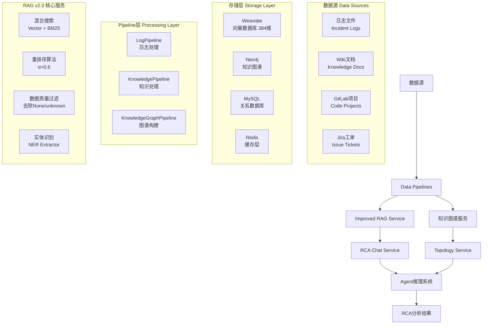

# RAG Pipeline 架构和流程文档

## 概述

本文档详细描述了AIOps Polaris中RAG (Retrieval-Augmented Generation) Pipeline的完整架构、实现流程和使用方法。RAG Pipeline是系统的核心组件，为智能运维Agent提供知识检索和上下文增强能力。

## 系统架构

### 核心组件



### RAG v2.0 混合搜索架构 (已升级)

RAG系统已升级为**ImprovedRAGService**，采用真正的混合搜索设计：

1. **向量搜索**: Weaviate 384维向量，使用sentence-transformers/all-MiniLM-L6-v2模型
2. **BM25全文搜索**: Weaviate FullTextCollection，支持关键词精确匹配
3. **重排序算法**: 加权融合 (α=0.6 向量 + 0.4 BM25)
4. **数据质量过滤**: 自动过滤None/unknown/低质量数据
5. **并行执行**: asyncio.gather并发查询多个数据源

## 核心服务

### 1. ImprovedRAGService (`src/services/improved_rag_service.py`) [新版]

升级版RAG服务，提供真正的混合搜索能力。

**主要功能**：
- 并行向量搜索和BM25搜索
- 智能重排序算法 (RRF + 加权融合)
- 数据质量自动过滤
- 性能优化的批量处理
- 完整的错误处理和日志记录

**关键方法**：
```python
# 混合搜索核心方法
async def hybrid_search(self, query: str, limit: int = 20, alpha: float = 0.6)

# 并行向量搜索
async def _vector_search(self, query_embedding, limit: int)

# 并行BM25搜索  
async def _bm25_search(self, query: str, limit: int)

# 重排序算法
def rerank_results(self, vector_results, bm25_results, query: str, alpha: float)

# 数据质量过滤
def _filter_results(self, results)
```

### 2. TopologyService (`src/services/topology_service.py`) [新增]

专门处理Neo4j服务拓扑查询的服务。

**主要功能**：
- 服务依赖关系查询
- 拓扑数据过滤 (去除None值)
- 关系路径分析
- 服务影响范围计算

**关键方法**：
```python
# 获取服务拓扑
async def get_service_topology(self, service_names: List[str])

# 查询服务依赖
async def get_service_dependencies(self, service_name: str)

# 分析影响范围
async def analyze_impact_scope(self, failed_service: str)
```

**Schema设计 (已优化)**：
```python
# EmbeddingCollection Schema - 语义搜索专用
{
    "class": "EmbeddingCollection",
    "description": "语义搜索专用Collection，支持向量检索和rerank",
    "vectorizer": "none",  # 手动提供384维向量
    "properties": [
        {"name": "content", "dataType": ["text"], "description": "文档内容或日志内容", "tokenization": "word"},
        {"name": "title", "dataType": ["string"], "description": "标题或摘要"},
        {"name": "source_type", "dataType": ["string"], "description": "数据源类型: logs, wiki, gitlab, jira"},
        {"name": "source_id", "dataType": ["string"], "description": "源系统中的唯一ID"},
        # 日志特定字段
        {"name": "service_name", "dataType": ["string"], "description": "服务名称"},
        {"name": "hostname", "dataType": ["string"], "description": "机器名/主机名"},
        {"name": "log_file", "dataType": ["string"], "description": "日志文件名"},
        {"name": "line_number", "dataType": ["int"], "description": "日志行数"},
        {"name": "log_level", "dataType": ["string"], "description": "日志级别: INFO, WARN, ERROR, DEBUG"},
        {"name": "timestamp", "dataType": ["date"], "description": "时间戳"},
        # 通用元数据字段
        {"name": "category", "dataType": ["string"], "description": "分类"},
        {"name": "tags", "dataType": ["string[]"], "description": "标签列表"},
        {"name": "author", "dataType": ["string"], "description": "作者"},
        {"name": "created_at", "dataType": ["date"], "description": "创建时间"},
        {"name": "updated_at", "dataType": ["date"], "description": "更新时间"},
        {"name": "metadata", "dataType": ["text"], "description": "额外元数据JSON字符串"},
        # RAG专用字段
        {"name": "chunk_index", "dataType": ["int"], "description": "文档分块索引"},
        {"name": "chunk_size", "dataType": ["int"], "description": "分块大小"},
        {"name": "parent_id", "dataType": ["string"], "description": "父文档ID"}
    ]
}

# FullTextCollection Schema - BM25全文搜索专用
{
    "class": "FullTextCollection",
    "description": "全文搜索专用Collection，支持BM25和关键词匹配",
    "vectorizer": "none",
    "properties": [
        {"name": "content", "dataType": ["text"], "description": "文档内容或日志内容", "tokenization": "word"},
        {"name": "title", "dataType": ["string"], "description": "标题或摘要"},
        {"name": "source_type", "dataType": ["string"], "description": "数据源类型: logs, wiki, gitlab, jira"},
        {"name": "source_id", "dataType": ["string"], "description": "源系统中的唯一ID"},
        # 日志特定字段
        {"name": "service_name", "dataType": ["string"], "description": "服务名称"},
        {"name": "hostname", "dataType": ["string"], "description": "机器名/主机名"},
        {"name": "log_file", "dataType": ["string"], "description": "日志文件名"},
        {"name": "line_number", "dataType": ["int"], "description": "日志行数"},
        {"name": "log_level", "dataType": ["string"], "description": "日志级别: INFO, WARN, ERROR, DEBUG"},
        {"name": "timestamp", "dataType": ["date"], "description": "时间戳"},
        # 通用元数据字段
        {"name": "category", "dataType": ["string"], "description": "分类"},
        {"name": "tags", "dataType": ["string[]"], "description": "标签列表"},
        {"name": "author", "dataType": ["string"], "description": "作者"},
        {"name": "created_at", "dataType": ["date"], "description": "创建时间"},
        {"name": "updated_at", "dataType": ["date"], "description": "更新时间"},
        {"name": "metadata", "dataType": ["text"], "description": "额外元数据JSON字符串"},
        # 全文搜索优化字段
        {"name": "keywords", "dataType": ["string[]"], "description": "提取的关键词列表"},
        {"name": "entities", "dataType": ["string[]"], "description": "识别的实体列表"}
    ]
}
```

### 3. RCAChatService (`src/api/rca_chat_endpoint.py`) [新增]

集成RCA分析流程的聊天服务。

**主要功能**：
- 完整的RCA分析流程协调
- NER实体识别集成
- 多阶段数据检索 (并行执行)
- Agent推理结果整合
- 证据链构建和可视化

**关键方法**：
```python
# 处理RCA查询
async def process_rca_query(self, query: str, session_id: str)

# 搜索证据数据
async def _search_evidence(self, query: str)

# 执行RCA分析
async def _perform_rca_analysis(self, query, evidence, entities)

# 格式化分析结果
def _format_rca_response(self, analysis_result, evidence, topology)
```

### 4. NERExtractor (`src/utils/ner_extractor.py`) [新增]

专门的命名实体识别工具，支持中英文服务名识别。

**主要功能**：
- 服务名称识别 (service-a, service-b等)
- 性能指标识别 (CPU, memory, disk等)
- 中文实体识别支持
- 灵活的正则表达式匹配

**关键方法**：
```python
# 提取实体
def extract_entities(self, text: str) -> Dict[str, List[str]]

# 提取服务名
def extract_service_names(self, text: str) -> List[str]

# 提取性能指标
def extract_metrics(self, text: str) -> List[str]
```

## Data Pipeline详解

### 1. Log Pipeline (`src/services/log_pipeline.py`)

处理日志数据的完整流程。

**处理流程**：
1. **日志发现**: 扫描`./data/logs/`目录
2. **格式解析**: 支持结构化和事件日志
3. **内容提取**: 提取时间戳、服务名、日志级别等
4. **关键词提取**: 自动识别重要关键词
5. **实体识别**: 提取服务、主机、错误类型等实体
6. **双重索引**: 同时建立向量索引和全文索引

**支持的日志格式**：
```regex
# 结构化日志
(?P<timestamp>\d{4}-\d{2}-\d{2}T\d{2}:\d{2}:\d{2}\.\d{3}Z)\s+
\[(?P<level>\w+)\]\s+
(?P<service>[\w-]+):\s+
(?P<message>.*)

# 事件日志
Incident: (?P<incident_id>[\w_]+)
Time: (?P<timestamp>.+)
Service: (?P<service>[\w-]+)
```

**关键词提取策略**：
- 性能关键词: CPU, memory, disk, network, latency, slow
- 错误关键词: error, exception, failure, timeout, crash
- 服务关键词: service names, component names
- 运维关键词: restart, scale, deploy, rollback

### 2. Knowledge Pipeline (`src/services/knowledge_pipeline.py`)

处理知识文档的索引化。

**数据源处理**：

**Wiki数据** (`./data/wiki/sample_wiki.json`):
- 文档标题和内容提取
- Markdown格式支持
- 技术文档分类

**GitLab数据** (`./data/gitlab/sample_gitlab.json`):
- 项目信息提取
- Issue和MR内容解析
- 代码仓库元数据

**Jira数据** (`./data/jira/sample_jira.json`):
- 工单标题和描述
- 优先级和状态信息
- 分类和标签提取

**文档分块策略**：
```python
def chunk_large_content(content, max_length=1000, overlap=100):
    """智能文档分块，保持语义完整性"""
    sentences = split_into_sentences(content)
    chunks = []
    current_chunk = ""
    
    for sentence in sentences:
        if len(current_chunk + sentence) <= max_length:
            current_chunk += sentence
        else:
            if current_chunk:
                chunks.append(current_chunk)
                current_chunk = sentence[-overlap:] + sentence
    
    return chunks
```

### 3. Knowledge Graph Pipeline (`src/services/knowledge_graph_pipeline.py`)

构建Neo4j知识图谱。

**图谱结构**：
```cypher
// 节点类型
(:Service {name, type, status})
(:Host {name, ip, location})
(:Issue {name, type, severity})
(:Component {name, version})

// 关系类型
(:Service)-[:DEPENDS_ON]->(:Service)
(:Service)-[:DEPLOYED_ON]->(:Host)
(:Issue)-[:AFFECTS]->(:Service)
(:Component)-[:PART_OF]->(:Service)
```

**NER实体抽取**：
- 服务实体: 通过服务名模式识别
- 主机实体: 通过主机名和IP模式
- 组件实体: 通过技术栈关键词
- 问题实体: 通过错误描述和症状

**关系推理**：
```python
def infer_service_dependencies(self, services_data):
    """基于日志和配置推理服务依赖关系"""
    dependencies = []
    
    for service in services_data:
        # 分析日志中的服务调用模式
        if re.search(r'call.*database', service['logs']):
            dependencies.append((service['name'], 'database'))
        
        if re.search(r'redis.*connection', service['logs']):
            dependencies.append((service['name'], 'redis'))
    
    return dependencies
```

## 搜索和检索机制

### 混合搜索策略 v2.0 (已升级)

ImprovedRAGService实现了真正的混合搜索和重排序：

```python
async def hybrid_search(self, query: str, limit: int = 20, alpha: float = 0.6):
    """
    改进的混合搜索算法
    alpha: 向量搜索权重 (推荐0.6)
    """
    try:
        # 1. 并行执行向量搜索和BM25搜索
        query_embedding = await self._get_query_embedding(query)
        
        vector_task = asyncio.create_task(self._vector_search(query_embedding, limit))
        bm25_task = asyncio.create_task(self._bm25_search(query, limit))
        
        vector_results, bm25_results = await asyncio.gather(vector_task, bm25_task)
        
        # 2. 数据质量过滤
        vector_results = self._filter_results(vector_results)
        bm25_results = self._filter_results(bm25_results)
        
        # 3. 重排序算法 (RRF + 加权融合)
        final_results = self.rerank_results(vector_results, bm25_results, query, alpha)
        
        # 4. 结果后处理和置信度计算
        processed_results = self._post_process_results(final_results, query)
        
        return processed_results[:limit]
        
    except Exception as e:
        logger.error(f"混合搜索失败: {e}")
        return []

def rerank_results(self, vector_results, bm25_results, query: str, alpha: float):
    """
    RRF (Reciprocal Rank Fusion) + 加权融合重排序算法
    """
    # RRF常数
    k = 60
    
    # 构建文档得分字典
    doc_scores = defaultdict(float)
    doc_data = {}
    
    # 向量搜索结果RRF得分
    for rank, result in enumerate(vector_results, 1):
        doc_id = self._get_doc_id(result)
        rrf_score = 1.0 / (k + rank)
        doc_scores[doc_id] += alpha * rrf_score
        doc_data[doc_id] = result
    
    # BM25搜索结果RRF得分
    for rank, result in enumerate(bm25_results, 1):
        doc_id = self._get_doc_id(result)
        rrf_score = 1.0 / (k + rank)
        doc_scores[doc_id] += (1.0 - alpha) * rrf_score
        if doc_id not in doc_data:
            doc_data[doc_id] = result
    
    # 按得分排序
    sorted_docs = sorted(doc_scores.items(), key=lambda x: x[1], reverse=True)
    
    # 构建最终结果
    final_results = []
    for doc_id, score in sorted_docs:
        result = doc_data[doc_id].copy()
        result['hybrid_score'] = score
        result['search_type'] = 'hybrid'
        final_results.append(result)
    
    return final_results
```

### 过滤机制

支持多维度过滤查询：

```python
filters = {
    "service_name": ["service-b", "service-a"],
    "hostname": ["host-1", "host-2"], 
    "timestamp": {
        "start": "2024-08-01T00:00:00Z",
        "end": "2024-08-31T23:59:59Z"
    },
    "log_file": ["incident_001*.log"],
    "keywords": ["CPU", "memory", "error"]
}

results = await rag_service.hybrid_search_with_rerank(
    query="服务性能问题",
    filters=filters,
    limit=20
)
```

## RCA搜索专用功能

### RCA专用分析流程 (全新设计)

基于多阶段数据检索和Agent推理的完整RCA流程：

```python
# RCAChatService.process_rca_query() - 完整RCA流程
async def process_rca_query(self, query: str, session_id: str = "default"):
    """多阶段RCA分析流程"""
    
    # 阶段1: NER实体识别
    entities = ner_extractor.extract_entities(query)
    service_names = entities.get('services', [])
    metrics = entities.get('metrics', [])
    
    # 阶段2: 并行数据检索
    evidence_task = asyncio.create_task(self._search_evidence(query))
    topology_task = asyncio.create_task(
        topology_service.get_service_topology(service_names)
    )
    
    evidence_data, topology_data = await asyncio.gather(
        evidence_task, topology_task
    )
    
    # 阶段3: Agent推理分析
    rca_result = await self._perform_rca_analysis(
        query, evidence_data, entities
    )
    
    # 阶段4: 结果整合和格式化
    response = self._format_rca_response(
        rca_result, evidence_data, topology_data
    )
    
    # 阶段5: 日志记录和返回
    await self._log_rca_analysis(query, response, session_id)
    
    return response

async def _search_evidence(self, query: str):
    """证据搜索 - 使用改进的混合搜索"""
    
    # 使用ImprovedRAGService进行混合搜索
    search_results = await self.improved_rag_service.hybrid_search(
        query=query,
        limit=20,
        alpha=0.6  # 60%向量搜索 + 40%BM25搜索
    )
    
    # 按证据类型分组
    evidence = {
        'logs': [],
        'knowledge': [],
        'incidents': [],
        'topology': []
    }
    
    for result in search_results:
        source_type = result.get('source_type', 'unknown')
        if source_type == 'logs':
            evidence['logs'].append(result)
        elif source_type in ['wiki', 'gitlab', 'jira']:
            evidence['knowledge'].append(result)
    
    return evidence
```

### 时间线分析

支持事件时间线重构：

```python
async def search_incident_timeline(self, service_name, start_time, end_time):
    """构建事件时间线"""
    
    timeline_query = f"""
    {{
        Get {{
            EmbeddingCollection(
                where: {{
                    operator: And
                    operands: [
                        {{path: ["service_name"] operator: Equal valueText: "{service_name}"}}
                        {{path: ["timestamp"] operator: GreaterThan valueText: "{start_time}"}}
                        {{path: ["timestamp"] operator: LessThan valueText: "{end_time}"}}
                    ]
                }}
                sort: [{{path: ["timestamp"] order: asc}}]
            ) {{
                content timestamp log_file line_number
                _additional {{ certainty }}
            }}
        }}
    }}
    """
    
    results = self.client.query.raw(timeline_query)
    return self._format_timeline(results)
```

## 性能优化

### 向量化优化 v2.0

```python
class ImprovedEmbeddingService:
    def __init__(self):
        # 统一使用384维模型
        self.model = SentenceTransformer('sentence-transformers/all-MiniLM-L6-v2')
        self.batch_size = 32
        self.cache = {}  # 嵌入向量缓存
        
    async def get_embedding(self, text: str) -> List[float]:
        """获取文本嵌入向量 (支持缓存)"""
        text_hash = hashlib.md5(text.encode()).hexdigest()
        
        if text_hash in self.cache:
            return self.cache[text_hash]
            
        embedding = self.model.encode([text])[0].tolist()
        self.cache[text_hash] = embedding
        
        return embedding
        
    async def batch_encode(self, texts: List[str]) -> List[List[float]]:
        """批量向量化优化 (384维)"""
        if not texts:
            return []
            
        batches = [texts[i:i+self.batch_size] 
                  for i in range(0, len(texts), self.batch_size)]
        
        all_embeddings = []
        for batch in batches:
            try:
                batch_embeddings = self.model.encode(
                    batch, 
                    convert_to_tensor=False,
                    normalize_embeddings=True  # 归一化向量
                )
                all_embeddings.extend(batch_embeddings.tolist())
            except Exception as e:
                logger.error(f"批量向量化失败: {e}")
                # 填充零向量作为fallback
                all_embeddings.extend([[0.0] * 384] * len(batch))
        
        return all_embeddings
```

### 缓存策略 v2.0 (Redis集成)

```python
import redis
import json
import hashlib
from typing import Optional

class ImprovedCacheService:
    def __init__(self):
        self.redis_client = redis.Redis(host='localhost', port=6379, db=0)
        self.cache_ttl = 3600  # 1小时过期
        
    async def get_search_cache(self, query: str, filters: dict = None) -> Optional[List]:
        """获取搜索结果缓存"""
        cache_key = self._generate_cache_key(query, filters)
        
        try:
            cached_result = self.redis_client.get(cache_key)
            if cached_result:
                return json.loads(cached_result)
        except Exception as e:
            logger.warning(f"缓存读取失败: {e}")
            
        return None
        
    async def set_search_cache(self, query: str, filters: dict, results: List):
        """设置搜索结果缓存"""
        cache_key = self._generate_cache_key(query, filters)
        
        try:
            self.redis_client.setex(
                cache_key, 
                self.cache_ttl, 
                json.dumps(results, ensure_ascii=False)
            )
        except Exception as e:
            logger.warning(f"缓存写入失败: {e}")
            
    def _generate_cache_key(self, query: str, filters: dict) -> str:
        """生成缓存键"""
        filter_str = json.dumps(filters, sort_keys=True) if filters else ""
        combined = f"{query}|{filter_str}"
        return f"search_cache:{hashlib.md5(combined.encode()).hexdigest()}"
        
    async def get_embedding_cache(self, text: str) -> Optional[List[float]]:
        """获取向量嵌入缓存"""
        cache_key = f"embedding:{hashlib.md5(text.encode()).hexdigest()}"
        
        try:
            cached_embedding = self.redis_client.get(cache_key)
            if cached_embedding:
                return json.loads(cached_embedding)
        except Exception as e:
            logger.warning(f"嵌入向量缓存读取失败: {e}")
            
        return None
        
    async def set_embedding_cache(self, text: str, embedding: List[float]):
        """设置向量嵌入缓存"""
        cache_key = f"embedding:{hashlib.md5(text.encode()).hexdigest()}"
        
        try:
            self.redis_client.setex(
                cache_key, 
                self.cache_ttl * 24,  # 嵌入向量缓存24小时
                json.dumps(embedding)
            )
        except Exception as e:
            logger.warning(f"嵌入向量缓存写入失败: {e}")
```

## 数据统计 (最新)

RAG v2.0系统数据存储架构：

- **Weaviate EmbeddingCollection**: 支持384维向量语义搜索
- **Weaviate FullTextCollection**: 支持BM25全文搜索和关键词匹配
- **Neo4j知识图谱**: 存储服务拓扑关系和实体关联 (已过滤None值)
- **Redis缓存**: 实时缓存查询结果和向量嵌入
- **数据源支持**: 
  - 日志文件: Incident故障日志 - **主要训练数据**
  - Wiki文档: 技术知识库
  - GitLab项目: 代码仓库信息
  - Jira工单: 问题追踪系统
- **数据质量**: 自动过滤None/unknown/空值
- **向量模型**: sentence-transformers/all-MiniLM-L6-v2

### 数据分布

```python
数据源分布:
├── logs/ (225条)
│   ├── incident_001_service_b_cpu_overload.log
│   ├── incident_002_d1_disk_io_bottleneck.log
│   └── incident_010_network_partition.log
├── wiki/ (3条)
│   ├── Kubernetes Pod故障排查指南
│   ├── 微服务架构最佳实践
│   └── 数据库性能优化策略
├── gitlab/ (3条)
│   ├── web-server项目
│   ├── 分布式限流中间件
│   └── 监控系统重构
└── jira/ (3条)
    ├── CPU使用率过高问题
    ├── Redis集群故障转移
    └── 数据库连接超时修复
```

## 使用方法

### 1. 运行Pipeline建立索引

```bash
# 方法1: 使用一键脚本 (推荐)
python run_pipelines.py

# 方法2: 分别运行各pipeline
python -m src.services.log_pipeline
python -m src.services.knowledge_pipeline  
python -m src.services.knowledge_graph_pipeline

# 方法3: 验证数据质量
python test_log_pipeline.py  # 验证日志处理
python test_log_schemas.py   # 验证数据格式
```

### 2. 测试RAG v2.0功能

```bash
# 基础连接测试
python test_rag_simple.py

# 完整集成测试 (混合搜索)
python test_rag_integration.py

# Agent集成测试
python test_agent_simple.py

# 完整RCA流程测试 (重要)
python test_complete_rca.py

# 新增测试
python tests/test_log_processing.py -v  # 日志处理测试
python tests/test_log_indexer.py      # 索引器测试
```

### 3. API调用 (RAG v2.0)

```python
# 直接使用改进的RAG服务
from src.services.improved_rag_service import ImprovedRAGService

rag_service = ImprovedRAGService()
results = await rag_service.hybrid_search(
    query="service-b CPU使用率过高，响应超时",
    limit=20,
    alpha=0.6  # 向量搜索权重
)

# 使用完整RCA流程
from src.api.rca_chat_endpoint import RCAChatService

rca_service = RCAChatService()
analysis = await rca_service.process_rca_query(
    query="service-b CPU使用率过高，响应超时，请分析根本原因",
    session_id="rca-session-001"
)

# 通过Web API (已集成RCA流程)
import requests

response = requests.post("http://localhost:8000/chat", json={
    "message": "service-b CPU使用率过高，请分析根本原因",
    "user_id": "web_user_123",
    "temperature": 0.7
})

print(f"分析结果: {response.json()['response']}")
print(f"证据文件: {response.json().get('evidence_files', [])}")
print(f"拓扑关系: {response.json().get('topology_data', {})}")
```

## 故障排查

### 常见问题

1. **Weaviate连接失败**
   ```bash
   # 检查Weaviate服务状态
   docker-compose ps weaviate
   
   # 重启服务
   docker-compose restart weaviate
   ```

2. **Neo4j连接问题**
   ```bash
   # 检查Neo4j状态
   docker-compose ps neo4j
   
   # 检查认证信息
   # 默认: neo4j/aiops123
   ```

3. **向量化模型加载失败**
   ```python
   # 检查模型是否下载
   from sentence_transformers import SentenceTransformer
   model = SentenceTransformer('sentence-transformers/all-MiniLM-L6-v2')
   ```

4. **索引数据为空**
   ```bash
   # 检查数据文件是否存在
   ls -la data/logs/ data/wiki/ data/gitlab/ data/jira/
   
   # 重新运行pipeline
   python run_pipelines.py
   ```

### 性能监控

```python
# 检查索引状态
from src.services.rag_vector_service import RAGVectorService

rag_service = RAGVectorService()
stats = await rag_service.get_collection_stats()
print(f"EmbeddingCollection: {stats['embedding_count']} records")
print(f"FullTextCollection: {stats['fulltext_count']} records")
```

## 扩展和定制

### 添加新数据源

```python
class CustomPipeline:
    async def process_custom_data(self, data_path):
        """处理自定义数据源"""
        
        # 1. 数据读取和解析
        raw_data = self._load_custom_data(data_path)
        
        # 2. 内容预处理
        processed_docs = self._preprocess_data(raw_data)
        
        # 3. 关键词和实体提取
        for doc in processed_docs:
            doc['keywords'] = self._extract_keywords(doc['content'])
            doc['entities'] = self._extract_entities(doc['content'])
        
        # 4. 索引到RAG系统
        await self.rag_service.bulk_add_documents(processed_docs)
```

### 自定义搜索策略

```python
class CustomSearchStrategy:
    def __init__(self, rag_service):
        self.rag_service = rag_service
        
    async def domain_specific_search(self, query, domain="security"):
        """领域特定搜索"""
        
        # 添加领域特定过滤器
        domain_filters = {
            "keywords": self._get_domain_keywords(domain),
            "source_type": self._get_domain_sources(domain)
        }
        
        results = await self.rag_service.hybrid_search_with_rerank(
            query, filters=domain_filters
        )
        
        return self._post_process_domain_results(results, domain)
```

## 总结

RAG Pipeline为AIOps Polaris提供了强大的知识检索和上下文增强能力，通过双Collection架构、混合搜索策略和知识图谱集成，实现了高效准确的智能运维分析。系统支持多数据源集成、实时索引更新和灵活的查询接口，为Agent提供了丰富的上下文信息，显著提升了RCA分析的准确性和效率。