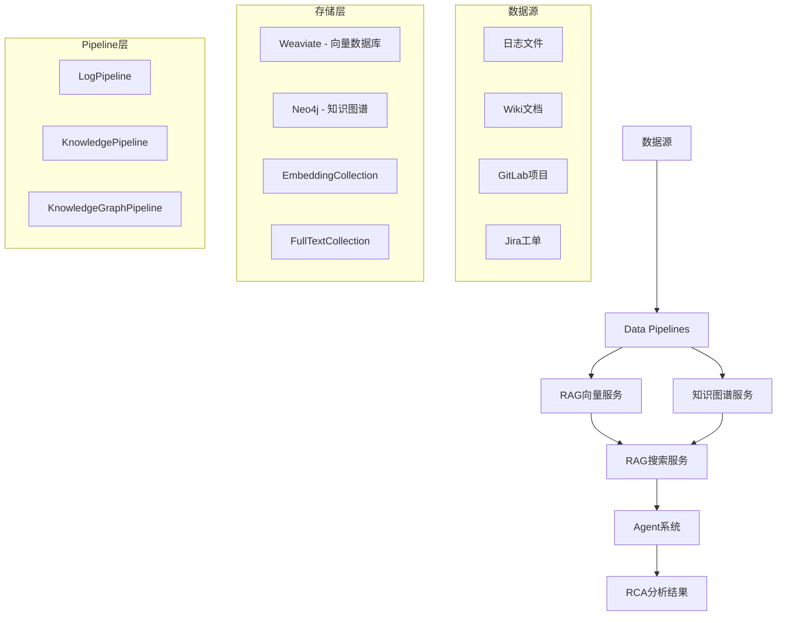

# RAG Pipeline 架构和流程文档

## 概述

本文档详细描述了AIOps Polaris中RAG (Retrieval-Augmented Generation) Pipeline的完整架构、实现流程和使用方法。RAG Pipeline是系统的核心组件，为智能运维Agent提供知识检索和上下文增强能力。

## 系统架构

### 核心组件



### 双Collection架构

RAG系统采用双Collection设计，支持向量搜索和全文搜索的混合检索：

1. **EmbeddingCollection**: 存储文档向量，支持语义搜索
2. **FullTextCollection**: 存储原始文档，支持BM25全文搜索

## 核心服务

### 1. RAGVectorService (`src/services/rag_vector_service.py`)

负责向量数据库的操作和管理。

**主要功能**：
- 创建和管理Weaviate Schema
- 文档向量化和存储
- 混合搜索（向量 + BM25）
- 结果重排序和过滤

**关键方法**：
```python
# 创建RAG Schema
async def create_rag_schema()

# 添加文档到向量索引
async def add_embedding_document(content, metadata, keywords)

# 添加文档到全文索引
async def add_fulltext_document(content, metadata, keywords)

# 混合搜索和重排序
async def hybrid_search_with_rerank(query, filters=None, limit=10)
```

**Schema设计**：
```python
{
    "class": "EmbeddingCollection",
    "properties": [
        {"name": "content", "dataType": ["text"]},
        {"name": "source_type", "dataType": ["string"]},
        {"name": "service_name", "dataType": ["string"]},
        {"name": "hostname", "dataType": ["string"]},
        {"name": "timestamp", "dataType": ["string"]},
        {"name": "log_file", "dataType": ["string"]},
        {"name": "line_number", "dataType": ["int"]},
        {"name": "keywords", "dataType": ["string[]"]}
    ]
}
```

### 2. RAGSearchService (`src/services/rag_search_service.py`)

为Agent提供高级搜索接口。

**主要功能**：
- RCA专用搜索
- 上下文聚合
- 时间线分析
- 服务依赖查询

**关键方法**：
```python
# RCA搜索
async def search_for_rca(incident_description, context=None)

# 获取RCA上下文
async def get_rca_context(services, timeframe=None)

# 搜索事件时间线
async def search_incident_timeline(service_name, start_time, end_time)
```

## Data Pipeline详解

### 1. Log Pipeline (`src/services/log_pipeline.py`)

处理日志数据的完整流程。

**处理流程**：
1. **日志发现**: 扫描`./data/logs/`目录
2. **格式解析**: 支持结构化和事件日志
3. **内容提取**: 提取时间戳、服务名、日志级别等
4. **关键词提取**: 自动识别重要关键词
5. **实体识别**: 提取服务、主机、错误类型等实体
6. **双重索引**: 同时建立向量索引和全文索引

**支持的日志格式**：
```regex
# 结构化日志
(?P<timestamp>\d{4}-\d{2}-\d{2}T\d{2}:\d{2}:\d{2}\.\d{3}Z)\s+
\[(?P<level>\w+)\]\s+
(?P<service>[\w-]+):\s+
(?P<message>.*)

# 事件日志
Incident: (?P<incident_id>[\w_]+)
Time: (?P<timestamp>.+)
Service: (?P<service>[\w-]+)
```

**关键词提取策略**：
- 性能关键词: CPU, memory, disk, network, latency, slow
- 错误关键词: error, exception, failure, timeout, crash
- 服务关键词: service names, component names
- 运维关键词: restart, scale, deploy, rollback

### 2. Knowledge Pipeline (`src/services/knowledge_pipeline.py`)

处理知识文档的索引化。

**数据源处理**：

**Wiki数据** (`./data/wiki/sample_wiki.json`):
- 文档标题和内容提取
- Markdown格式支持
- 技术文档分类

**GitLab数据** (`./data/gitlab/sample_gitlab.json`):
- 项目信息提取
- Issue和MR内容解析
- 代码仓库元数据

**Jira数据** (`./data/jira/sample_jira.json`):
- 工单标题和描述
- 优先级和状态信息
- 分类和标签提取

**文档分块策略**：
```python
def chunk_large_content(content, max_length=1000, overlap=100):
    """智能文档分块，保持语义完整性"""
    sentences = split_into_sentences(content)
    chunks = []
    current_chunk = ""
    
    for sentence in sentences:
        if len(current_chunk + sentence) <= max_length:
            current_chunk += sentence
        else:
            if current_chunk:
                chunks.append(current_chunk)
                current_chunk = sentence[-overlap:] + sentence
    
    return chunks
```

### 3. Knowledge Graph Pipeline (`src/services/knowledge_graph_pipeline.py`)

构建Neo4j知识图谱。

**图谱结构**：
```cypher
// 节点类型
(:Service {name, type, status})
(:Host {name, ip, location})
(:Issue {name, type, severity})
(:Component {name, version})

// 关系类型
(:Service)-[:DEPENDS_ON]->(:Service)
(:Service)-[:DEPLOYED_ON]->(:Host)
(:Issue)-[:AFFECTS]->(:Service)
(:Component)-[:PART_OF]->(:Service)
```

**NER实体抽取**：
- 服务实体: 通过服务名模式识别
- 主机实体: 通过主机名和IP模式
- 组件实体: 通过技术栈关键词
- 问题实体: 通过错误描述和症状

**关系推理**：
```python
def infer_service_dependencies(self, services_data):
    """基于日志和配置推理服务依赖关系"""
    dependencies = []
    
    for service in services_data:
        # 分析日志中的服务调用模式
        if re.search(r'call.*database', service['logs']):
            dependencies.append((service['name'], 'database'))
        
        if re.search(r'redis.*connection', service['logs']):
            dependencies.append((service['name'], 'redis'))
    
    return dependencies
```

## 搜索和检索机制

### 混合搜索策略

RAG系统采用向量搜索和BM25搜索的混合策略：

```python
async def hybrid_search_with_rerank(self, query, alpha=0.7):
    """
    混合搜索和重排序
    alpha: 向量搜索权重 (0.0-1.0)
    """
    # 1. 向量搜索 (语义相似度)
    vector_results = await self.vector_search(query)
    
    # 2. BM25搜索 (关键词匹配)
    bm25_results = await self.bm25_search(query)
    
    # 3. 混合权重计算
    combined_results = self._combine_search_results(
        vector_results, bm25_results, alpha
    )
    
    # 4. 重排序
    reranked_results = self._rerank_results(combined_results, query)
    
    return reranked_results
```

### 过滤机制

支持多维度过滤查询：

```python
filters = {
    "service_name": ["service-b", "service-a"],
    "hostname": ["host-1", "host-2"], 
    "timestamp": {
        "start": "2024-08-01T00:00:00Z",
        "end": "2024-08-31T23:59:59Z"
    },
    "log_file": ["incident_001*.log"],
    "keywords": ["CPU", "memory", "error"]
}

results = await rag_service.hybrid_search_with_rerank(
    query="服务性能问题",
    filters=filters,
    limit=20
)
```

## RCA搜索专用功能

### 场景化搜索

针对RCA分析的特殊需求，提供专门的搜索接口：

```python
async def search_for_rca(self, incident_description, context=None):
    """RCA专用搜索"""
    
    # 1. 症状关键词提取
    symptoms = self._extract_symptoms(incident_description)
    
    # 2. 相关日志搜索
    log_results = await self._search_related_logs(symptoms)
    
    # 3. 知识库查询
    knowledge_results = await self._search_knowledge_base(symptoms)
    
    # 4. 依赖关系查询
    dependency_results = await self._query_dependencies(symptoms)
    
    # 5. 上下文聚合
    aggregated_context = self._aggregate_rca_context(
        log_results, knowledge_results, dependency_results
    )
    
    return aggregated_context
```

### 时间线分析

支持事件时间线重构：

```python
async def search_incident_timeline(self, service_name, start_time, end_time):
    """构建事件时间线"""
    
    timeline_query = f"""
    {{
        Get {{
            EmbeddingCollection(
                where: {{
                    operator: And
                    operands: [
                        {{path: ["service_name"] operator: Equal valueText: "{service_name}"}}
                        {{path: ["timestamp"] operator: GreaterThan valueText: "{start_time}"}}
                        {{path: ["timestamp"] operator: LessThan valueText: "{end_time}"}}
                    ]
                }}
                sort: [{{path: ["timestamp"] order: asc}}]
            ) {{
                content timestamp log_file line_number
                _additional {{ certainty }}
            }}
        }}
    }}
    """
    
    results = self.client.query.raw(timeline_query)
    return self._format_timeline(results)
```

## 性能优化

### 向量化优化

```python
class EmbeddingOptimizer:
    def __init__(self):
        self.model = SentenceTransformer('all-MiniLM-L6-v2')
        self.batch_size = 32
        
    async def batch_encode(self, texts):
        """批量向量化优化"""
        batches = [texts[i:i+self.batch_size] 
                  for i in range(0, len(texts), self.batch_size)]
        
        embeddings = []
        for batch in batches:
            batch_embeddings = self.model.encode(batch, 
                                               convert_to_tensor=True)
            embeddings.extend(batch_embeddings.cpu().numpy())
        
        return embeddings
```

### 缓存策略

```python
from functools import lru_cache

class RAGSearchService:
    @lru_cache(maxsize=128)
    def _cached_search(self, query_hash, filters_hash):
        """搜索结果缓存"""
        return self._perform_search(query_hash, filters_hash)
    
    async def search_with_cache(self, query, filters=None):
        query_hash = hashlib.md5(query.encode()).hexdigest()
        filters_hash = hashlib.md5(str(filters).encode()).hexdigest()
        
        return self._cached_search(query_hash, filters_hash)
```

## 数据统计

当前RAG系统包含的数据量：

- **向量索引**: 234条记录
- **全文索引**: 234条记录  
- **知识图谱**: 27个节点，11个关系
- **数据源**: 
  - 日志文件: 4个 (225条记录)
  - Wiki文档: 3个
  - GitLab项目: 3个
  - Jira工单: 3个

### 数据分布

```python
数据源分布:
├── logs/ (225条)
│   ├── incident_001_service_b_cpu_overload.log
│   ├── incident_002_d1_disk_io_bottleneck.log
│   └── incident_010_network_partition.log
├── wiki/ (3条)
│   ├── Kubernetes Pod故障排查指南
│   ├── 微服务架构最佳实践
│   └── 数据库性能优化策略
├── gitlab/ (3条)
│   ├── web-server项目
│   ├── 分布式限流中间件
│   └── 监控系统重构
└── jira/ (3条)
    ├── CPU使用率过高问题
    ├── Redis集群故障转移
    └── 数据库连接超时修复
```

## 使用方法

### 1. 运行Pipeline建立索引

```bash
# 方法1: 使用一键脚本
python run_pipelines.py

# 方法2: 分别运行各pipeline
python -m src.services.log_pipeline
python -m src.services.knowledge_pipeline  
python -m src.services.knowledge_graph_pipeline
```

### 2. 测试RAG功能

```bash
# 基础连接测试
python test_rag_simple.py

# 完整集成测试
python test_rag_integration.py

# Agent集成测试
python test_agent_simple.py

# 完整RCA流程测试
python test_complete_rca.py
```

### 3. API调用

```python
# 直接使用RAG服务
from src.services.rag_search_service import RAGSearchService

rag_service = RAGSearchService()
results = await rag_service.search_for_rca(
    incident_description="service-b CPU使用率过高，响应超时",
    context={"services": ["service-b"], "timeframe": "last_24h"}
)

# 通过Web API
import requests

response = requests.post("http://localhost:8000/chat", json={
    "message": "service-b CPU使用率过高，请分析根本原因",
    "session_id": "rca-session"
})
```

## 故障排查

### 常见问题

1. **Weaviate连接失败**
   ```bash
   # 检查Weaviate服务状态
   docker-compose ps weaviate
   
   # 重启服务
   docker-compose restart weaviate
   ```

2. **Neo4j连接问题**
   ```bash
   # 检查Neo4j状态
   docker-compose ps neo4j
   
   # 检查认证信息
   # 默认: neo4j/aiops123
   ```

3. **向量化模型加载失败**
   ```python
   # 检查模型是否下载
   from sentence_transformers import SentenceTransformer
   model = SentenceTransformer('sentence-transformers/all-MiniLM-L6-v2')
   ```

4. **索引数据为空**
   ```bash
   # 检查数据文件是否存在
   ls -la data/logs/ data/wiki/ data/gitlab/ data/jira/
   
   # 重新运行pipeline
   python run_pipelines.py
   ```

### 性能监控

```python
# 检查索引状态
from src.services.rag_vector_service import RAGVectorService

rag_service = RAGVectorService()
stats = await rag_service.get_collection_stats()
print(f"EmbeddingCollection: {stats['embedding_count']} records")
print(f"FullTextCollection: {stats['fulltext_count']} records")
```

## 扩展和定制

### 添加新数据源

```python
class CustomPipeline:
    async def process_custom_data(self, data_path):
        """处理自定义数据源"""
        
        # 1. 数据读取和解析
        raw_data = self._load_custom_data(data_path)
        
        # 2. 内容预处理
        processed_docs = self._preprocess_data(raw_data)
        
        # 3. 关键词和实体提取
        for doc in processed_docs:
            doc['keywords'] = self._extract_keywords(doc['content'])
            doc['entities'] = self._extract_entities(doc['content'])
        
        # 4. 索引到RAG系统
        await self.rag_service.bulk_add_documents(processed_docs)
```

### 自定义搜索策略

```python
class CustomSearchStrategy:
    def __init__(self, rag_service):
        self.rag_service = rag_service
        
    async def domain_specific_search(self, query, domain="security"):
        """领域特定搜索"""
        
        # 添加领域特定过滤器
        domain_filters = {
            "keywords": self._get_domain_keywords(domain),
            "source_type": self._get_domain_sources(domain)
        }
        
        results = await self.rag_service.hybrid_search_with_rerank(
            query, filters=domain_filters
        )
        
        return self._post_process_domain_results(results, domain)
```

## 总结

RAG Pipeline为AIOps Polaris提供了强大的知识检索和上下文增强能力，通过双Collection架构、混合搜索策略和知识图谱集成，实现了高效准确的智能运维分析。系统支持多数据源集成、实时索引更新和灵活的查询接口，为Agent提供了丰富的上下文信息，显著提升了RCA分析的准确性和效率。