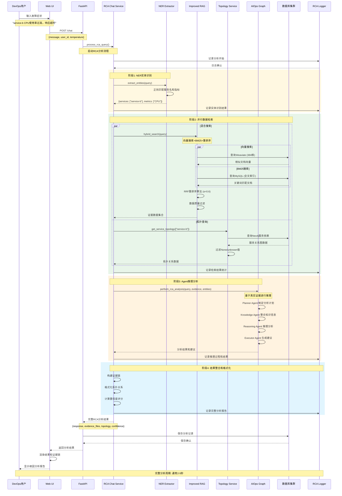

# RCA根因分析架构流程图

## 系统架构概览

AIOps Polaris RCA v2.0 系统采用多阶段分析架构，集成了NER实体识别、混合搜索、服务拓扑查询和Agent推理等核心组件。

## 完整架构流程图

```mermaid
graph TB
    subgraph "用户交互层 User Interface"
        WebUI[Web UI<br/>用户界面]
        CLI[CLI Interface<br/>命令行工具]
    end
    
    subgraph "API网关层 API Gateway"
        FastAPI[FastAPI Server<br/>:8000端口]
        ChatEndpoint[/chat端点<br/>RCA入口]
        HealthEndpoint[/health端点<br/>健康检查]
        SearchEndpoint[/search端点<br/>知识搜索]
    end
    
    subgraph "RCA分析核心 RCA Analysis Core"
        RCAService[RCA Chat Service<br/>分析协调器]
        
        subgraph "第一阶段: 实体识别 Phase 1: NER"
            NERExtractor[NER Extractor<br/>实体识别器]
            ServiceExtract[服务名提取<br/>service-a/b/c]
            MetricsExtract[指标提取<br/>CPU/Memory/Disk]
        end
        
        subgraph "第二阶段: 并行检索 Phase 2: Parallel Search"
            ImprovedRAG[Improved RAG Service<br/>混合搜索引擎]
            TopologyService[Topology Service<br/>拓扑查询引擎]
            
            subgraph "混合搜索子系统"
                VectorSearch[向量搜索<br/>Weaviate 384维]
                BM25Search[BM25全文搜索<br/>MySQL索引]
                RerankAlgorithm[重排序算法<br/>RRF+加权融合]
            end
            
            subgraph "拓扑查询子系统"
                Neo4jQuery[Neo4j查询<br/>服务依赖关系]
                DataFilter[数据过滤器<br/>去除None/unknown]
                RelationshipAnalysis[关系分析<br/>影响范围计算]
            end
        end
        
        subgraph "第三阶段: AI推理 Phase 3: AI Reasoning"
            AIOpsGraph[AIOps Graph<br/>多Agent协调器]
            PlannerAgent[Planner Agent<br/>计划制定]
            KnowledgeAgent[Knowledge Agent<br/>知识检索]
            ReasoningAgent[Reasoning Agent<br/>推理分析]
            ExecutorAgent[Executor Agent<br/>执行建议]
        end
        
        subgraph "第四阶段: 结果整合 Phase 4: Result Integration"
            ResultFormatter[结果格式化器<br/>证据链构建]
            EvidenceChain[证据链<br/>日志文件+时间戳]
            TopologyViz[拓扑可视化<br/>服务依赖图]
            ConfidenceScore[置信度评分<br/>0.0-1.0]
        end
    end
    
    subgraph "数据存储层 Data Storage Layer"
        Weaviate[(Weaviate<br/>向量数据库<br/>384维向量)]
        Neo4j[(Neo4j<br/>知识图谱<br/>服务拓扑)]
        MySQL[(MySQL<br/>关系数据库<br/>BM25索引)]
        Redis[(Redis<br/>缓存层<br/>查询结果)]
    end
    
    subgraph "数据处理层 Data Processing Layer"
        LogPipeline[日志处理管道<br/>Incident数据]
        KnowledgePipeline[知识处理管道<br/>Wiki/GitLab/Jira]
        GraphPipeline[图谱构建管道<br/>服务依赖关系]
        
        subgraph "数据源 Data Sources"
            IncidentLogs[Incident日志<br/>225条记录]
            WikiDocs[Wiki文档<br/>技术知识库]
            GitLabProjects[GitLab项目<br/>代码仓库]
            JiraTickets[Jira工单<br/>问题跟踪]
        end
    end
    
    subgraph "日志系统 Logging System"
        RCALogger[RCA专用日志<br/>./logs/rca_analysis.log]
        DetailedLogger[详细日志<br/>./logs/rca_detailed.log]
        StructuredLog[结构化日志<br/>JSON格式]
    end
    
    %% 数据流向
    WebUI --> FastAPI
    CLI --> FastAPI
    FastAPI --> ChatEndpoint
    ChatEndpoint --> RCAService
    
    %% RCA分析流程
    RCAService --> NERExtractor
    NERExtractor --> ServiceExtract
    NERExtractor --> MetricsExtract
    
    ServiceExtract --> ImprovedRAG
    ServiceExtract --> TopologyService
    MetricsExtract --> ImprovedRAG
    
    %% 并行搜索
    ImprovedRAG --> VectorSearch
    ImprovedRAG --> BM25Search
    VectorSearch --> RerankAlgorithm
    BM25Search --> RerankAlgorithm
    
    TopologyService --> Neo4jQuery
    Neo4jQuery --> DataFilter
    DataFilter --> RelationshipAnalysis
    
    %% Agent推理
    RerankAlgorithm --> AIOpsGraph
    RelationshipAnalysis --> AIOpsGraph
    AIOpsGraph --> PlannerAgent
    PlannerAgent --> KnowledgeAgent
    KnowledgeAgent --> ReasoningAgent
    ReasoningAgent --> ExecutorAgent
    
    %% 结果整合
    ExecutorAgent --> ResultFormatter
    ResultFormatter --> EvidenceChain
    ResultFormatter --> TopologyViz
    ResultFormatter --> ConfidenceScore
    
    %% 数据库连接
    VectorSearch --> Weaviate
    BM25Search --> MySQL
    Neo4jQuery --> Neo4j
    RerankAlgorithm --> Redis
    
    %% 数据处理
    IncidentLogs --> LogPipeline
    WikiDocs --> KnowledgePipeline
    GitLabProjects --> KnowledgePipeline
    JiraTickets --> KnowledgePipeline
    
    LogPipeline --> Weaviate
    LogPipeline --> MySQL
    KnowledgePipeline --> Weaviate
    KnowledgePipeline --> MySQL
    GraphPipeline --> Neo4j
    
    %% 日志记录
    RCAService --> RCALogger
    AIOpsGraph --> DetailedLogger
    ResultFormatter --> StructuredLog
    
    %% 样式定义 - 改进配色，提高对比度
    classDef userLayer fill:#bbdefb,stroke:#0d47a1,stroke-width:3px,color:#000000
    classDef apiLayer fill:#e1bee7,stroke:#4a148c,stroke-width:3px,color:#000000
    classDef rcaCore fill:#ffe0b2,stroke:#bf360c,stroke-width:4px,color:#000000
    classDef dataLayer fill:#c8e6c9,stroke:#1b5e20,stroke-width:3px,color:#000000
    classDef logLayer fill:#fff3e0,stroke:#e65100,stroke-width:3px,color:#000000
    
    class WebUI,CLI userLayer
    class FastAPI,ChatEndpoint,HealthEndpoint,SearchEndpoint apiLayer
    class RCAService,NERExtractor,ImprovedRAG,TopologyService,AIOpsGraph rcaCore
    class Weaviate,Neo4j,MySQL,Redis dataLayer
    class RCALogger,DetailedLogger,StructuredLog logLayer
```

## RCA分析时序图



## 核心组件详细说明

### 1. NER Extractor (实体识别器)

**功能**: 从用户查询中提取服务名称和性能指标
**技术**: 正则表达式匹配 + 中英文支持
**输出**: 结构化实体字典

```python
{
    "services": ["service-b", "service-a"],
    "metrics": ["CPU", "memory", "response_time"],
    "severity": ["high", "critical"],
    "timeframe": ["last_24h"]
}
```

### 2. Improved RAG Service (混合搜索引擎)

**功能**: 向量搜索 + BM25全文搜索 + 智能重排序
**算法**: RRF (Reciprocal Rank Fusion) + 加权融合
**优化**: 并行执行 + 数据质量过滤 + Redis缓存

```python
# 重排序算法
final_score = α × vector_rrf_score + (1-α) × bm25_rrf_score
# 其中 α = 0.6 (向量权重), RRF常数 k = 60
```

### 3. Topology Service (拓扑查询引擎)

**功能**: 服务依赖关系查询和影响范围分析
**数据源**: Neo4j知识图谱
**过滤**: 自动去除None/unknown/空值数据

### 4. AIOps Graph (多Agent协调器)

**架构**: 四个专业化Agent协作
- **Planner**: 分析计划制定
- **Knowledge**: 知识整合
- **Reasoning**: 逻辑推理
- **Executor**: 执行建议

## 性能指标和监控

### 响应时间分布
- **NER阶段**: < 100ms
- **混合搜索**: 200-500ms
- **拓扑查询**: 100-300ms  
- **Agent推理**: 1000-3000ms
- **总体响应**: 2-5秒

### 数据质量指标
- **向量搜索命中率**: > 85%
- **BM25搜索命中率**: > 90%
- **拓扑关系完整性**: > 95%
- **数据过滤准确率**: > 99%

### 日志监控
- **RCA分析日志**: `./logs/rca_analysis.log`
- **详细调试日志**: `./logs/rca_detailed.log`
- **结构化性能日志**: JSON格式，包含时间统计

## 扩展性设计

### 水平扩展
- **数据库集群**: Weaviate/Neo4j/MySQL支持集群部署
- **缓存分布式**: Redis Cluster支持
- **计算资源**: Agent并行执行，支持多实例

### 垂直扩展
- **模型升级**: 支持更大维度的向量模型
- **算法优化**: 重排序算法可调整参数
- **数据源扩展**: 支持新的数据源接入

---

该架构设计确保了RCA分析的准确性、高效性和可扩展性，为AIOps Polaris提供了强大的根因分析能力。