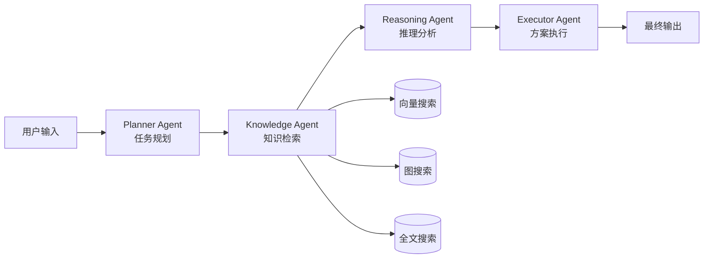
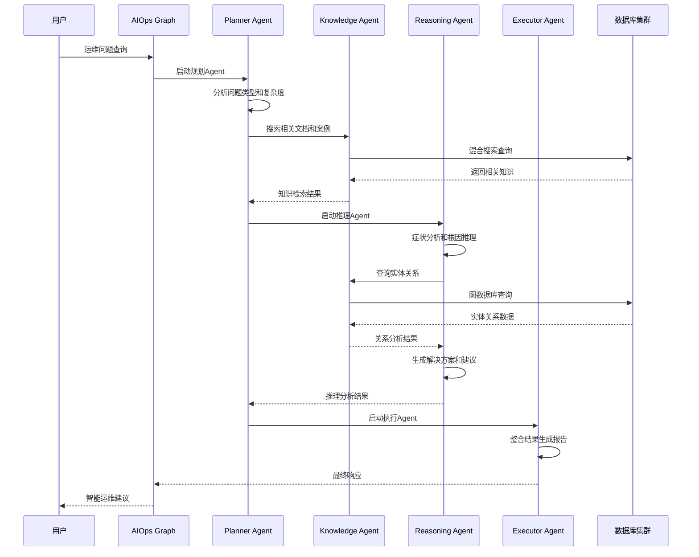

# AIOps Polaris 系统设计文档

## 📋 概述

AIOps Polaris 是一个基于现代AI技术栈的智能运维系统，采用**RAG（检索增强生成）+ 混合搜索 + 多Agent架构**设计，旨在为DevOps团队提供智能化的故障诊断、根因分析和解决方案推荐服务。

### 🎯 设计目标

- **智能化**: 基于AI的自动问题分析和解决方案生成
- **多模态**: 结合向量搜索、图搜索、全文搜索的混合检索
- **协作式**: 多Agent协同工作的分布式处理架构
- **可扩展**: 模块化设计支持功能扩展和性能扩容
- **实用性**: 面向实际运维场景的POC验证系统

## 🏗️ 系统架构设计

### 整体架构图

```
                    ┌─────────────────────────────────────────┐
                    │            AIOps Polaris                │
                    │         智能运维助手系统                │
                    └─────────────────────────────────────────┘
                                        │
                    ┌─────────────────────────────────────────┐
                    │              前端层                     │
                    ├─────────────────────────────────────────┤
                    │ • Web UI (HTML/JS)                      │
                    │ • CLI Interface (Python)               │
                    │ • REST API (FastAPI)                   │
                    └─────────────────────────────────────────┘
                                        │
                    ┌─────────────────────────────────────────┐
                    │            业务逻辑层                   │
                    ├─────────────────────────────────────────┤
                    │           AIOps Graph                   │
                    │        (LangGraph 编排)                 │
                    │                                         │
                    │  ┌──────────┬──────────┬──────────┐     │
                    │  │ Planner  │Knowledge │Reasoning │     │
                    │  │  Agent   │  Agent   │  Agent   │     │
                    │  └──────────┴──────────┴──────────┘     │
                    │              │                          │
                    │         ┌──────────┐                    │
                    │         │Executor  │                    │
                    │         │ Agent    │                    │
                    │         └──────────┘                    │
                    └─────────────────────────────────────────┘
                                        │
                    ┌─────────────────────────────────────────┐
                    │              服务层                     │
                    ├─────────────────────────────────────────┤
                    │ • SearchService (混合搜索)              │
                    │ • VectorService (向量操作)              │
                    │ • GraphService (图数据库)               │
                    │ • DatabaseService (关系数据库)          │
                    │ • EmbeddingService (文本向量化)         │
                    │ • NERService (实体识别)                │
                    └─────────────────────────────────────────┘
                                        │
                    ┌─────────────────────────────────────────┐
                    │             数据存储层                  │
                    ├─────────────────────────────────────────┤
                    │  MySQL        Neo4j       Weaviate     │
                    │ (关系数据)   (知识图谱)    (向量数据库)   │
                    │                                         │
                    │        Redis (缓存层)                   │
                    └─────────────────────────────────────────┘
```

### 🧠 核心设计思想

#### 1. **分层架构设计**
- **前端层**: 多种交互方式，满足不同用户需求
- **业务层**: Agent协调，智能决策和任务分解
- **服务层**: 业务逻辑封装，单一职责原则
- **数据层**: 多模态存储，各司其职

#### 2. **多Agent协作架构**
基于LangGraph框架的智能体协作模式：



#### 3. **数据存储策略**
采用**多模态数据存储**架构，各数据库发挥最佳性能：

| 数据库 | 主要职责 | 数据类型 | 优势 |
|--------|----------|----------|------|
| MySQL | 关系数据、事务处理 | 会话、消息、配置 | ACID、复杂查询 |
| Neo4j | 知识图谱、关系推理 | 实体、关系 | 图遍历、路径查询 |
| Weaviate | 向量搜索、语义相似 | 文档嵌入向量 | 语义搜索、相似匹配 |
| Redis | 缓存、临时存储 | 嵌入缓存、会话 | 高速访问、过期管理 |

## 💾 数据库详细设计

### MySQL - 关系数据存储

#### 核心表结构设计

**会话管理模块**
```sql
-- 用户会话表
CREATE TABLE user_sessions (
    id VARCHAR(36) PRIMARY KEY,
    user_id VARCHAR(100) NOT NULL INDEX,
    session_id VARCHAR(100) NOT NULL UNIQUE INDEX,
    created_at DATETIME DEFAULT NOW(),
    updated_at DATETIME DEFAULT NOW() ON UPDATE NOW(),
    is_active BOOLEAN DEFAULT TRUE,
    session_metadata JSON COMMENT '会话配置：温度、令牌限制等'
);

-- 会话消息表  
CREATE TABLE session_messages (
    id VARCHAR(36) PRIMARY KEY,
    session_id VARCHAR(100) NOT NULL,
    user_id VARCHAR(100) NOT NULL INDEX,
    message TEXT NOT NULL COMMENT '用户输入',
    response TEXT COMMENT 'AI响应',
    message_type ENUM('user', 'assistant', 'system'),
    created_at DATETIME DEFAULT NOW() INDEX,
    tokens_used INTEGER DEFAULT 0 COMMENT 'Token消耗量',
    processing_time FLOAT DEFAULT 0.0 COMMENT '处理耗时(秒)',
    message_metadata JSON COMMENT 'Agent执行详情',
    FOREIGN KEY (session_id) REFERENCES user_sessions(session_id)
);
```

**知识管理模块**
```sql
-- 知识文档表
CREATE TABLE knowledge_documents (
    id VARCHAR(36) PRIMARY KEY,
    title VARCHAR(500) NOT NULL,
    content TEXT NOT NULL,
    source ENUM('wiki','gitlab','jira','logs') NOT NULL INDEX,
    source_id VARCHAR(100) COMMENT '原系统ID',
    category VARCHAR(100) INDEX COMMENT '文档分类',
    tags JSON COMMENT '标签数组',
    embedding_id VARCHAR(100) COMMENT 'Weaviate向量ID',
    created_at DATETIME DEFAULT NOW() INDEX,
    updated_at DATETIME DEFAULT NOW() ON UPDATE NOW(),
    FULLTEXT INDEX ft_title_content (title, content)
);

-- 实体表（与Neo4j同步）
CREATE TABLE entities (
    id VARCHAR(36) PRIMARY KEY,
    name VARCHAR(200) NOT NULL,
    entity_type VARCHAR(100) NOT NULL INDEX,
    description TEXT,
    properties JSON COMMENT '实体属性字典',
    neo4j_id BIGINT INDEX COMMENT 'Neo4j节点ID',
    created_at DATETIME DEFAULT NOW(),
    updated_at DATETIME DEFAULT NOW() ON UPDATE NOW(),
    UNIQUE KEY unique_name_type (name, entity_type)
);

-- 关系表（与Neo4j同步）
CREATE TABLE relationships (
    id VARCHAR(36) PRIMARY KEY,
    source_entity_id VARCHAR(36) NOT NULL,
    target_entity_id VARCHAR(36) NOT NULL,
    relationship_type VARCHAR(100) NOT NULL INDEX,
    properties JSON COMMENT '关系属性',
    confidence FLOAT DEFAULT 1.0 COMMENT '置信度',
    neo4j_id BIGINT COMMENT 'Neo4j关系ID',
    created_at DATETIME DEFAULT NOW(),
    FOREIGN KEY (source_entity_id) REFERENCES entities(id),
    FOREIGN KEY (target_entity_id) REFERENCES entities(id)
);
```

**系统管理模块**
```sql
-- 系统配置表
CREATE TABLE system_config (
    id VARCHAR(36) PRIMARY KEY,
    config_key VARCHAR(100) UNIQUE NOT NULL,
    config_value JSON NOT NULL COMMENT '支持复杂配置对象',
    description TEXT COMMENT '配置说明',
    created_at DATETIME DEFAULT NOW(),
    updated_at DATETIME DEFAULT NOW() ON UPDATE NOW()
);

-- 异步任务队列
CREATE TABLE task_queue (
    id VARCHAR(36) PRIMARY KEY,
    task_type VARCHAR(100) NOT NULL INDEX COMMENT '任务类型',
    task_data JSON NOT NULL COMMENT '任务参数',
    status ENUM('pending','running','completed','failed') DEFAULT 'pending' INDEX,
    priority INTEGER DEFAULT 0 INDEX COMMENT '优先级',
    max_retries INTEGER DEFAULT 3,
    retry_count INTEGER DEFAULT 0,
    scheduled_at DATETIME DEFAULT NOW() INDEX COMMENT '计划执行时间',
    started_at DATETIME NULL COMMENT '实际开始时间',
    completed_at DATETIME NULL COMMENT '完成时间',
    error_message TEXT COMMENT '错误信息',
    result JSON COMMENT '执行结果',
    created_at DATETIME DEFAULT NOW(),
    updated_at DATETIME DEFAULT NOW() ON UPDATE NOW()
);
```

#### 数据存储策略

**1. 会话和消息数据**
- **设计原理**: 支持多用户并发会话，消息历史追溯
- **性能优化**: 
  - `session_id`和`user_id`创建复合索引
  - `created_at`时间索引支持时间范围查询
  - `message_metadata`存储Agent执行轨迹，支持调试和优化

**2. 知识文档管理**
- **设计原理**: 作为多模态搜索的元数据中心
- **关联设计**:
  - `embedding_id` → Weaviate向量ID
  - 全文索引支持MySQL内部文本搜索
  - `source`枚举严格控制数据源类型

**3. 实体关系映射**
- **设计原理**: MySQL作为Neo4j的结构化存储镜像
- **同步机制**:
  - `neo4j_id`字段建立双向映射
  - `properties` JSON字段存储复杂属性
  - 支持实体关系的CRUD操作和事务一致性

### Neo4j - 知识图谱存储

#### 图数据模型设计

```cypher
// 实体节点类型
CREATE CONSTRAINT entity_name_type IF NOT EXISTS 
FOR (e:Entity) REQUIRE (e.name, e.type) IS UNIQUE;

// 核心节点类型
(:Technology)    // 技术组件：CPU, MySQL, Kubernetes等
(:Problem)       // 问题类型：高CPU、连接超时等  
(:Solution)      // 解决方案：重启服务、调整配置等
(:Person)        // 人员角色：DevOps、开发者等
(:Process)       // 流程步骤：诊断、修复、验证等
(:Resource)      // 资源类型：内存、磁盘、网络等
```

**关系类型设计**
```cypher
// 问题诊断关系
(Problem)-[:CAUSED_BY]->(Technology)
(Problem)-[:SOLVED_BY]->(Solution)
(Technology)-[:DEPENDS_ON]->(Technology)

// 运维流程关系
(Person)-[:RESPONSIBLE_FOR]->(Technology)
(Process)-[:REQUIRES]->(Resource)
(Solution)-[:INVOLVES]->(Process)

// 知识关联关系
(Problem)-[:SIMILAR_TO]->(Problem)
(Solution)-[:ALTERNATIVE_TO]->(Solution)
(Technology)-[:MONITORS]->(Technology)
```

#### 图查询优化

**索引策略**
```cypher
// 为常用查询创建索引
CREATE INDEX entity_name IF NOT EXISTS FOR (e:Entity) ON (e.name);
CREATE INDEX entity_type IF NOT EXISTS FOR (e:Entity) ON (e.type);
CREATE INDEX problem_severity IF NOT EXISTS FOR (p:Problem) ON (p.severity);
```

**典型查询模式**
```cypher
// 根因分析查询：找到问题的可能原因
MATCH (p:Problem {name: $problem_name})-[:CAUSED_BY*1..3]->(cause)
RETURN DISTINCT cause.name, cause.description
ORDER BY cause.confidence DESC;

// 解决方案推荐：基于相似问题的解决方案
MATCH (p1:Problem)-[:SIMILAR_TO]-(p2:Problem {name: $current_problem})
MATCH (p1)-[:SOLVED_BY]->(s:Solution)
RETURN s.name, s.steps, s.effectiveness
ORDER BY s.effectiveness DESC;

// 依赖关系分析：分析技术组件依赖
MATCH (t1:Technology {name: $tech_name})-[:DEPENDS_ON*1..2]->(t2:Technology)
RETURN t2.name, t2.status, t2.health_check_url;
```

### Weaviate - 向量数据库存储

#### Schema设计

```python
# 知识文档类定义
knowledge_document_schema = {
    "class": "KnowledgeDocument",
    "description": "运维知识文档向量存储",
    "properties": [
        {
            "name": "title",
            "dataType": ["text"],
            "description": "文档标题"
        },
        {
            "name": "content", 
            "dataType": ["text"],
            "description": "文档内容"
        },
        {
            "name": "source",
            "dataType": ["string"],
            "description": "数据源：wiki/gitlab/jira/logs"
        },
        {
            "name": "category",
            "dataType": ["string"], 
            "description": "文档分类"
        },
        {
            "name": "tags",
            "dataType": ["string[]"],
            "description": "标签列表"
        },
        {
            "name": "mysql_id",
            "dataType": ["string"],
            "description": "MySQL中对应的文档ID"
        },
        {
            "name": "created_at",
            "dataType": ["date"],
            "description": "创建时间"
        }
    ],
    "vectorizer": "text2vec-transformers",
    "moduleConfig": {
        "text2vec-transformers": {
            "model": "sentence-transformers/all-MiniLM-L6-v2",
            "options": {
                "waitForModel": True,
                "useGPU": False
            }
        }
    }
}
```

#### 向量化策略

**文本预处理流程**
```python
def preprocess_document(title: str, content: str) -> str:
    """
    文档预处理：标题 + 内容组合，用于向量化
    """
    # 组合标题和内容，标题权重更高
    combined_text = f"标题: {title}\n\n内容: {content}"
    
    # 文本清理和标准化
    cleaned_text = clean_and_normalize(combined_text)
    
    # 长度限制（避免超出模型输入限制）
    if len(cleaned_text) > 8000:
        cleaned_text = cleaned_text[:8000] + "..."
    
    return cleaned_text
```

**相似性搜索优化**
```python
# 混合搜索：向量相似性 + 元数据过滤
vector_search_query = {
    "query": query_text,
    "limit": limit,
    "where": {
        "operator": "And",
        "operands": [
            {
                "path": ["source"],
                "operator": "Equal", 
                "valueText": source_filter
            },
            {
                "path": ["created_at"],
                "operator": "GreaterThan",
                "valueDate": date_filter
            }
        ]
    },
    "additional": ["certainty", "distance"]
}
```

### Redis - 缓存层设计

#### 缓存策略

**1. 嵌入向量缓存**
```python
# 缓存键设计
embedding_cache_key = f"embedding:md5:{content_hash}"
cache_ttl = 3600 * 24 * 7  # 7天过期

# 缓存存储
redis_client.setex(
    embedding_cache_key,
    cache_ttl, 
    json.dumps(embedding_vector)
)
```

**2. 搜索结果缓存**
```python
# 搜索结果缓存（短期）
search_cache_key = f"search:{query_hash}:{search_type}:{limit}"
search_cache_ttl = 300  # 5分钟过期

# 热点查询识别和延长TTL
if query in hot_queries:
    search_cache_ttl = 1800  # 30分钟
```

**3. 会话状态缓存**
```python
# 会话上下文缓存
session_cache_key = f"session:{session_id}:context"
session_ttl = 3600 * 2  # 2小时过期

# 存储Agent执行状态
agent_state_key = f"agent:{session_id}:state"
```

## 🤖 多Agent架构设计

### Agent职责划分

#### 1. **Planner Agent - 任务规划器**
```python
class PlannerAgent:
    """
    职责：
    - 分析用户问题类型和复杂度
    - 制定解决方案的执行计划
    - 协调其他Agent的工作流程
    """
    
    tools = [
        "analyze_query",        # 问题分析
        "create_plan",          # 创建执行计划  
        "search_relevant_docs"  # 搜索相关文档
    ]
    
    async def analyze_query(self, user_message: str) -> Dict:
        """分析用户查询，确定问题类型和优先级"""
        analysis = {
            "problem_type": "performance",     # 性能/故障/配置/知识查询
            "severity": "medium",              # 严重程度
            "components": ["cpu", "system"],   # 涉及组件
            "complexity": "medium",            # 复杂度评估
            "suggested_agents": ["knowledge", "reasoning"]
        }
        return analysis
    
    async def create_plan(self, analysis: Dict) -> Dict:
        """基于分析结果创建执行计划"""
        plan = {
            "steps": [
                {"agent": "knowledge", "action": "search_documents", "params": {...}},
                {"agent": "reasoning", "action": "analyze_symptoms", "params": {...}},
                {"agent": "executor", "action": "generate_report", "params": {...}}
            ],
            "estimated_time": 5.0,
            "confidence": 0.85
        }
        return plan
```

#### 2. **Knowledge Agent - 知识检索器**
```python
class KnowledgeAgent:
    """
    职责：
    - 执行混合搜索（向量+图+全文）
    - 查找相似历史案例
    - 提取关键实体和关系
    """
    
    tools = [
        "search_documents",         # 文档搜索
        "find_similar_cases",       # 相似案例查找
        "get_entity_relationships", # 实体关系查询
        "extract_key_information"   # 关键信息提取
    ]
    
    async def search_documents(self, query: str, search_type: str = "hybrid") -> Dict:
        """执行混合搜索"""
        results = await self.search_service.hybrid_search(
            query=query,
            search_type=search_type,
            limit=10,
            threshold=0.7
        )
        return results
    
    async def find_similar_cases(self, problem_description: str) -> List[Dict]:
        """基于问题描述找相似案例"""
        # 1. 向量相似性搜索
        vector_results = await self.vector_search(problem_description)
        
        # 2. 图数据库查询相似问题
        graph_results = await self.graph_search_similar_problems(problem_description)
        
        # 3. 结果合并和排序
        similar_cases = self.merge_and_rank_results(vector_results, graph_results)
        return similar_cases
```

#### 3. **Reasoning Agent - 推理分析器**
```python
class ReasoningAgent:
    """
    职责：  
    - 症状分析和模式识别
    - 根因推断和假设验证
    - 解决方案评估和优先级排序
    """
    
    tools = [
        "analyze_symptoms",      # 症状分析
        "infer_root_causes",     # 根因推理
        "evaluate_solutions",    # 方案评估
        "make_recommendation"    # 推荐决策
    ]
    
    async def analyze_symptoms(self, symptoms: List[str], context: Dict) -> Dict:
        """分析症状模式"""
        analysis = {
            "symptom_patterns": [],
            "severity_assessment": "medium",
            "impacted_systems": ["web-server", "database"],
            "correlation_analysis": {...}
        }
        return analysis
    
    async def infer_root_causes(self, symptoms: Dict, knowledge_base: List) -> List[Dict]:
        """根因推理"""
        # 1. 基于症状匹配已知问题模式
        pattern_matches = await self.match_problem_patterns(symptoms)
        
        # 2. 图数据库因果关系推理
        causal_analysis = await self.graph_causal_reasoning(symptoms)
        
        # 3. 概率推理和置信度计算
        root_causes = self.calculate_cause_probabilities(pattern_matches, causal_analysis)
        
        return root_causes
```

#### 4. **Executor Agent - 执行器**
```python
class ExecutorAgent:
    """
    职责：
    - 解析和验证执行计划
    - 生成具体操作步骤
    - 整合最终响应结果
    """
    
    tools = [
        "parse_execution_plan",  # 解析执行计划
        "execute_step",          # 执行单个步骤
        "verify_result",         # 结果验证
        "generate_report"        # 生成报告
    ]
    
    async def generate_report(self, 
                            analysis: Dict, 
                            knowledge: Dict, 
                            reasoning: Dict) -> Dict:
        """整合各Agent结果生成最终报告"""
        report = {
            "problem_summary": self.summarize_problem(analysis),
            "root_cause_analysis": reasoning.get("root_causes", []),
            "recommended_solutions": reasoning.get("solutions", []),
            "step_by_step_guide": self.generate_action_steps(reasoning),
            "related_documents": knowledge.get("documents", []),
            "monitoring_suggestions": self.suggest_monitoring(analysis),
            "confidence_score": self.calculate_overall_confidence(analysis, reasoning)
        }
        return report
```

### Agent协作流程



## 🔍 混合搜索引擎设计

### 搜索架构

```python
class HybridSearchEngine:
    """
    混合搜索引擎：整合多种搜索方式
    """
    
    def __init__(self):
        self.vector_service = VectorService()      # Weaviate向量搜索
        self.graph_service = GraphService()        # Neo4j图搜索
        self.database_service = DatabaseService()  # MySQL全文搜索
        
    async def hybrid_search(self, 
                          query: str, 
                          search_type: str = "hybrid",
                          weights: Dict[str, float] = None) -> Dict:
        """
        混合搜索主入口
        """
        if weights is None:
            weights = {"vector": 0.5, "graph": 0.3, "fulltext": 0.2}
            
        results = {
            "documents": [],
            "total": 0,
            "search_metadata": {
                "vector_results": 0,
                "graph_results": 0, 
                "fulltext_results": 0
            }
        }
        
        # 并行执行多种搜索
        search_tasks = []
        
        if search_type in ["hybrid", "vector"]:
            search_tasks.append(self._vector_search(query))
            
        if search_type in ["hybrid", "graph"]:
            search_tasks.append(self._graph_search(query))
            
        if search_type in ["hybrid", "fulltext"]:
            search_tasks.append(self._fulltext_search(query))
        
        # 等待所有搜索完成
        search_results = await asyncio.gather(*search_tasks, return_exceptions=True)
        
        # 结果融合和排序
        merged_results = await self._merge_and_rank_results(
            search_results, weights, query
        )
        
        return merged_results
```

### 结果融合算法

```python
class ResultFusionAlgorithm:
    """
    多源搜索结果融合算法
    """
    
    def calculate_fusion_score(self, 
                              doc: Dict, 
                              vector_score: float,
                              graph_score: float, 
                              fulltext_score: float,
                              weights: Dict[str, float]) -> float:
        """
        计算融合分数
        """
        # 1. 加权平均基础分数
        base_score = (
            vector_score * weights["vector"] +
            graph_score * weights["graph"] +
            fulltext_score * weights["fulltext"]
        )
        
        # 2. 文档质量加权
        quality_boost = self._calculate_quality_boost(doc)
        
        # 3. 新鲜度加权
        freshness_boost = self._calculate_freshness_boost(doc)
        
        # 4. 来源可信度加权
        source_boost = self._calculate_source_boost(doc)
        
        # 最终分数计算
        final_score = base_score * (1 + quality_boost + freshness_boost + source_boost)
        
        return min(final_score, 1.0)  # 限制最大分数为1.0
    
    def _calculate_quality_boost(self, doc: Dict) -> float:
        """基于文档质量的加权"""
        boost = 0.0
        
        # 文档长度适中加分
        content_length = len(doc.get("content", ""))
        if 200 <= content_length <= 5000:
            boost += 0.1
            
        # 标签丰富度加分
        tags_count = len(doc.get("tags", []))
        if tags_count >= 3:
            boost += 0.05
            
        # 结构化内容加分（包含代码、命令等）
        if self._contains_structured_content(doc["content"]):
            boost += 0.1
            
        return boost
```

## 🚀 性能优化策略

### 1. **缓存策略**

```python
class CacheStrategy:
    """
    多层级缓存策略
    """
    
    # L1缓存：内存缓存（最频繁访问）
    memory_cache = TTLCache(maxsize=1000, ttl=300)  # 5分钟TTL
    
    # L2缓存：Redis缓存（中等频次访问）
    redis_cache_ttl = {
        "embeddings": 86400 * 7,    # 嵌入向量：7天
        "search_results": 300,       # 搜索结果：5分钟
        "session_context": 7200,     # 会话上下文：2小时
        "system_config": 3600        # 系统配置：1小时
    }
    
    # L3缓存：数据库查询优化
    database_cache_strategy = {
        "prepared_statements": True,   # 预编译语句
        "connection_pooling": True,    # 连接池
        "query_result_cache": True     # 查询结果缓存
    }
```

### 2. **异步并发处理**

```python
class ConcurrentProcessor:
    """
    并发处理优化
    """
    
    async def parallel_agent_execution(self, agents: List[BaseAgent], context: Dict):
        """
        Agent并行执行（适用于独立任务）
        """
        tasks = []
        for agent in agents:
            if agent.can_run_parallel:
                task = asyncio.create_task(agent.execute(context))
                tasks.append(task)
        
        # 等待所有并行任务完成
        results = await asyncio.gather(*tasks, return_exceptions=True)
        return self._handle_parallel_results(results)
    
    async def parallel_search_execution(self, query: str):
        """
        多数据库并行搜索
        """
        async with asyncio.TaskGroup() as tg:
            vector_task = tg.create_task(self.vector_search(query))
            graph_task = tg.create_task(self.graph_search(query))
            fulltext_task = tg.create_task(self.fulltext_search(query))
            
        return {
            "vector": vector_task.result(),
            "graph": graph_task.result(),
            "fulltext": fulltext_task.result()
        }
```

### 3. **数据库优化**

```sql
-- MySQL索引优化
CREATE INDEX idx_session_user_time ON session_messages(user_id, created_at DESC);
CREATE INDEX idx_doc_source_category ON knowledge_documents(source, category);
CREATE INDEX idx_entity_type_name ON entities(entity_type, name);

-- 分区表设计（大数据量场景）
ALTER TABLE session_messages PARTITION BY RANGE (UNIX_TIMESTAMP(created_at)) (
    PARTITION p_current VALUES LESS THAN (UNIX_TIMESTAMP('2024-12-01')),
    PARTITION p_future VALUES LESS THAN (MAXVALUE)
);
```

```cypher
-- Neo4j查询优化
CREATE INDEX entity_name_index IF NOT EXISTS FOR (e:Entity) ON (e.name);
CREATE INDEX problem_severity_index IF NOT EXISTS FOR (p:Problem) ON (p.severity);

-- 查询提示优化
MATCH (p:Problem)-[:CAUSED_BY*1..2]->(cause:Technology)
WHERE p.name = $problem_name
WITH cause, count(*) as frequency
RETURN cause.name, cause.description, frequency
ORDER BY frequency DESC
LIMIT 10;
```

## 🔒 安全和可靠性设计

### 1. **数据安全**

```python
class SecurityManager:
    """
    安全管理器
    """
    
    def __init__(self):
        self.encryption_key = os.getenv("ENCRYPTION_KEY")
        self.jwt_secret = os.getenv("JWT_SECRET")
    
    def encrypt_sensitive_data(self, data: str) -> str:
        """加密敏感数据"""
        # 使用AES加密敏感配置和日志
        pass
    
    def sanitize_user_input(self, user_input: str) -> str:
        """用户输入清理"""
        # 防止SQL注入、XSS等攻击
        cleaned = html.escape(user_input)
        return cleaned
    
    def validate_api_access(self, request: Request) -> bool:
        """API访问验证"""
        # JWT token验证、访问频率限制等
        pass
```

### 2. **错误处理和恢复**

```python
class ErrorHandler:
    """
    统一错误处理和恢复机制
    """
    
    async def handle_database_error(self, error: Exception, operation: str):
        """数据库错误处理"""
        if isinstance(error, ConnectionError):
            # 连接错误：尝试重连
            await self.retry_with_backoff(operation, max_retries=3)
        elif isinstance(error, TimeoutError):
            # 超时错误：降级到缓存
            return await self.fallback_to_cache(operation)
        else:
            # 其他错误：记录日志并返回默认响应
            logger.error(f"Database error in {operation}: {error}")
            return self.get_default_response()
    
    async def circuit_breaker_pattern(self, service_call: Callable):
        """断路器模式"""
        if self.circuit_breaker.is_open():
            return await self.fallback_response()
        
        try:
            result = await service_call()
            self.circuit_breaker.success()
            return result
        except Exception as e:
            self.circuit_breaker.failure()
            raise e
```

## 📊 监控和可观测性

### 1. **指标收集**

```python
class MetricsCollector:
    """
    指标收集器
    """
    
    def __init__(self):
        # Prometheus指标定义
        self.request_count = Counter('aiops_requests_total', 'Total requests', ['endpoint', 'status'])
        self.request_duration = Histogram('aiops_request_duration_seconds', 'Request duration')
        self.agent_execution_time = Histogram('aiops_agent_execution_seconds', 'Agent execution time', ['agent_type'])
        self.database_connections = Gauge('aiops_db_connections', 'Database connections', ['database'])
        
    async def record_api_request(self, endpoint: str, duration: float, status: str):
        """记录API请求指标"""
        self.request_count.labels(endpoint=endpoint, status=status).inc()
        self.request_duration.observe(duration)
    
    async def record_agent_performance(self, agent_type: str, execution_time: float):
        """记录Agent执行性能"""
        self.agent_execution_time.labels(agent_type=agent_type).observe(execution_time)
```

### 2. **日志策略**

```python
class StructuredLogger:
    """
    结构化日志记录
    """
    
    def __init__(self):
        self.logger = structlog.get_logger()
    
    async def log_agent_execution(self, 
                                agent_name: str, 
                                session_id: str, 
                                execution_context: Dict):
        """记录Agent执行日志"""
        await self.logger.info(
            "agent_execution",
            agent=agent_name,
            session_id=session_id,
            user_id=execution_context.get("user_id"),
            execution_time=execution_context.get("duration"),
            input_tokens=execution_context.get("input_tokens"),
            output_tokens=execution_context.get("output_tokens"),
            tools_used=execution_context.get("tools"),
            success=execution_context.get("success", True)
        )
    
    async def log_search_operation(self, 
                                 search_type: str, 
                                 query: str, 
                                 results_count: int,
                                 processing_time: float):
        """记录搜索操作日志"""
        await self.logger.info(
            "search_operation",
            search_type=search_type,
            query_hash=hashlib.md5(query.encode()).hexdigest()[:8],
            results_count=results_count,
            processing_time=processing_time,
            databases_queried=["mysql", "neo4j", "weaviate"] if search_type == "hybrid" else [search_type]
        )
```

## 🔮 扩展性设计

### 1. **插件化架构**

```python
class PluginManager:
    """
    插件管理器 - 支持动态加载新的Agent和工具
    """
    
    def __init__(self):
        self.plugins = {}
        self.plugin_loader = PluginLoader()
    
    async def register_agent_plugin(self, plugin_name: str, agent_class: Type[BaseAgent]):
        """注册新的Agent插件"""
        self.plugins[plugin_name] = {
            "type": "agent",
            "class": agent_class,
            "enabled": True,
            "loaded_at": datetime.utcnow()
        }
        
    async def register_tool_plugin(self, tool_name: str, tool_func: Callable):
        """注册新的工具插件"""
        self.plugins[tool_name] = {
            "type": "tool", 
            "function": tool_func,
            "enabled": True,
            "loaded_at": datetime.utcnow()
        }
```

### 2. **配置驱动架构**

```yaml
# config/agents.yaml - Agent配置
agents:
  planner:
    enabled: true
    max_concurrent: 5
    timeout: 30
    tools:
      - analyze_query
      - create_plan
      - search_relevant_docs
    
  knowledge:
    enabled: true  
    max_concurrent: 10
    timeout: 15
    search_weights:
      vector: 0.5
      graph: 0.3
      fulltext: 0.2

  reasoning:
    enabled: true
    max_concurrent: 3
    timeout: 45
    confidence_threshold: 0.7

# config/databases.yaml - 数据库配置  
databases:
  mysql:
    connection_pool_size: 20
    query_timeout: 10
    retry_count: 3
    
  neo4j:
    max_connection_lifetime: 3600
    connection_acquisition_timeout: 30
    
  weaviate:
    timeout: 15
    batch_size: 100
```

---

## 📋 总结

AIOps Polaris采用现代化的多层架构设计，通过以下核心设计理念实现智能运维：

1. **多模态数据存储**：MySQL+Neo4j+Weaviate各司其职，发挥最佳性能
2. **智能Agent协作**：基于LangGraph的多Agent框架，分工明确、协作高效  
3. **混合搜索引擎**：融合向量、图、全文搜索，提供精准的知识检索
4. **高可用架构**：完善的缓存、错误处理、监控体系
5. **扩展性设计**：插件化架构支持功能扩展和定制

该系统为DevOps团队提供了一个功能完整、性能优异、易于扩展的智能运维助手平台，能够有效提升运维效率和问题解决能力。