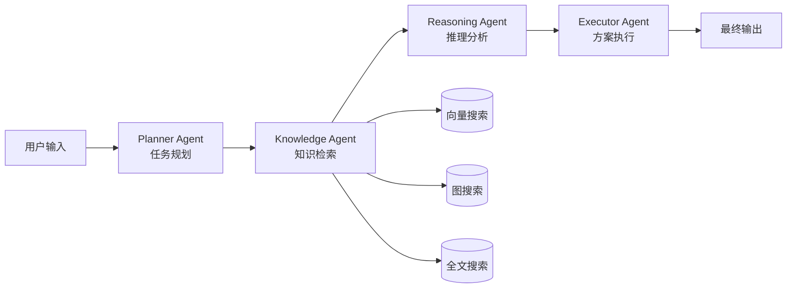
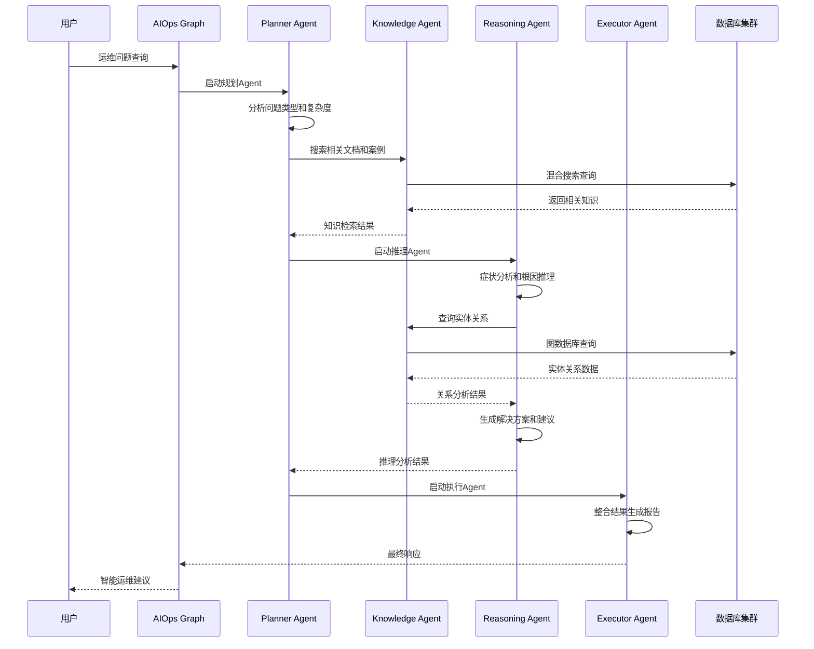

# AIOps Polaris 系统设计文档

## 📋 概述

AIOps Polaris 是一个基于现代AI技术栈的智能运维系统，采用**RAG（检索增强生成）+ 混合搜索 + 多Agent架构**设计，旨在为DevOps团队提供智能化的故障诊断、根因分析和解决方案推荐服务。

### 🎯 设计目标

- **智能化**: 基于AI的自动问题分析和解决方案生成
- **多模态**: 结合向量搜索、图搜索、全文搜索的混合检索
- **协作式**: 多Agent协同工作的分布式处理架构
- **可扩展**: 模块化设计支持功能扩展和性能扩容
- **实用性**: 面向实际运维场景的POC验证系统

## 🏗️ 系统架构设计

### 🏗️ 整体系统架构图

```
                    ┌─────────────────────────────────────────────────────┐
                    │                AIOps Polaris                        │
                    │           智能RCA根因分析平台 v2.0                   │
                    └─────────────────────────────────────────────────────┘
                                             │
    ┌─────────────────────────────────────────────────────────────────────┐
    │                            前端交互层                               │
    ├─────────────────────────────────────────────────────────────────────┤
    │  Web UI         CLI Interface       REST API      WebSocket       │
    │ (Enhanced)      (chat_cli.py)      (FastAPI)     (Real-time)      │
    │ • 证据详情展示   • 命令行交互        • /chat端点    • 实时更新      │
    │ • 拓扑关系可视化 • 批量分析工具      • /health检查   • 进度推送     │
    │ • 上下滚动修复   • 脚本自动化        • /metrics指标  • 状态同步     │
    └─────────────────────────────────────────────────────────────────────┘
                                             │
    ┌─────────────────────────────────────────────────────────────────────┐
    │                        🧠 RCA智能分析层                             │
    ├─────────────────────────────────────────────────────────────────────┤
    │                         RCA Chat Service                           │
    │                    (集成式RCA分析端点)                              │
    │                                                                     │
    │  ┌──────────────────────────────────────────────────────────────┐   │
    │  │  多阶段分析流水线 (Multi-Stage Analysis Pipeline)           │   │
    │  │                                                              │   │
    │  │  1️⃣ NER实体识别    2️⃣ 混合搜索      3️⃣ 拓扑查询          │   │
    │  │  • 服务名提取      • 向量搜索      • Neo4j查询           │   │
    │  │  • 故障类型识别    • BM25全文搜索   • 依赖关系分析        │   │
    │  │  • 中英文支持      • 智能重排序    • 影响传播路径        │   │
    │  │                                                              │   │
    │  │  4️⃣ 智能推理       5️⃣ 结果生成                             │   │
    │  │  • 症状模式分析    • 结构化报告                           │   │
    │  │  • 根因置信度计算  • 解决方案推荐                         │   │
    │  │  • 证据验证过滤    • 完整日志记录                         │   │
    │  └──────────────────────────────────────────────────────────────┘   │
    └─────────────────────────────────────────────────────────────────────┘
                                             │
    ┌─────────────────────────────────────────────────────────────────────┐
    │                          🔧 核心服务层                              │
    ├─────────────────────────────────────────────────────────────────────┤
    │                                                                     │
    │  ┌──────────────────┐  ┌──────────────────┐  ┌─────────────────┐   │
    │  │  ImprovedRAG     │  │  TopologyService │  │  NERExtractor   │   │
    │  │     Service      │  │                  │  │                 │   │
    │  │ • 混合搜索引擎    │  │ • 服务拓扑查询   │  │ • 实体识别器    │   │
    │  │ • 向量+BM25      │  │ • 依赖关系分析   │  │ • 多语言支持    │   │
    │  │ • 智能重排序     │  │ • 上下游影响     │  │ • 置信度评分    │   │
    │  │ • 并发处理       │  │ • 数据验证过滤   │  │ • 服务名标准化  │   │
    │  └──────────────────┘  └──────────────────┘  └─────────────────┘   │
    │                                                                     │
    │  ┌──────────────────┐  ┌──────────────────┐  ┌─────────────────┐   │
    │  │   RCALogger      │  │  EmbeddingService│  │  VectorService  │   │
    │  │                  │  │                  │  │                 │   │
    │  │ • 完整日志系统    │  │ • 文本向量化     │  │ • Weaviate操作  │   │
    │  │ • 分析过程追踪    │  │ • 缓存机制       │  │ • 语义搜索      │   │
    │  │ • 双文件记录     │  │ • 模型管理       │  │ • 相似度计算    │   │
    │  │ • 结构化输出     │  │ • 批量处理       │  │ • 索引管理      │   │
    │  └──────────────────┘  └──────────────────┘  └─────────────────┘   │
    └─────────────────────────────────────────────────────────────────────┘
                                             │
    ┌─────────────────────────────────────────────────────────────────────┐
    │                       💾 多模态数据存储层                            │
    ├─────────────────────────────────────────────────────────────────────┤
    │                                                                     │
    │ ┌─────────────────┐ ┌─────────────────┐ ┌─────────────────────────┐ │
    │ │    Weaviate     │ │      Neo4j      │ │         MySQL           │ │
    │ │  (向量数据库)   │ │   (知识图谱)    │ │      (业务数据)         │ │
    │ │ • 双Collection  │ │ • 服务拓扑      │ │ • 会话管理              │ │
    │ │ • 语义搜索      │ │ • 依赖关系      │ │ • 消息历史              │ │
    │ │ • BM25全文搜索  │ │ • 实体属性      │ │ • 统计数据              │ │
    │ │ • 混合索引      │ │ • 关系推理      │ │ • 配置管理              │ │
    │ └─────────────────┘ └─────────────────┘ └─────────────────────────┘ │
    │                                                                     │
    │ ┌─────────────────┐ ┌─────────────────────────────────────────────┐ │
    │ │      Redis      │ │                Logs                         │ │
    │ │   (缓存系统)    │ │           (日志系统)                        │ │
    │ │ • 向量缓存      │ │ • ./logs/rca_analysis.log (概要)           │ │
    │ │ • 搜索结果      │ │ • ./logs/rca_detailed.log (详细)           │ │
    │ │ • 会话状态      │ │ • 结构化记录                                │ │
    │ │ • 配置缓存      │ │ • 可追溯审计                                │ │
    │ └─────────────────┘ └─────────────────────────────────────────────┘ │
    └─────────────────────────────────────────────────────────────────────┘

    ┌─────────────────────────────────────────────────────────────────────┐
    │                    🔍 核心技术特性                                  │
    │ • 混合搜索: 向量+BM25+重排序 (α=0.6向量, 0.4全文)                  │
    │ • 多阶段推理: NER→搜索→拓扑→推理→输出                               │
    │ • 数据质量保证: 过滤unknown/None数据，确保真实性                    │
    │ • 证据驱动分析: 完整证据链追踪(文件名、时间戳、置信度)              │
    │ • 实时拓扑可视化: 服务依赖关系图形化展示                            │
    └─────────────────────────────────────────────────────────────────────┘
```

### 🧠 核心设计思想

#### 1. **分层架构设计**
- **前端层**: 多种交互方式，满足不同用户需求
- **业务层**: Agent协调，智能决策和任务分解
- **服务层**: 业务逻辑封装，单一职责原则
- **数据层**: 多模态存储，各司其职

#### 2. **多Agent协作架构**
基于LangGraph框架的智能体协作模式：



#### 3. **数据存储策略（重构后 - 单一数据源原则）**
采用**单一数据源**原则，避免数据冗余和同步复杂性：

| 数据库 | 主要职责 | 数据类型 | 设计原则 | 优势 |
|--------|----------|----------|----------|------|
| Weaviate | **文档主存储** | 完整文档内容+元数据+向量 | 单一数据源 | 语义搜索、内容检索、原生向量能力 |
| Neo4j | **图数据主存储** | 完整实体+关系+属性 | 单一数据源 | 图遍历、关系推理、复杂查询 |
| MySQL | **业务逻辑存储** | 会话、统计、配置 | 业务专用 | 事务处理、统计分析、会话管理 |
| Redis | **缓存和临时数据** | 嵌入缓存、会话状态 | 性能优化 | 高速访问、过期管理 |

#### **数据流设计（重构后）**

**文档摄入流程**：
1. 文档接收 → 内容解析 → 向量化
2. **Weaviate存储**（主存储：完整内容+元数据+向量）
3. **MySQL记录**（业务统计：weaviate_id+访问统计）
4. **实体抽取** → **Neo4j存储**（完整实体+关系）
5. **关联创建**（Neo4j Document节点引用weaviate_id）

**搜索查询流程**：
1. 用户查询 → 查询分析 → 路由策略
2. **文档搜索**：直接查询Weaviate主存储
3. **实体搜索**：直接查询Neo4j主存储  
4. **统计更新**：MySQL更新访问计数
5. 结果聚合 → 排序 → 返回

**架构优势**：
- **无数据同步**：消除跨数据库同步开销和一致性问题
- **性能提升**：直接从主存储查询，无需关联查询
- **维护简化**：每个数据库职责明确，代码逻辑清晰
- **扩展性好**：可独立优化和扩展每个数据库

## 💾 数据库详细设计

### 架构重构：单一数据源原则 (Single Source of Truth)

基于架构评估和优化，系统已采用**单一数据源**的设计原则，避免数据冗余和同步复杂性：

- **Weaviate**: 文档和向量数据的**主存储**，包含完整文档内容、元数据和向量
- **Neo4j**: 图数据和关系的**主存储**，包含完整实体和关系信息
- **MySQL**: 业务逻辑和统计数据的存储，仅存储引用ID和业务统计信息

### MySQL - 业务逻辑和统计数据存储

#### 核心表结构设计（重构后）

**会话管理模块**
```sql
-- 用户会话表
CREATE TABLE user_sessions (
    id VARCHAR(36) PRIMARY KEY,
    user_id VARCHAR(100) NOT NULL INDEX,
    session_id VARCHAR(100) NOT NULL UNIQUE INDEX,
    created_at DATETIME DEFAULT NOW(),
    updated_at DATETIME DEFAULT NOW() ON UPDATE NOW(),
    is_active BOOLEAN DEFAULT TRUE,
    session_metadata JSON COMMENT '会话配置：温度、令牌限制等'
);

-- 会话消息表  
CREATE TABLE session_messages (
    id VARCHAR(36) PRIMARY KEY,
    session_id VARCHAR(100) NOT NULL,
    user_id VARCHAR(100) NOT NULL INDEX,
    message TEXT NOT NULL COMMENT '用户输入',
    response TEXT COMMENT 'AI响应',
    message_type ENUM('user', 'assistant', 'system'),
    created_at DATETIME DEFAULT NOW() INDEX,
    tokens_used INTEGER DEFAULT 0 COMMENT 'Token消耗量',
    processing_time FLOAT DEFAULT 0.0 COMMENT '处理耗时(秒)',
    message_metadata JSON COMMENT 'Agent执行详情',
    FOREIGN KEY (session_id) REFERENCES user_sessions(session_id)
);
```

**知识管理模块（重构后 - 仅存储业务统计）**
```sql
-- 知识文档统计表 - 实际文档存储在Weaviate
CREATE TABLE knowledge_documents (
    id VARCHAR(36) PRIMARY KEY,
    weaviate_id VARCHAR(100) NOT NULL UNIQUE INDEX COMMENT 'Weaviate文档ID',
    title VARCHAR(500) NOT NULL,
    source ENUM('wiki','gitlab','jira','logs') NOT NULL INDEX,
    source_id VARCHAR(100) COMMENT '原系统ID',
    category VARCHAR(100) INDEX COMMENT '文档分类',
    -- 业务统计字段
    view_count INTEGER DEFAULT 0 COMMENT '访问次数',
    last_accessed DATETIME NULL COMMENT '最后访问时间',
    created_at DATETIME DEFAULT NOW() INDEX,
    updated_at DATETIME DEFAULT NOW() ON UPDATE NOW(),
    INDEX idx_source_category (source, category),
    INDEX idx_created_at (created_at)
);

-- 实体统计表 - 实际实体存储在Neo4j
CREATE TABLE entities (
    id VARCHAR(36) PRIMARY KEY,
    name VARCHAR(200) NOT NULL,
    entity_type VARCHAR(100) NOT NULL INDEX,
    source_document_id VARCHAR(100) COMMENT '来源文档Weaviate ID',
    confidence FLOAT DEFAULT 1.0 COMMENT 'NER提取置信度',
    -- 业务统计字段
    mention_count INTEGER DEFAULT 1 COMMENT '被提及次数',
    last_mentioned DATETIME DEFAULT NOW() COMMENT '最后提及时间',
    created_at DATETIME DEFAULT NOW(),
    UNIQUE KEY unique_name_type (name, entity_type),
    INDEX idx_type_confidence (entity_type, confidence)
);

-- 关系统计表 - 实际关系存储在Neo4j  
CREATE TABLE relationships (
    id VARCHAR(36) PRIMARY KEY,
    source_entity_id VARCHAR(36) NOT NULL,
    target_entity_id VARCHAR(36) NOT NULL,
    relationship_type VARCHAR(100) NOT NULL INDEX,
    source_document_id VARCHAR(100) COMMENT '来源文档Weaviate ID',
    confidence FLOAT DEFAULT 1.0 COMMENT '关系置信度',
    -- 业务统计字段
    usage_count INTEGER DEFAULT 1 COMMENT '被使用次数',
    last_used DATETIME DEFAULT NOW() COMMENT '最后使用时间',
    created_at DATETIME DEFAULT NOW(),
    FOREIGN KEY (source_entity_id) REFERENCES entities(id) ON DELETE CASCADE,
    FOREIGN KEY (target_entity_id) REFERENCES entities(id) ON DELETE CASCADE
);
```

**系统管理模块**
```sql
-- 系统配置表
CREATE TABLE system_config (
    id VARCHAR(36) PRIMARY KEY,
    config_key VARCHAR(100) UNIQUE NOT NULL,
    config_value JSON NOT NULL COMMENT '支持复杂配置对象',
    description TEXT COMMENT '配置说明',
    created_at DATETIME DEFAULT NOW(),
    updated_at DATETIME DEFAULT NOW() ON UPDATE NOW()
);

-- 异步任务队列
CREATE TABLE task_queue (
    id VARCHAR(36) PRIMARY KEY,
    task_type VARCHAR(100) NOT NULL INDEX COMMENT '任务类型',
    task_data JSON NOT NULL COMMENT '任务参数',
    status ENUM('pending','running','completed','failed') DEFAULT 'pending' INDEX,
    priority INTEGER DEFAULT 0 INDEX COMMENT '优先级',
    max_retries INTEGER DEFAULT 3,
    retry_count INTEGER DEFAULT 0,
    scheduled_at DATETIME DEFAULT NOW() INDEX COMMENT '计划执行时间',
    started_at DATETIME NULL COMMENT '实际开始时间',
    completed_at DATETIME NULL COMMENT '完成时间',
    error_message TEXT COMMENT '错误信息',
    result JSON COMMENT '执行结果',
    created_at DATETIME DEFAULT NOW(),
    updated_at DATETIME DEFAULT NOW() ON UPDATE NOW()
);
```

#### 数据存储策略（重构后）

**1. 会话和消息数据**
- **设计原理**: 支持多用户并发会话，消息历史追溯
- **性能优化**: 
  - `session_id`和`user_id`创建复合索引
  - `created_at`时间索引支持时间范围查询
  - `message_metadata`存储Agent执行轨迹，支持调试和优化

**2. 知识文档业务统计**
- **设计原理**: 仅存储文档的业务元数据和访问统计，实际内容在Weaviate
- **关联设计**:
  - `weaviate_id` → 链接到Weaviate的主存储文档
  - 去除了`content`和`embedding_id`字段，避免数据冗余
  - `view_count`和`last_accessed`追踪文档使用情况
  - `source`枚举严格控制数据源类型

**3. 实体关系业务统计** 
- **设计原理**: 仅存储实体和关系的业务统计信息，实际图数据在Neo4j
- **统计字段**:
  - `mention_count`和`last_mentioned`追踪实体被提及情况
  - `usage_count`和`last_used`追踪关系使用频率
  - 去除了`neo4j_id`、`properties`、`description`等冗余字段
  - 保留`confidence`用于NER和关系抽取的质量评估

**4. 单一数据源优势**:
- **消除同步复杂性**: 无需维护跨数据库的数据一致性
- **提升性能**: 直接从主存储查询，减少关联查询开销  
- **简化维护**: 每个数据库职责明确，代码逻辑清晰
- **便于扩展**: 可独立优化和扩展每个存储系统

### Neo4j - 知识图谱主存储（重构后）

#### 图数据模型设计（完整存储）

```cypher
// 实体节点类型 - 完整存储实体信息
CREATE CONSTRAINT entity_name_type IF NOT EXISTS 
FOR (e:Entity) REQUIRE (e.name, e.type) IS UNIQUE;

// 文档节点类型 - 链接到Weaviate的文档
CREATE CONSTRAINT document_weaviate_id IF NOT EXISTS
FOR (d:Document) REQUIRE d.weaviate_id IS UNIQUE;

// 核心节点类型（完整属性存储）
(:Entity {
    name: str,
    type: str,
    properties: map,           // 完整属性信息
    confidence: float,         // NER置信度
    created_at: datetime,
    updated_at: datetime
})

(:Document {
    weaviate_id: str,          // 链接到Weaviate文档的ID
    title: str,
    source: str,               // wiki, gitlab, jira, logs
    category: str,
    created_at: datetime
})

// 专业化节点类型
(:Technology)    // 技术组件：CPU, MySQL, Kubernetes等
(:Problem)       // 问题类型：高CPU、连接超时等  
(:Solution)      // 解决方案：重启服务、调整配置等
(:Person)        // 人员角色：DevOps、开发者等
(:Process)       // 流程步骤：诊断、修复、验证等
(:Resource)      // 资源类型：内存、磁盘、网络等
```

**关系类型设计（完整存储）**
```cypher
// 实体间关系（完整属性存储）
CREATE (source:Entity)-[r:RELATION_TYPE {
    properties: map,           // 完整关系属性
    confidence: float,         // 关系置信度
    source_document_id: str,   // 来源文档Weaviate ID
    created_at: datetime,
    updated_at: datetime
}]->(target:Entity)

// 文档关联关系
(Entity)-[:MENTIONED_IN {
    context: str,              // 提及上下文
    position: int,             // 在文档中的位置
    extraction_method: str     // 抽取方法 (NER, Manual, etc.)
}]->(Document)

// 问题诊断关系
(Problem)-[:CAUSED_BY {
    likelihood: float,
    evidence: str[]
}]->(Technology)

(Problem)-[:SOLVED_BY {
    effectiveness: float,
    success_rate: float,
    steps: str[]
}]->(Solution)

(Technology)-[:DEPENDS_ON {
    dependency_type: str,      // hard, soft, optional
    criticality: str           // critical, important, minor
}]->(Technology)

// 运维流程关系
(Person)-[:RESPONSIBLE_FOR {
    role: str,
    expertise_level: str
}]->(Technology)

(Process)-[:REQUIRES {
    resource_amount: str,
    priority: str
}]->(Resource)

(Solution)-[:INVOLVES {
    execution_order: int,
    estimated_time: str
}]->(Process)

// 知识关联关系
(Problem)-[:SIMILAR_TO {
    similarity_score: float,
    comparison_aspects: str[]
}]->(Problem)

(Solution)-[:ALTERNATIVE_TO {
    comparison_score: float,
    trade_offs: str[]
}]->(Solution)
```

#### 图查询优化

**索引策略**
```cypher
// 为常用查询创建索引
CREATE INDEX entity_name IF NOT EXISTS FOR (e:Entity) ON (e.name);
CREATE INDEX entity_type IF NOT EXISTS FOR (e:Entity) ON (e.type);
CREATE INDEX problem_severity IF NOT EXISTS FOR (p:Problem) ON (p.severity);
```

**典型查询模式**
```cypher
// 根因分析查询：找到问题的可能原因
MATCH (p:Problem {name: $problem_name})-[:CAUSED_BY*1..3]->(cause)
RETURN DISTINCT cause.name, cause.description
ORDER BY cause.confidence DESC;

// 解决方案推荐：基于相似问题的解决方案
MATCH (p1:Problem)-[:SIMILAR_TO]-(p2:Problem {name: $current_problem})
MATCH (p1)-[:SOLVED_BY]->(s:Solution)
RETURN s.name, s.steps, s.effectiveness
ORDER BY s.effectiveness DESC;

// 依赖关系分析：分析技术组件依赖
MATCH (t1:Technology {name: $tech_name})-[:DEPENDS_ON*1..2]->(t2:Technology)
RETURN t2.name, t2.status, t2.health_check_url;
```

### Weaviate - 文档主存储（重构后）

#### Schema设计（完整文档存储）

```python
# 知识文档类定义 - 完整文档和元数据存储
knowledge_document_schema = {
    "class": "KnowledgeDocument",
    "description": "知识文档主存储 - 包含完整文档信息和元数据",
    "properties": [
        {
            "name": "title",
            "dataType": ["text"],
            "description": "文档标题"
        },
        {
            "name": "content", 
            "dataType": ["text"],
            "description": "文档完整内容"
        },
        {
            "name": "source",
            "dataType": ["string"],
            "description": "数据源：wiki/gitlab/jira/logs"
        },
        {
            "name": "source_id",
            "dataType": ["string"],
            "description": "源系统中的ID"
        },
        {
            "name": "category",
            "dataType": ["string"], 
            "description": "文档分类"
        },
        {
            "name": "tags",
            "dataType": ["string[]"],
            "description": "标签列表"
        },
        {
            "name": "author",
            "dataType": ["string"],
            "description": "文档作者"
        },
        {
            "name": "version",
            "dataType": ["string"],
            "description": "文档版本"
        },
        {
            "name": "language",
            "dataType": ["string"],
            "description": "文档语言"
        },
        {
            "name": "file_path",
            "dataType": ["string"],
            "description": "原始文件路径"
        },
        {
            "name": "created_at",
            "dataType": ["date"],
            "description": "创建时间"
        },
        {
            "name": "updated_at",
            "dataType": ["date"],
            "description": "更新时间"
        }
    ],
    "vectorizer": "none",  # 手动提供向量，更灵活控制
    "indexNullState": False,
    "indexFilterable": True,
    "indexSearchable": True
}

# 日志条目类定义
log_entry_schema = {
    "class": "LogEntry", 
    "description": "系统日志条目",
    "properties": [
        {
            "name": "timestamp",
            "dataType": ["date"],
            "description": "日志时间戳"
        },
        {
            "name": "level",
            "dataType": ["string"],
            "description": "日志级别"
        },
        {
            "name": "service",
            "dataType": ["string"],
            "description": "服务名称"
        },
        {
            "name": "message",
            "dataType": ["text"],
            "description": "日志消息"
        },
        {
            "name": "metadata",
            "dataType": ["text"],
            "description": "附加元数据JSON"
        }
    ],
    "vectorizer": "none"
}
```

#### 向量化策略

**文本预处理流程**
```python
def preprocess_document(title: str, content: str) -> str:
    """
    文档预处理：标题 + 内容组合，用于向量化
    """
    # 组合标题和内容，标题权重更高
    combined_text = f"标题: {title}\n\n内容: {content}"
    
    # 文本清理和标准化
    cleaned_text = clean_and_normalize(combined_text)
    
    # 长度限制（避免超出模型输入限制）
    if len(cleaned_text) > 8000:
        cleaned_text = cleaned_text[:8000] + "..."
    
    return cleaned_text
```

**相似性搜索优化**
```python
# 混合搜索：向量相似性 + 元数据过滤
vector_search_query = {
    "query": query_text,
    "limit": limit,
    "where": {
        "operator": "And",
        "operands": [
            {
                "path": ["source"],
                "operator": "Equal", 
                "valueText": source_filter
            },
            {
                "path": ["created_at"],
                "operator": "GreaterThan",
                "valueDate": date_filter
            }
        ]
    },
    "additional": ["certainty", "distance"]
}
```

### Redis - 缓存层设计

#### 缓存策略

**1. 嵌入向量缓存**
```python
# 缓存键设计
embedding_cache_key = f"embedding:md5:{content_hash}"
cache_ttl = 3600 * 24 * 7  # 7天过期

# 缓存存储
redis_client.setex(
    embedding_cache_key,
    cache_ttl, 
    json.dumps(embedding_vector)
)
```

**2. 搜索结果缓存**
```python
# 搜索结果缓存（短期）
search_cache_key = f"search:{query_hash}:{search_type}:{limit}"
search_cache_ttl = 300  # 5分钟过期

# 热点查询识别和延长TTL
if query in hot_queries:
    search_cache_ttl = 1800  # 30分钟
```

**3. 会话状态缓存**
```python
# 会话上下文缓存
session_cache_key = f"session:{session_id}:context"
session_ttl = 3600 * 2  # 2小时过期

# 存储Agent执行状态
agent_state_key = f"agent:{session_id}:state"
```

## 🤖 多Agent架构设计

### Agent职责划分

#### 1. **Planner Agent - 任务规划器**
```python
class PlannerAgent:
    """
    职责：
    - 分析用户问题类型和复杂度
    - 制定解决方案的执行计划
    - 协调其他Agent的工作流程
    """
    
    tools = [
        "analyze_query",        # 问题分析
        "create_plan",          # 创建执行计划  
        "search_relevant_docs"  # 搜索相关文档
    ]
    
    async def analyze_query(self, user_message: str) -> Dict:
        """分析用户查询，确定问题类型和优先级"""
        analysis = {
            "problem_type": "performance",     # 性能/故障/配置/知识查询
            "severity": "medium",              # 严重程度
            "components": ["cpu", "system"],   # 涉及组件
            "complexity": "medium",            # 复杂度评估
            "suggested_agents": ["knowledge", "reasoning"]
        }
        return analysis
    
    async def create_plan(self, analysis: Dict) -> Dict:
        """基于分析结果创建执行计划"""
        plan = {
            "steps": [
                {"agent": "knowledge", "action": "search_documents", "params": {...}},
                {"agent": "reasoning", "action": "analyze_symptoms", "params": {...}},
                {"agent": "executor", "action": "generate_report", "params": {...}}
            ],
            "estimated_time": 5.0,
            "confidence": 0.85
        }
        return plan
```

#### 2. **Knowledge Agent - 知识检索器**
```python
class KnowledgeAgent:
    """
    职责：
    - 执行混合搜索（向量+图+全文）
    - 查找相似历史案例
    - 提取关键实体和关系
    """
    
    tools = [
        "search_documents",         # 文档搜索
        "find_similar_cases",       # 相似案例查找
        "get_entity_relationships", # 实体关系查询
        "extract_key_information"   # 关键信息提取
    ]
    
    async def search_documents(self, query: str, search_type: str = "hybrid") -> Dict:
        """执行混合搜索"""
        results = await self.search_service.hybrid_search(
            query=query,
            search_type=search_type,
            limit=10,
            threshold=0.7
        )
        return results
    
    async def find_similar_cases(self, problem_description: str) -> List[Dict]:
        """基于问题描述找相似案例"""
        # 1. 向量相似性搜索
        vector_results = await self.vector_search(problem_description)
        
        # 2. 图数据库查询相似问题
        graph_results = await self.graph_search_similar_problems(problem_description)
        
        # 3. 结果合并和排序
        similar_cases = self.merge_and_rank_results(vector_results, graph_results)
        return similar_cases
```

#### 3. **Reasoning Agent - 推理分析器**
```python
class ReasoningAgent:
    """
    职责：  
    - 症状分析和模式识别
    - 根因推断和假设验证
    - 解决方案评估和优先级排序
    """
    
    tools = [
        "analyze_symptoms",      # 症状分析
        "infer_root_causes",     # 根因推理
        "evaluate_solutions",    # 方案评估
        "make_recommendation"    # 推荐决策
    ]
    
    async def analyze_symptoms(self, symptoms: List[str], context: Dict) -> Dict:
        """分析症状模式"""
        analysis = {
            "symptom_patterns": [],
            "severity_assessment": "medium",
            "impacted_systems": ["web-server", "database"],
            "correlation_analysis": {...}
        }
        return analysis
    
    async def infer_root_causes(self, symptoms: Dict, knowledge_base: List) -> List[Dict]:
        """根因推理"""
        # 1. 基于症状匹配已知问题模式
        pattern_matches = await self.match_problem_patterns(symptoms)
        
        # 2. 图数据库因果关系推理
        causal_analysis = await self.graph_causal_reasoning(symptoms)
        
        # 3. 概率推理和置信度计算
        root_causes = self.calculate_cause_probabilities(pattern_matches, causal_analysis)
        
        return root_causes
```

#### 4. **Executor Agent - 执行器**
```python
class ExecutorAgent:
    """
    职责：
    - 解析和验证执行计划
    - 生成具体操作步骤
    - 整合最终响应结果
    """
    
    tools = [
        "parse_execution_plan",  # 解析执行计划
        "execute_step",          # 执行单个步骤
        "verify_result",         # 结果验证
        "generate_report"        # 生成报告
    ]
    
    async def generate_report(self, 
                            analysis: Dict, 
                            knowledge: Dict, 
                            reasoning: Dict) -> Dict:
        """整合各Agent结果生成最终报告"""
        report = {
            "problem_summary": self.summarize_problem(analysis),
            "root_cause_analysis": reasoning.get("root_causes", []),
            "recommended_solutions": reasoning.get("solutions", []),
            "step_by_step_guide": self.generate_action_steps(reasoning),
            "related_documents": knowledge.get("documents", []),
            "monitoring_suggestions": self.suggest_monitoring(analysis),
            "confidence_score": self.calculate_overall_confidence(analysis, reasoning)
        }
        return report
```

### Agent协作流程



## 🔍 混合搜索引擎设计

### 搜索架构

```python
class HybridSearchEngine:
    """
    混合搜索引擎：整合多种搜索方式
    """
    
    def __init__(self):
        self.vector_service = VectorService()      # Weaviate向量搜索
        self.graph_service = GraphService()        # Neo4j图搜索
        self.database_service = DatabaseService()  # MySQL全文搜索
        
    async def hybrid_search(self, 
                          query: str, 
                          search_type: str = "hybrid",
                          weights: Dict[str, float] = None) -> Dict:
        """
        混合搜索主入口
        """
        if weights is None:
            weights = {"vector": 0.5, "graph": 0.3, "fulltext": 0.2}
            
        results = {
            "documents": [],
            "total": 0,
            "search_metadata": {
                "vector_results": 0,
                "graph_results": 0, 
                "fulltext_results": 0
            }
        }
        
        # 并行执行多种搜索
        search_tasks = []
        
        if search_type in ["hybrid", "vector"]:
            search_tasks.append(self._vector_search(query))
            
        if search_type in ["hybrid", "graph"]:
            search_tasks.append(self._graph_search(query))
            
        if search_type in ["hybrid", "fulltext"]:
            search_tasks.append(self._fulltext_search(query))
        
        # 等待所有搜索完成
        search_results = await asyncio.gather(*search_tasks, return_exceptions=True)
        
        # 结果融合和排序
        merged_results = await self._merge_and_rank_results(
            search_results, weights, query
        )
        
        return merged_results
```

### 结果融合算法

```python
class ResultFusionAlgorithm:
    """
    多源搜索结果融合算法
    """
    
    def calculate_fusion_score(self, 
                              doc: Dict, 
                              vector_score: float,
                              graph_score: float, 
                              fulltext_score: float,
                              weights: Dict[str, float]) -> float:
        """
        计算融合分数
        """
        # 1. 加权平均基础分数
        base_score = (
            vector_score * weights["vector"] +
            graph_score * weights["graph"] +
            fulltext_score * weights["fulltext"]
        )
        
        # 2. 文档质量加权
        quality_boost = self._calculate_quality_boost(doc)
        
        # 3. 新鲜度加权
        freshness_boost = self._calculate_freshness_boost(doc)
        
        # 4. 来源可信度加权
        source_boost = self._calculate_source_boost(doc)
        
        # 最终分数计算
        final_score = base_score * (1 + quality_boost + freshness_boost + source_boost)
        
        return min(final_score, 1.0)  # 限制最大分数为1.0
    
    def _calculate_quality_boost(self, doc: Dict) -> float:
        """基于文档质量的加权"""
        boost = 0.0
        
        # 文档长度适中加分
        content_length = len(doc.get("content", ""))
        if 200 <= content_length <= 5000:
            boost += 0.1
            
        # 标签丰富度加分
        tags_count = len(doc.get("tags", []))
        if tags_count >= 3:
            boost += 0.05
            
        # 结构化内容加分（包含代码、命令等）
        if self._contains_structured_content(doc["content"]):
            boost += 0.1
            
        return boost
```

## 🚀 性能优化策略

### 1. **缓存策略**

```python
class CacheStrategy:
    """
    多层级缓存策略
    """
    
    # L1缓存：内存缓存（最频繁访问）
    memory_cache = TTLCache(maxsize=1000, ttl=300)  # 5分钟TTL
    
    # L2缓存：Redis缓存（中等频次访问）
    redis_cache_ttl = {
        "embeddings": 86400 * 7,    # 嵌入向量：7天
        "search_results": 300,       # 搜索结果：5分钟
        "session_context": 7200,     # 会话上下文：2小时
        "system_config": 3600        # 系统配置：1小时
    }
    
    # L3缓存：数据库查询优化
    database_cache_strategy = {
        "prepared_statements": True,   # 预编译语句
        "connection_pooling": True,    # 连接池
        "query_result_cache": True     # 查询结果缓存
    }
```

### 2. **异步并发处理**

```python
class ConcurrentProcessor:
    """
    并发处理优化
    """
    
    async def parallel_agent_execution(self, agents: List[BaseAgent], context: Dict):
        """
        Agent并行执行（适用于独立任务）
        """
        tasks = []
        for agent in agents:
            if agent.can_run_parallel:
                task = asyncio.create_task(agent.execute(context))
                tasks.append(task)
        
        # 等待所有并行任务完成
        results = await asyncio.gather(*tasks, return_exceptions=True)
        return self._handle_parallel_results(results)
    
    async def parallel_search_execution(self, query: str):
        """
        多数据库并行搜索
        """
        async with asyncio.TaskGroup() as tg:
            vector_task = tg.create_task(self.vector_search(query))
            graph_task = tg.create_task(self.graph_search(query))
            fulltext_task = tg.create_task(self.fulltext_search(query))
            
        return {
            "vector": vector_task.result(),
            "graph": graph_task.result(),
            "fulltext": fulltext_task.result()
        }
```

### 3. **数据库优化**

```sql
-- MySQL索引优化
CREATE INDEX idx_session_user_time ON session_messages(user_id, created_at DESC);
CREATE INDEX idx_doc_source_category ON knowledge_documents(source, category);
CREATE INDEX idx_entity_type_name ON entities(entity_type, name);

-- 分区表设计（大数据量场景）
ALTER TABLE session_messages PARTITION BY RANGE (UNIX_TIMESTAMP(created_at)) (
    PARTITION p_current VALUES LESS THAN (UNIX_TIMESTAMP('2024-12-01')),
    PARTITION p_future VALUES LESS THAN (MAXVALUE)
);
```

```cypher
-- Neo4j查询优化
CREATE INDEX entity_name_index IF NOT EXISTS FOR (e:Entity) ON (e.name);
CREATE INDEX problem_severity_index IF NOT EXISTS FOR (p:Problem) ON (p.severity);

-- 查询提示优化
MATCH (p:Problem)-[:CAUSED_BY*1..2]->(cause:Technology)
WHERE p.name = $problem_name
WITH cause, count(*) as frequency
RETURN cause.name, cause.description, frequency
ORDER BY frequency DESC
LIMIT 10;
```

## 🔒 安全和可靠性设计

### 1. **数据安全**

```python
class SecurityManager:
    """
    安全管理器
    """
    
    def __init__(self):
        self.encryption_key = os.getenv("ENCRYPTION_KEY")
        self.jwt_secret = os.getenv("JWT_SECRET")
    
    def encrypt_sensitive_data(self, data: str) -> str:
        """加密敏感数据"""
        # 使用AES加密敏感配置和日志
        pass
    
    def sanitize_user_input(self, user_input: str) -> str:
        """用户输入清理"""
        # 防止SQL注入、XSS等攻击
        cleaned = html.escape(user_input)
        return cleaned
    
    def validate_api_access(self, request: Request) -> bool:
        """API访问验证"""
        # JWT token验证、访问频率限制等
        pass
```

### 2. **错误处理和恢复**

```python
class ErrorHandler:
    """
    统一错误处理和恢复机制
    """
    
    async def handle_database_error(self, error: Exception, operation: str):
        """数据库错误处理"""
        if isinstance(error, ConnectionError):
            # 连接错误：尝试重连
            await self.retry_with_backoff(operation, max_retries=3)
        elif isinstance(error, TimeoutError):
            # 超时错误：降级到缓存
            return await self.fallback_to_cache(operation)
        else:
            # 其他错误：记录日志并返回默认响应
            logger.error(f"Database error in {operation}: {error}")
            return self.get_default_response()
    
    async def circuit_breaker_pattern(self, service_call: Callable):
        """断路器模式"""
        if self.circuit_breaker.is_open():
            return await self.fallback_response()
        
        try:
            result = await service_call()
            self.circuit_breaker.success()
            return result
        except Exception as e:
            self.circuit_breaker.failure()
            raise e
```

## 📊 监控和可观测性

AIOps Polaris 配备了完整的监控和可观测性体系，基于 **Prometheus + Grafana + 自定义指标服务** 实现全方位系统监控。

### 1. **监控架构**

```
┌─────────────────┐    ┌─────────────────┐    ┌─────────────────┐
│   FastAPI App   │───▶│   Prometheus    │───▶│    Grafana      │
│   + Metrics     │    │   (指标收集)     │    │   (可视化)      │
└─────────────────┘    └─────────────────┘    └─────────────────┘
         │                       │                       │
         ▼                       ▼                       ▼
┌─────────────────┐    ┌─────────────────┐    ┌─────────────────┐
│ MetricsService  │    │  Time Series    │    │   Dashboards    │
│  (指标暴露)     │    │     数据库      │    │    + Alerts     │
└─────────────────┘    └─────────────────┘    └─────────────────┘
```

### 2. **核心指标类别**

#### HTTP请求指标
- `aiops_http_requests_total`: 总HTTP请求计数 (按方法、端点、状态码分组)
- `aiops_http_request_duration_seconds`: HTTP请求处理时长分布
- `aiops_http_requests_in_progress`: 当前处理中的HTTP请求数

#### Agent执行指标  
- `aiops_agent_executions_total`: Agent执行总次数 (按类型、状态分组)
- `aiops_agent_execution_duration_seconds`: Agent执行时长分布
- `aiops_agent_active`: 当前活跃Agent数量

#### 搜索服务指标
- `aiops_search_requests_total`: 搜索请求总数 (按搜索类型、数据源分组)
- `aiops_search_duration_seconds`: 搜索响应时长分布
- `aiops_search_results_count`: 搜索结果数量分布

#### 数据库指标
- `aiops_database_connections`: 数据库连接数 (按数据库类型、状态分组)
- `aiops_database_operations_total`: 数据库操作计数
- `aiops_database_operation_duration_seconds`: 数据库操作耗时

#### 业务指标
- `aiops_user_sessions_total`: 用户会话创建总数
- `aiops_active_sessions`: 当前活跃会话数
- `aiops_messages_total`: 消息处理总数
- `aiops_message_tokens`: 消息Token数量分布

#### 系统资源指标
- `aiops_cpu_usage_percent`: CPU使用率
- `aiops_memory_usage_bytes`: 内存使用情况 (按类型分组)
- `aiops_cache_hit_ratio`: 缓存命中率

### 3. **指标收集实现**

#### MetricsService 核心功能
```python
# 监控服务核心类
class MetricsService:
    def __init__(self):
        self.registry = CollectorRegistry()
        self._init_metrics()  # 初始化所有指标
    
    # HTTP请求装饰器
    def track_http_request(self, endpoint: str)
    
    # Agent执行上下文管理器
    @contextmanager
    def track_agent_execution(self, agent_type: str)
    
    # 数据库操作跟踪
    @contextmanager  
    def track_database_operation(self, db_type: str, operation: str)
    
    # 指标导出（Prometheus格式）
    def export_metrics(self) -> bytes
```

#### 自动指标收集
- **HTTP中间件**: 自动跟踪所有API请求的响应时间和状态
- **Agent装饰器**: 透明跟踪Agent执行性能和成功率
- **数据库钩子**: 监控数据库连接池和查询性能
- **系统资源**: 定时更新CPU、内存使用情况

### 4. **Grafana仪表盘**

#### AIOps Overview Dashboard
- **系统概览**: HTTP请求率、响应时间、活跃连接
- **Agent监控**: Agent执行统计、性能分析、错误追踪  
- **搜索分析**: 搜索请求模式、响应时间、结果质量
- **资源监控**: CPU、内存使用趋势
- **数据库监控**: 连接池状态、查询性能

#### 关键可视化组件
- **实时指标卡片**: 当前活跃请求、Agent、会话数
- **时间序列图表**: 请求率、响应时间、资源使用趋势
- **直方图分析**: 响应时间分布、搜索结果数量分布
- **状态热力图**: HTTP状态码分布、数据库操作状态

### 5. **监控端点**

#### `/metrics` - Prometheus指标导出
```bash
curl http://localhost:8888/metrics
```
返回标准Prometheus格式指标数据，包含系统实时状态。

#### `/health` - 增强健康检查  
```json
{
  "status": "healthy",
  "components": {
    "weaviate": {"status": "healthy"},
    "neo4j": {"status": "healthy"}, 
    "metrics": {"metrics_enabled": true, "registry_collectors": 15}
  }
}
```

### 6. **监控部署和使用**

#### 快速启动监控栈
```bash
# 启动完整监控栈
docker-compose up -d

# 验证服务状态
docker-compose ps

# 运行监控集成测试
python tests/test_monitoring_integration.py
```

#### 监控访问地址
- **API服务**: http://localhost:8888
- **API指标**: http://localhost:8888/metrics
- **Prometheus**: http://localhost:9090
- **Grafana**: http://localhost:3000 (admin/aiops123)
- **系统概览仪表盘**: http://localhost:3000/d/aiops-overview

#### 关键监控查询示例
```promql
# HTTP请求率 (按端点分组)
rate(aiops_http_requests_total[5m])

# 95th分位数响应时间
histogram_quantile(0.95, rate(aiops_http_request_duration_seconds_bucket[5m]))

# 错误率
rate(aiops_http_requests_total{status_code=~"5.."}[5m]) / rate(aiops_http_requests_total[5m])

# Agent执行成功率
rate(aiops_agent_executions_total{status="success"}[5m]) / rate(aiops_agent_executions_total[5m])

# 搜索性能分析
histogram_quantile(0.95, rate(aiops_search_duration_seconds_bucket[5m]))
```

#### 监控最佳实践
1. **定期检查仪表盘**: 关注系统性能趋势和异常
2. **设置告警规则**: 为关键指标配置Prometheus告警
3. **性能基线**: 建立正常业务状态下的性能基线
4. **容量规划**: 基于监控数据进行资源容量规划

### 7. **故障排除和调试**

#### 常见监控问题
1. **指标数据缺失**
   - 检查 `/metrics` 端点是否可访问
   - 验证Prometheus配置和目标发现
   - 确认MetricsService正确初始化

2. **Grafana仪表盘空白**
   - 检查Prometheus数据源连接
   - 验证查询语句语法
   - 确认时间范围设置

3. **性能监控异常**
   - 检查系统资源限制
   - 分析日志中的错误信息
   - 验证数据库连接状态

#### 监控数据分析指南
- **响应时间分析**: 关注95th/99th分位数，识别性能瓶颈
- **错误率趋势**: 监控4xx/5xx错误模式，快速定位问题
- **资源使用**: 跟踪CPU、内存趋势，预防资源耗尽
- **业务指标**: 关注用户会话、消息处理等业务关键指标

### 8. **指标收集详细实现**

```python
class MetricsCollector:
    """
    指标收集器
    """
    
    def __init__(self):
        # Prometheus指标定义
        self.request_count = Counter('aiops_requests_total', 'Total requests', ['endpoint', 'status'])
        self.request_duration = Histogram('aiops_request_duration_seconds', 'Request duration')
        self.agent_execution_time = Histogram('aiops_agent_execution_seconds', 'Agent execution time', ['agent_type'])
        self.database_connections = Gauge('aiops_db_connections', 'Database connections', ['database'])
        
    async def record_api_request(self, endpoint: str, duration: float, status: str):
        """记录API请求指标"""
        self.request_count.labels(endpoint=endpoint, status=status).inc()
        self.request_duration.observe(duration)
    
    async def record_agent_performance(self, agent_type: str, execution_time: float):
        """记录Agent执行性能"""
        self.agent_execution_time.labels(agent_type=agent_type).observe(execution_time)
```

### 2. **日志策略**

```python
class StructuredLogger:
    """
    结构化日志记录
    """
    
    def __init__(self):
        self.logger = structlog.get_logger()
    
    async def log_agent_execution(self, 
                                agent_name: str, 
                                session_id: str, 
                                execution_context: Dict):
        """记录Agent执行日志"""
        await self.logger.info(
            "agent_execution",
            agent=agent_name,
            session_id=session_id,
            user_id=execution_context.get("user_id"),
            execution_time=execution_context.get("duration"),
            input_tokens=execution_context.get("input_tokens"),
            output_tokens=execution_context.get("output_tokens"),
            tools_used=execution_context.get("tools"),
            success=execution_context.get("success", True)
        )
    
    async def log_search_operation(self, 
                                 search_type: str, 
                                 query: str, 
                                 results_count: int,
                                 processing_time: float):
        """记录搜索操作日志"""
        await self.logger.info(
            "search_operation",
            search_type=search_type,
            query_hash=hashlib.md5(query.encode()).hexdigest()[:8],
            results_count=results_count,
            processing_time=processing_time,
            databases_queried=["mysql", "neo4j", "weaviate"] if search_type == "hybrid" else [search_type]
        )
```

## 🔮 扩展性设计

### 1. **插件化架构**

```python
class PluginManager:
    """
    插件管理器 - 支持动态加载新的Agent和工具
    """
    
    def __init__(self):
        self.plugins = {}
        self.plugin_loader = PluginLoader()
    
    async def register_agent_plugin(self, plugin_name: str, agent_class: Type[BaseAgent]):
        """注册新的Agent插件"""
        self.plugins[plugin_name] = {
            "type": "agent",
            "class": agent_class,
            "enabled": True,
            "loaded_at": datetime.utcnow()
        }
        
    async def register_tool_plugin(self, tool_name: str, tool_func: Callable):
        """注册新的工具插件"""
        self.plugins[tool_name] = {
            "type": "tool", 
            "function": tool_func,
            "enabled": True,
            "loaded_at": datetime.utcnow()
        }
```

### 2. **配置驱动架构**

```yaml
# config/agents.yaml - Agent配置
agents:
  planner:
    enabled: true
    max_concurrent: 5
    timeout: 30
    tools:
      - analyze_query
      - create_plan
      - search_relevant_docs
    
  knowledge:
    enabled: true  
    max_concurrent: 10
    timeout: 15
    search_weights:
      vector: 0.5
      graph: 0.3
      fulltext: 0.2

  reasoning:
    enabled: true
    max_concurrent: 3
    timeout: 45
    confidence_threshold: 0.7

# config/databases.yaml - 数据库配置  
databases:
  mysql:
    connection_pool_size: 20
    query_timeout: 10
    retry_count: 3
    
  neo4j:
    max_connection_lifetime: 3600
    connection_acquisition_timeout: 30
    
  weaviate:
    timeout: 15
    batch_size: 100
```

---

## 📋 总结

AIOps Polaris采用现代化的多层架构设计，通过以下核心设计理念实现智能运维：

1. **多模态数据存储**：MySQL+Neo4j+Weaviate各司其职，发挥最佳性能
2. **智能Agent协作**：基于LangGraph的多Agent框架，分工明确、协作高效  
3. **混合搜索引擎**：融合向量、图、全文搜索，提供精准的知识检索
4. **高可用架构**：完善的缓存、错误处理、监控体系
5. **扩展性设计**：插件化架构支持功能扩展和定制

该系统为DevOps团队提供了一个功能完整、性能优异、易于扩展的智能运维助手平台，能够有效提升运维效率和问题解决能力。