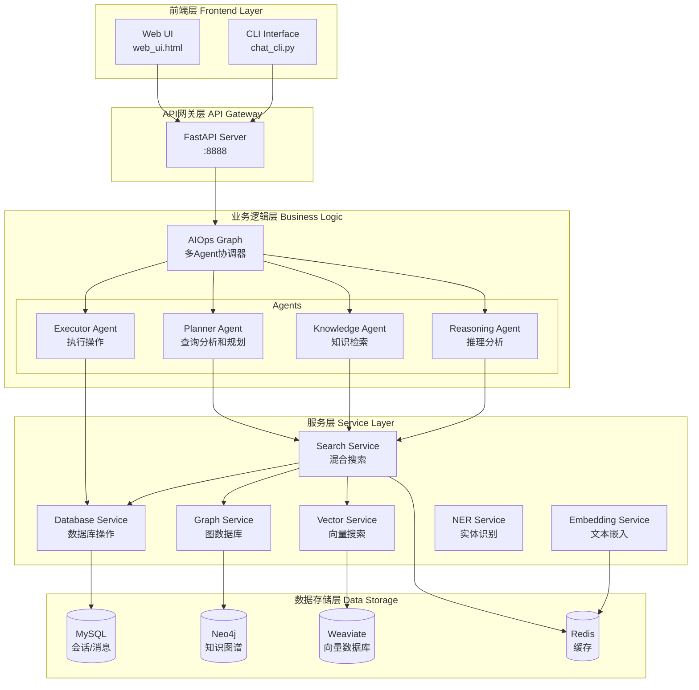
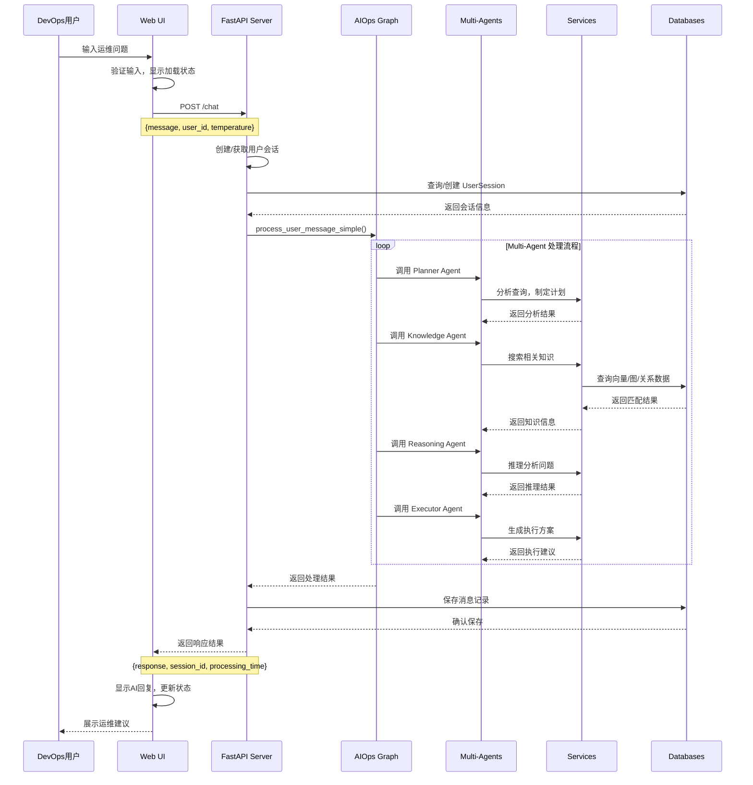
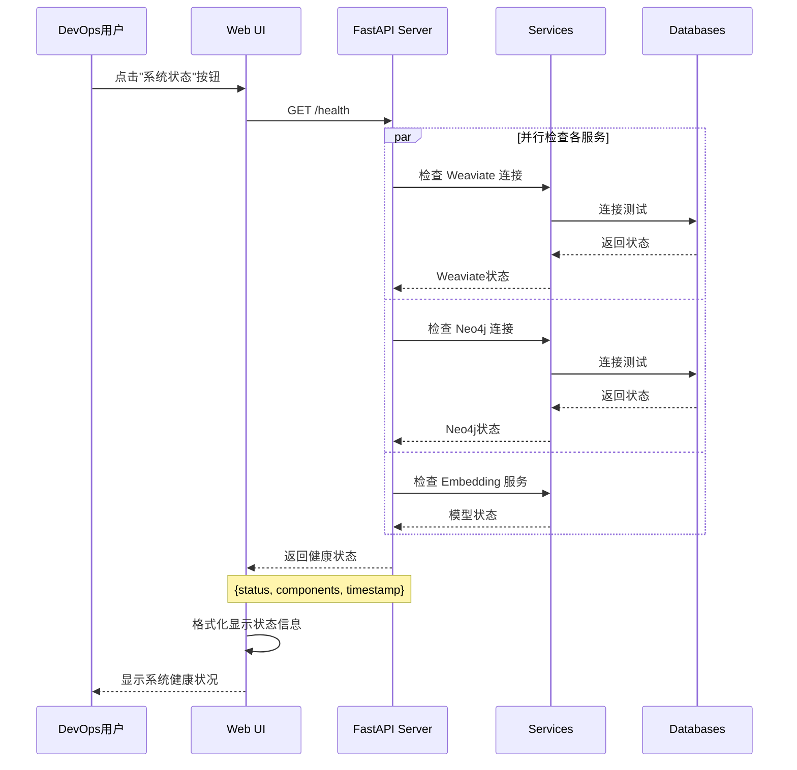
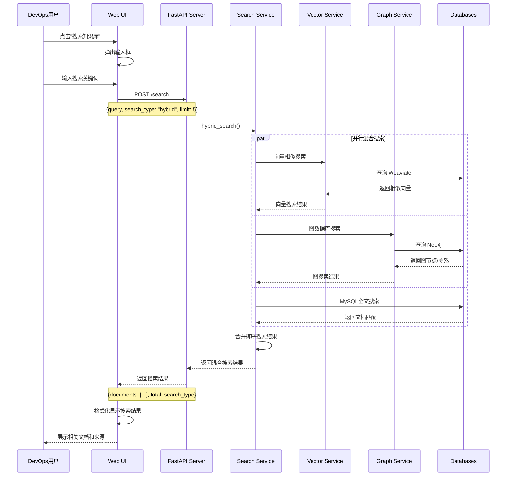
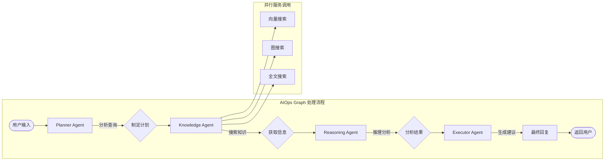

# AIOps Polaris 系统交互流程文档

## 系统概览

AIOps Polaris 是一个基于 RAG + 混合搜索 + 多Agent架构的智能运维助手系统，采用微服务架构设计，支持多种交互方式。

## 系统架构图



## Web UI 交互时序图

### 1. 用户聊天交互流程



### 2. 系统健康检查流程



### 3. 知识搜索流程



## API 接口详细说明

### 核心 API 端点

| 端点 | 方法 | 描述 | 请求体 | 响应体 |
|------|------|------|--------|--------|
| `/chat` | POST | 智能运维对话 | `{message, user_id, session_id?, temperature?, max_tokens?}` | `{success, response, session_id, processing_time, agent_messages, suggestions}` |
| `/search` | POST | 混合知识搜索 | `{query, search_type, source?, category?, limit?, threshold?}` | `{documents: [...], total, search_type, processing_time}` |
| `/health` | GET | 系统健康检查 | - | `{status, timestamp, version, components: {...}}` |
| `/stats` | GET | 系统统计信息 | - | `{vector_stats, graph_stats, database_stats, api_info}` |

### 会话管理 API

| 端点 | 方法 | 描述 |
|------|------|------|
| `/sessions/{user_id}` | GET | 获取用户会话列表 |
| `/sessions/{session_id}/messages` | GET | 获取会话消息历史 |  
| `/sessions/{session_id}` | DELETE | 删除/停用会话 |

### 知识管理 API

| 端点 | 方法 | 描述 |
|------|------|------|
| `/knowledge/entities` | GET | 获取知识实体列表 |
| `/knowledge/extract` | POST | 从文本提取知识 |
| `/search/suggestions` | GET | 获取搜索建议 |

## Web UI 前端实现细节

### 核心 JavaScript 函数

```javascript
// API 请求封装 - 处理CORS
async function apiRequest(url, options = {}) {
    try {
        const response = await fetch(url, {
            mode: 'cors',
            credentials: 'omit',
            ...options,
            headers: {
                'Content-Type': 'application/json',
                'Accept': 'application/json',
                ...options.headers
            }
        });
        return response;
    } catch (error) {
        console.error('API request failed:', error);
        throw error;
    }
}

// 聊天消息发送
async function sendMessage() {
    const message = messageInput.value.trim();
    if (!message) return;

    addMessage(message, true);
    updateStatus('正在处理您的请求...', 'loading');

    try {
        const response = await apiRequest(`${API_BASE_URL}/chat`, {
            method: 'POST',
            body: JSON.stringify({
                message: message,
                user_id: userId,
                temperature: 0.7
            })
        });

        const result = await response.json();
        
        if (response.ok) {
            addMessage(result.response);
            updateStatus(`处理完成 (${result.processing_time?.toFixed(2)}s)`, 'success');
        } else {
            addMessage(`错误: ${result.message}`, false);
            updateStatus('处理失败', 'error');
        }
    } catch (error) {
        addMessage(`连接错误: ${error.message}`, false);
        updateStatus('连接失败', 'error');
    }
}
```

### 状态管理

- **用户ID生成**: `userId = 'web_user_' + Date.now()`  
- **会话状态**: 自动创建和管理会话
- **错误处理**: 完善的错误捕获和用户提示
- **加载状态**: 请求期间的视觉反馈

## 多Agent 协作流程



## 数据流转说明

### 1. 输入数据流
1. **用户输入** → Web UI JavaScript
2. **API请求** → FastAPI 路由处理
3. **业务逻辑** → AIOps Graph 多Agent协调
4. **数据访问** → 各Service层调用数据库

### 2. 输出数据流
1. **数据库结果** → Service层封装
2. **Agent处理** → 业务逻辑合成
3. **API响应** → JSON格式返回
4. **前端渲染** → 用户界面展示

## 错误处理机制

### API层错误处理
- HTTP状态码标准化
- 统一错误响应格式
- 异常捕获和日志记录

### 前端错误处理  
- 网络错误重试机制
- 用户友好错误提示
- 降级处理方案

### 服务层错误处理
- 数据库连接失败恢复
- 外部服务调用超时
- 数据验证和清理

## 性能优化策略

1. **缓存机制**: Redis缓存嵌入向量和搜索结果
2. **连接池**: 数据库连接池管理
3. **异步处理**: 全异步I/O操作
4. **并行搜索**: 混合搜索并行执行
5. **资源管理**: 服务生命周期管理

## 监控和日志

- **结构化日志**: 使用structlog记录关键操作
- **性能指标**: 处理时间、Token使用量统计
- **健康检查**: 定期服务状态检测
- **错误追踪**: 完整的错误堆栈信息

---

此文档详细描述了 AIOps Polaris 系统的完整交互流程，可作为开发和运维参考文档。